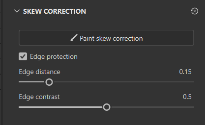

# Correzione dell&#39;inclinazione

<table>
  <tr style="border: 0;">
    <td style="border: 0; width: 35%" valign="top"></td>
    <td style="border: 0; width: 65%" valign="top">A volte, quando ci si esegue i baking a low-poly da un modello high-poly, è possibile che i dettagli appaiano deformati o distorti. Questo di solito accade quando le normali della gabbia e della superficie non si allineano bene. La esegue i baking automatica proietta il poligono superiore sul poligono inferiore in base a questi valori normali, quindi se non sono corretti, la esegue i baking produce risultati insoddisfacenti. Per fortuna, è disponibile la correzione dell'inclinazione (o mappatura dell'inclinazione) per correggere questo tipo di artefatto. La correzione dell'inclinazione consente di pittura i valori direttamente sulla trama low-poly per reindirizzare la proiezione utilizzata durante la esegue i baking senza dover creare una gabbia personalizzata.</td>
  </tr>
</table>

>[!NOTE]
>
> La correzione dell&#39;inclinazione viene colorata all&#39;interno della **modalità di Esegue i baking** ed è memorizzata per set di texture.

## Pittura correzioni inclinazione

La funzione Correzione inclinazione consente di regolare manualmente le normali di superficie della trama in modo specifico per la esegue i baking. Anche se puoi pittura le correzioni dell&#39;inclinazione senza eseguire i baking, può essere utile [eseguire i baking prima le mappe di trama](how-to-bake-mesh-maps.md).

*Passare alla modalità di esegue i baking per accedere alle impostazioni di correzione dell&#39;inclinazione.*

>[!IMPORTANT]
>
> La correzione dell’inclinazione richiede le seguenti impostazioni:
>
> * È necessario selezionare una scena High Poly. La funzione Inclina pittura è disponibile solo quando si esegue i baking da un livello di poli alto a uno basso; se si seleziona **Usa trama di poli basso come trama di poli alto**, la funzione Inclina pittura di correzione **non** sarà disponibile.
> * **Cage** deve essere impostato su **Distance-based**.
> * È necessario controllare **valori normali medi**.

Con le impostazioni precedenti, potete fare clic su **Pittura correzione inclinazione** nel **pannello delle impostazioni comuni** per iniziare a disegnare. Quando si accede per la prima volta alla modalità di disegno della correzione dell&#39;inclinazione, **Ripeti automaticamente** verrà attivato automaticamente per il canale normale. Se preferisci, puoi disattivare **Auto-rebake** o cambiare il canale selezionato nel [**pannello baker mappa trama**](../interface/baking-panels/mesh-map-bakers.md).

### Strumenti di pittura

Quando disegnate le correzioni dell&#39;inclinazione, potete usare molti degli strumenti e delle scelte rapide che avete usato dalla modalità Pittura, inclusi gli strumenti **Gomma** e **Riempimento poligonale**.

* Potete passare dalla modalità di disegno a **Pennello**, **Gomma** e **Riempimento poligonale** o utilizzare la [scelta rapida da tastiera da tastiera](../interface/settings/shortcuts.md) standard.
* Durante l&#39;utilizzo degli strumenti Pennello o Gomma, puoi regolare la dimensione, il flusso, l&#39;opacità e la spaziatura del pennello con i parametri nella parte superiore del **Riquadro di visualizzazione**. Puoi anche utilizzare la [scelta rapida da tastiera da tastiera](../interface/settings/shortcuts.md) pertinente, se disponibile.

### Protezione bordo

La protezione del bordo ignora la correzione dell’inclinazione dipinta vicino ai bordi per mantenere una sfumatura uniforme delle normali della superficie. Puoi attivare/disattivare **Protezione Edge** nella sezione **Correzione inclinazione**. Quando è attivata l’opzione **Correzione bordo**, potete regolare la distanza del bordo e il contrasto del bordo per ottenere risultati ottimali.

* Distanza bordo: consente di controllare la distanza a cui ha effetto la protezione del bordo.
* Contrasto bordo: consente di controllare la sfumatura di protezione dei bordi. Un contrasto basso produce una sfumatura più uniforme.

>[!TIP]
>
> I valori per **Distanza bordo** e **Contrasto bordo** sono basati sulle dimensioni della trama. Per trame con dettagli molto piccoli rispetto alla dimensione di trama, potrebbe essere più facile immettere manualmente valori piccoli, piuttosto che utilizzare i cursori.

>[!NOTE]
>
> La protezione dei bordi si basa sulla mappa di trama **Bordi netti**, che è legata alla geometria della trama, non ai bordi UV.

### Visualizza inclina vettoriale

Per impostazione predefinita, quando iniziate a colorare le correzioni di inclinazione, le normali della superficie della trama vengono visualizzate nella **finestra della vista** come linee rosse, gialle e verdi. Potete modificare l&#39;aspetto di queste linee o disattivarle del tutto nella sezione **Inclina vettoriali** del **menu Visualizzazioni** che viene visualizzata nella **Finestra della vista.**

* **Lunghezza vettoriale**: regola la lunghezza delle linee nella finestra della vista. Linee più lunghe possono facilitare la comprensione della direzione del vettore.
* **Densità UV vettoriale**: modificate il numero di linee sulla superficie della trama. I vettori vengono posizionati nello spazio UV, quindi se la trama ha una densità di texel incoerente, il numero di vettori per unità di area della superficie varierà con la dimensione del poligono nella mappa UV.
* **Opacità vettoriale**: rendete i vettori più o meno trasparenti.

Il colore dei vettori indica l’entità della correzione dell’inclinazione applicata a ciascuna posizione del vettore.

* I vettori rossi non indicano correzioni dell’inclinazione: vengono utilizzate le normali di superficie di default.
* I vettori verdi indicano che le normali della superficie sono completamente corrette e direttamente perpendicolari alla superficie.

*Colorare con un valore di flusso basso consente di controllare con precisione l&#39;intensità della correzione dell&#39;inclinazione.*

## Ottimizzazione delle prestazioni

### Organizza UV

**Rinnovo automatico** è ottimizzato per cercare di limitare il rebaking all&#39;area interessata da ogni tratto del pennello quando si disegnano correzioni dell&#39;inclinazione. Quando pitture un tratto, **Auto-rebake** disegna un rettangolo di selezione attorno al tratto nello spazio UV e riattiva tutti gli elementi all&#39;interno del rettangolo. Ciò significa che se il tratto copre solo una piccola sezione dello spazio UV, solo una piccola area verrà rimbalzata, rendendo l&#39;operazione molto efficiente.

Tuttavia, se il tratto attraversa due Isole UV su lati opposti dello spazio UV, anche un piccolo tratto può richiedere la riattivazione dell&#39;intera texture, annullando l&#39;ottimizzazione.

Di conseguenza, si consiglia di organizzare gli UV a trama in modo che le Isole UV vicine l&#39;una all&#39;altra nello spazio 3D siano anche vicine l&#39;una all&#39;altra nello spazio UV. Questo migliora le prestazioni di **Auto-rebake**.

### Imposta Allineamento a UV

In generale, è più efficace colorare le correzioni di inclinazione con **Proiezione > Allineamento** impostato su UV. Per modificare l&#39;**allineamento**:

1. Selezionare **Pittura correzione inclinazione** e attrezzare **Pennello** o **Gomma**.
1. Fate clic con il pulsante destro del mouse nel **Riquadro di visualizzazione** per aprire il **pannello delle impostazioni del pennello**.
1. Scorri fino a **Proiezione**.
1. Imposta **Allineamento** su **UV**.

Con **Allineamento** impostato su **UV**, è più difficile pittura tratti uniformi tra le giunture di Isola UV; tuttavia, ciò è generalmente meno importante quando si colorano le correzioni dell&#39;inclinazione rispetto alla creazione della trama.

>[!NOTE]
>
> I parametri per **Pennello** e **Gomma** sono archiviati separatamente. Per ottimizzare le prestazioni di entrambi gli strumenti, dovrai impostare **Allineamento** per ciascuno di essi singolarmente.

## Inclinare le correzioni e annullare la sovrapposizione

Le operazioni di esegue i baking e pittura condividono una sola cronologia di annullamento. Il passaggio dalla modalità di Esegue i baking a quella di pittura è di per sé un passaggio inevitabile, e anche l&#39;attivazione o la disattivazione della correzione dell&#39;inclinazione può essere annullata. Quando si annulla un’azione eseguita i baking in modalità pittura, la modalità Esegue i baking viene riaperta automaticamente prima che i passaggi vengano annullati; pertanto, un’azione non viene mai annullata all’esterno della modalità in cui si è verificata.