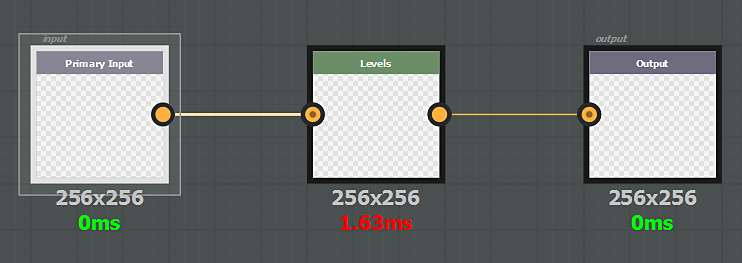

# Filtro generico

Un effetto generico verrà applicato a tutti i canali del documento, compresa l’opacità. Un filtro generico può essere:

* **scala di grigi**, verrà applicato a ogni componente (R, G, B e A) di ogni canale (colore di base, metallizzato, rugosità e così via)
* **colore**, verrà applicato sul canale colorato così com’è o convertito internamente in scala di grigio per agire sui canali in scala di grigio

Il nodo di input dell&#39;effetto deve avere **identificatore** o **utilizzo** definito **input** e il relativo nodo di output deve avere **output**. I filtri basati su **colore** non possono essere utilizzati sulla maschera di un livello; solo i filtri basati su **scala di grigi** saranno compatibili.

>[!NOTE]
>
> È possibile utilizzare **l&#39;utilizzo** o **l&#39;identificatore** in un nodo di input (l&#39;utilizzo ha la priorità).

Esempio:

{width="575px"}
