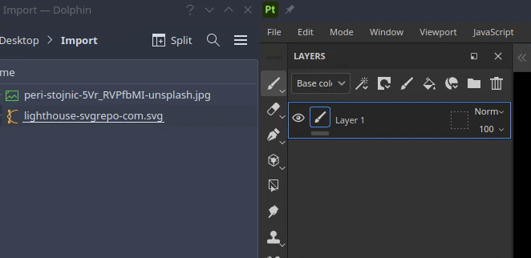

# Aggiunta di risorse tramite trascinamento

L’importazione delle risorse può essere eseguita semplicemente trascinando un file dall’esterno dell’applicazione in aree diverse dell’interfaccia.

## Importazione nella finestra Risorse

Per importare una risorsa in Painter, trascinala e rilasciala nella finestra Risorse.

Verrà aperta la finestra Importa risorsa che consente di controllare la posizione della risorsa (all&#39;interno del progetto, sul disco per il riutilizzo in più progetti o nella sessione per un utilizzo temporaneo). Questa finestra consente inoltre di configurare correttamente l&#39;utilizzo di una risorsa, poiché a volte alcuni formati di file possono essere ambigui.

### Importazione nella finestra della vista

Per importare e applicare direttamente un materiale nel progetto, è sufficiente trascinarlo e rilasciarlo nella finestra della vista. Mentre trascini il file, dovrebbe evidenziare la trama per indicare a quale parte del progetto verrà applicata.

È inoltre possibile importare un file SVG trascinandolo nella finestra della vista. In questo modo verrà creato un nuovo livello con la modalità di proiezione altera e la risorsa <b>Da grafica a materiale</b>, rendendo più pratica la creazione di decalcomanie.

### Importazione nel gruppo di livelli

Trascinando e rilasciando una risorsa nel livello, verranno creati dei livelli (o effetti). Se non si tratta di un filtro o di un materiale per Substance, è possibile che venga visualizzato un menu in cui viene chiesto in quale canale inserire la risorsa.

<table>
<tr style="border: 0;">
<td style="border: 0;" valign="top">

<b>Audio</b>

Regola o aggiungi audio al progetto.

* Regola il volume del video sorgente se dispone di audio.
* Aggiungere, rimuovere o sostituire un file audio esterno.
* Regola il volume del file audio esterno.

</td>
<td style="border: 0;" valign="top">

</td>
</tr>
</table>

### Importazione in uno slot di risorse

Trascinando e rilasciando un file in uno degli slot delle risorse nell&#39;interfaccia, ad esempio in un canale all&#39;interno di un livello di riempimento, la risorsa verrà importata e applicata automaticamente.

