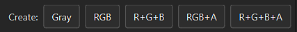

# Creazione di Modelli di output

Questa pagina spiega come creare e modificare Modelli di output personalizzati. I modelli di output controllano la denominazione e la configurazione delle texture esportate. La creazione di un Modello di output personalizzato consente di configurare le esportazioni in modo che corrispondano perfettamente al flusso di lavoro.

La scheda di configurazione della finestra di esportazione è suddivisa in tre parti principali:

* <b>Elenco predefiniti:</b> (a sinistra) consente di scegliere quale modello modificare o duplicare e rinominare i modelli esistenti.
* <b>Elenco texture di output</b>: (al centro) elenca il contenuto di un predefinito selezionato e visualizza la convenzione di denominazione e le opzioni di impacchettamento del canale.
* <b>Elenco di canali</b> e <b>texture convertite</b>: (a destra)elenco di canali e texture da utilizzare per comporre il contenuto di una texture esportata.

{width="800px"}

>[!NOTE]
>
> I modelli di output vengono salvati sul disco come <b>singoli file</b> e possono essere condivisi con qualsiasi altro utente di Substance 3D Painter.\
> Puoi trovare i file locali dei modelli personalizzati che hai creato nella cartella assets/export-presets dei tuoi [file Substance 3D Painter](../pipeline-and-integration/resource-management/shelf-and-assets-location.md).

>[!NOTE]
>
> Quando un modello viene utilizzato per esportare le texture, il file modello viene incluso automaticamente nel file di progetto nei salvataggi successivi.\
> Ciò consente la condivisione e/o lo spostamento di un progetto in un altro computer, mantenendo i modelli per l’esportazione delle texture.\
> Nel progetto viene salvato solo l’ultimo predefinito utilizzato. Tuttavia, se Substance 3D Painter rileva un predefinito con lo stesso nome, il predefinito all’interno del progetto verrà contrassegnato come &quot;Obsoleto&quot; nell’elenco.

## Creazione di un modello

All’inizio dell’elenco dei predefiniti, sono presenti tre pulsanti:

* <b> duplicato</b>: duplicato di un modello esistente.
* <b> Rimuovi</b>: elimina qualsiasi modello selezionato.
* <b> Crea</b>: crea un nuovo modello vuoto.

Puoi anche fare doppio clic su un modello o <b>fare clic con il pulsante destro del mouse > rinomina</b> per modificare il nome di un modello.

## Creazione di mappe di output

Una volta selezionato un modello, è possibile aggiungere nuove mappe di output utilizzando i pulsanti dedicati disponibili nella parte superiore della sezione centrale della finestra.

Una volta creata una mappa, è possibile assegnarle un nome e quindi trascinare le mappe di input in uno degli slot di canale disponibili.\
Una volta che una mappa di input è stata rilasciata nella sezione mappe di output, si aprirà un menu che chiede quale tipo di contenuto deve essere caricato in quello slot.

Le opzioni vanno dai <b>canali RGB</b> e <b>singoli</b> ai <b>canali Alpha</b> e alla conversione dell&#39;input in <b>scala di grigi</b>.

>[!NOTE]
>
> Ogni volta che una mappa di input viene trascinata e rilasciata, viene generato un colore casuale. In questo modo viene fornito un segnale visivo per i canali e la mappa di input corrispondente caricata.\
> Il pulsante indica inoltre cosa viene caricato nello slot:
> 
> * Colore di sfondo: indica le mappe <b>di input</b> caricate.
> * Barra RGB: indicare che i canali <b>R</b> , <b>G</b> e <b>B</b> della mappa di input sono stati caricati.
> * Barra rossa: indica che il canale <b>rosso</b> dalla mappa di input è caricato.
> * Barra verde : indica che il canale <b>verde</b> dalla mappa di input è caricato.
> * Barra blu: indica che il canale <b>blu</b> dalla mappa di input è caricato.
> * Barra grigia: indica che la mappa di input è caricata come <b>scala di grigi</b> (da una conversione RGB a scala di grigi o perché l&#39;input è già in scala di grigi).
> * Linea bianco/nero: indica che il canale <b>alfa</b> dalla mappa di input è caricato. In Substance 3D Painter l&#39;alfa di un input corrisponde all&#39;area totale dipinta.

## Assegnazione dei nomi alle mappe di output

Alcuni flag sono disponibili per generare automaticamente il nome della texture durante il processo di esportazione.

* <b> $mesh</b>: nome del file mesh caricato nel progetto
* <b> $textureSet</b>: nome del set di texture
* <b> /</b> (barra): separazione tra cartelle

<b> Esempio</b>: cymourai.fbx con un set di texture denominato &quot;MaterialBase&quot;

* <b>$mesh\_$textureSet\_BaseColor</b> genererà <b>cymourai\_MaterialBase\_BaseColor.png.</b>
* <b>$mesh/$textureSet\_BaseColor</b> genererà una cartella denominata <b>cymourai</b> con una texture denominata <b>MaterialBase\_BaseColor.png</b> al suo interno.

>[!NOTE]
>
> Se il formato di esportazione è impostato come formato di file **PSD** (Photoshop), le cartelle vengono convertite automaticamente come gruppi.

## Assegnazione dei canali alle mappe di output

È possibile lasciare alcuni canali (della mappa di output) completamente vuoti. In questo caso verrà assegnato un colore predefinito.

>[!NOTE]
>
> Se uno slot fa riferimento a un canale non presente nella texture impostata durante l’esportazione, viene generato anche un colore predefinito.\
> Questo colore cambia a seconda del canale che offre il miglior valore neutro.\
>  **Esempio**: se mancante, il canale di height verrà generato con un valore di grigio predefinito.

Esistono diversi tipi di mappe:

* <b>Mappe di input</b>: canali diretti che possono essere aggiunti in un set di texture. Tramite il pannello delle impostazioni di TextureSet.
* <b> Mappe trama</b>: le texture presenti negli slot delle mappe aggiuntivi di un set di texture (texture cotte).
* <b> Mappe convertite:</b> texture virtuali, generate durante l&#39;esportazione in base ai canali presenti nel documento.
  * <b>Normale OpenGL/DirectX</b>: genera un normale nello spazio dedicato combinando il normale dalle mappe aggiuntive, il height e il canale normale.
  * <b>AO</b> misto: combina la mappa aggiuntiva Occlusione ambiente con il canale Occlusione ambiente.
  * <b>Diffuso</b>: colore diffuso generato dai canali BaseColor e Metallic (le parti metalliche verranno sostituite da un colore nero).
  * <b>Specular</b>: colore di Specular generato dai canali BaseColor e Metallic.
  * <b>Lucidità</b>: inversa rispetto al canale di rugosità.
  * <b>Unity4 Diffuse</b>: colore diffuso generato da BaseColor in modo che corrisponda agli shader Unity4.
  * <b>Lucidità Unity4</b>: la lucidità generata dal canale Rugosità e Metallico corrisponde agli shader Unity4.
  * <b>Riflessione</b>: esportate una mappa in cui il bianco indica materiali dielettrici e altri colori per materiali metallici
  * <b>1/ior</b>: 1 diviso per il valore ior, ior viene generato dalla mappa metallica: 1,4 per i dielettrici, 100 per i metalli (colore nero)
  * <b>Lucidità2</b>: versione quadrata del canale di lucidità (lucidità \*)
  * <b>f0</b>: valore di riflettanza in fresnel 0 (0,04 per dielettrici, 1,0 per metallici)
