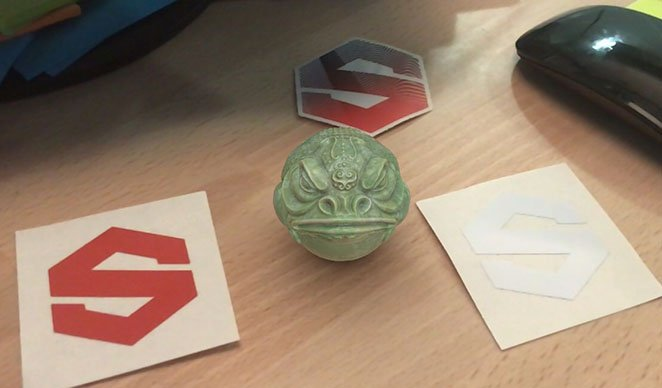

# Modello predefinito USDz (Apple AR)

>[!NOTE]
>
> Per esportare in USD con un Modello di output personalizzato, non utilizzare il modello USDz (Apple AR). Utilizza invece il Modello di output scelto e abilita <b>Esporta risorsa USD</b> nella parte inferiore della <b>scheda Impostazioni</b>.

Il modello di output predefinito USDz (Apple AR) esporta la risorsa configurata per l’uso con le applicazioni Apple AR.

Per utilizzare il modello USDz (Apple AR):

1. Aprite la finestra Esporta con <b>File > Esporta texture</b> o con la scelta rapida da tastiera <b>Ctrl + Maiusc + E</b>.
1. Nella <b>scheda Impostazioni</b>, apri il <b>menu a discesa dei Modelli di output</b> e seleziona <b>USDz (Apple AR)</b>.

{zoomable="yes"}

Vengono creati e salvati cinque file di texture (colore di base, metallizzato, normale, occlusione e rugosità). Tutti i file vengono salvati come JPG, ad eccezione della mappa normale che viene salvata come PNG per evitare artefatti dovuti alla compressione con perdita di dati.

Inoltre, vengono creati altri due file con estensione usdc e usdz:

Ecco un esempio di JadeToad aperto direttamente in MacOS dal Finder:

{width="400px"}

Di seguito è riportato un esempio del file USDZ inviato a un iPhone, utilizzando la modalità AR per inserire il modello JadeToad in un ambiente reale:

{width="500px"}
