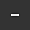
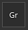

# Modelli di output

{width="500px"}

La scheda Modello di output consente di gestire e creare nuovi Modelli di output. Potete usare i Modelli di output per modificare i nomi, i formati e la configurazione delle texture esportate.

## Elenco dei predefiniti

L’elenco Predefiniti mostra tutti i Modelli di output disponibili. Questo elenco include una raccolta di [Modelli di output predefiniti](../export-presets/default-presets.md), nonché i modelli personalizzati creati dall&#39;utente.

Da questo elenco, i modelli possono essere <b>creati</b>, <b>rinominati</b>, <b>duplicati,</b> o <b>eliminati</b>.

| Azione | Visivo | Descrizione |
| --- | --- | --- |
| **Duplicato** | 

 | Crea una copia del modello di output attualmente selezionato nell&#39;elenco. |
| **Rimuovi** | 

 | Rimuovere il modello di output selezionato nell&#39;elenco.  **Nota:** l&#39;eliminazione di un modello non può essere annullata. |
| **Aggiungi** | 

 | Aggiungi un nuovo modello di output vuoto. |
| **Doppio clic** | 

 | Rinomina il modello di output selezionato. |
| **Fare clic con il pulsante destro del mouse** | 

 | Fai clic con il pulsante destro del mouse su un modello per aprire il menu di scelta rapida in cui è possibile eliminare, rinominare o duplicare un modello. |

## Elenco mappe di output

In questa sezione sono elencate tutte le texture generate dal modello e la relativa composizione.

### Mappare tipi e parole chiave

Nella riga superiore sono elencati tutti i tipi di texture che è possibile creare:

| Pulsante | Visivo | Descrizione |
| --- | --- | --- |
| **Grigio** | 

 | Aggiungete una nuova mappa in scala di grigi. |
| **RGB** | 

 | Aggiungi una nuova mappa colori RGB. |
| **R+G+B** | 

 | Aggiungete una nuova mappa RGB con 3 singoli slot in scala di grigi. |
| **RGB+A** | 

 | Aggiungete una nuova mappa RGB e uno slot alfa (scala di grigi). |
| **R+G+B+A** | 

 | Aggiungi una nuova mappa RGBA con 4 singoli slot in scala di grigi. |

>[!NOTE]
>
> Alcuni tipi possono essere uniti o compressi quando sono vuoti o condividono la stessa mappa di input:
> 
> 

### Nome mappa

È possibile assegnare un nome a ogni texture utilizzando una convenzione di denominazione personalizzata. È possibile aggiungere alcune parole chiave (con l&#39;aiuto del pulsante **$**) che verranno automaticamente sostituite dall&#39;applicazione al momento della generazione del file finale:

| Parola chiave | Descrizione |
| --- | --- |
| **$project** | Sostituito dal nome del file di progetto (.spp). |
| **$mesh** | Sostituito dal nome del file mesh (file mesh di input, come .fbx) |
| **$textureset** | Sostituito dal nome del materiale/set di texture da cui viene generata la texture. |
| **$udim** | Sostituito dal numero UDIM da cui viene generata una texture. |
| **$colorSpace** | Sostituito dal nome dello spazio colore utilizzato per il canale specificato (RGB o G ignora l’Alpha). |

### Formato file mappa e profondità di bit

Il primo menu a discesa può essere utilizzato per specificare il formato di file della mappa di output corrente.

Il secondo menu a discesa viene utilizzato per specificare la profondità di bit della mappa di output. La profondità di bit dipende dal formato di file selezionato. Per ulteriori dettagli, vedere [Impostazioni di esportazione](export-settings.md).

>[!NOTE]
>
> Per tenere conto delle impostazioni di formato e profondità di bit durante l&#39;esportazione, verificare che il tipo di file nelle impostazioni generali sia impostato su **In base al modello di output**.

## Elenco mappa di origine

### Mappe di input

L&#39;elenco della mappa di input raggruppa tutti i canali che possono essere aggiunti tramite le [impostazioni del set di texture](../../interface/texture-set/texture-set-settings.md).

>[!NOTE]
>
> I canali **utente** sono basati sul nome originale (**utente\_x**) e i nomi personalizzati vengono ignorati.

### Mappe delle mesh

Le mappe trama sono le texture cotte:

| Nome | Descrizione |
| --- | --- |
| **Normale** | Carta normale cotta. |
| **Spazio globale normale** | Spazio del mondo al forno normale. |
| **ID** | Baked ID |
| **occlusione ambiente** | Occlusione ambiente cotto |
| **Curvatura** | Curvatura cotta. |
| **Posizione** | Posizione cotta. |
| **Thickness** | Thickness al forno. |
| **Height** | Height al forno. |
| **Normali piegati** | Normali curvati. |

### Mappe convertite

Le mappe convertite sono mappe generate dall&#39;applicazione da un&#39;altra origine:

| Nome | Descrizione |
| --- | --- |
| **OpenGL normale** | Mappa normale combinata nel formato OpenGL del normale al forno e del canale normale dell’insieme di texture. |
| **DirectX normale** | Mappa normale combinata nel formato DirectX della normale cotta e del canale normale dell’insieme di texture. |
| **AO misto** | Occlusione ambiente combinata dell&#39;occlusione ambiente cotto e del canale di occlusione ambiente del set di texture. |
| **Diffusione** | Texture diffusa generata dal canale **Colore di base** e **Metallico** (le aree metalliche vengono sostituite da un colore nero). |
| **Specular** | Texture di Specular generata dal canale **Colore di base** e **Metallico**. |
| **Lucentezza** | Texture lucida generata dall’inverso del canale di rugosità. |
| **Diffusione Unity4** | Obsoleto. Texture diffusa generata dal canale **Colore di base** in modo che corrisponda agli shader di Unità 4. |
| **Sfumatura Unity4** | Obsoleto. Texture lucida generata dal canale **Rugosità** e **Metallica** in modo che corrisponda agli shader di Unità 4. |
| **Riflessione** | Texture in cui il bianco indica un materiale dielettrico e altri colori come materiali metallici. |
| **1/ior** | Texture contenente 1 diviso per il valore **IOR**. **IOR** viene generato dalla mappa metallica: 1,4 per i dielettrici, 100 per i metalli (colore nero). |
| **Lucentezza2** | Versione quadrata del canale **Lucidità** (**Lucidità** \* **Lucidità**) |
| **f0** | Texture contenente il valore di riflettanza fresnel 0 (0,04 per la dieletria e 1,0 per la metallizzazione). |
