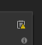

# Aggiornamento automatico delle risorse

L&#39;aggiornamento automatico delle risorse o <b>aggiornamento automatico</b> è una funzionalità della [finestra Risorse](../interface/assets/assets.md) che consente di ricaricare e aggiornare le risorse quando sono disponibili nuove versioni. Questo processo può essere attivato automaticamente o manualmente nell&#39;interfaccia o tramite script Python.

## Esercitazione

Seguite un breve tutorial per una panoramica della funzione:

## Abilitazione dell&#39;aggiornamento automatico

Per abilitare l&#39;<b>aggiornamento automatico</b>, vai nella parte inferiore della finestra Risorse e fai clic sull&#39;icona a due frecce. Viene aperto il menu di aggiornamento automatico con tutte le relative impostazioni. Quindi abilita una delle opzioni disponibili nella sezione <b>aggiornamenti automatici</b>.

### Aggiornamenti automatici

Le impostazioni di aggiornamento automatico determinano la frequenza con cui l’applicazione deve cercare gli aggiornamenti e la posizione.

| Impostazione | Descrizione |
| --- | --- |
| <b>Pannello Risorse</b> | Se questa opzione è attivata, l&#39;aggiornamento automatico cercherà le risorse da aggiornare in tutte le librerie attualmente caricate. Questo include il progetto corrente. Tuttavia, non aggiorna le risorse utilizzate nella pila di livelli, le impostazioni di visualizzazione, le impostazioni dello shader e così via. |
| <b>Risorse utilizzate nel progetto</b> | Se questa opzione è attivata, l&#39;aggiornamento automatico cercherà le risorse da aggiornare che sono attualmente importate e utilizzate dal progetto corrente. Questo vale per le risorse utilizzate nella pila di livelli, le impostazioni di visualizzazione, le impostazioni dello shader, ecc. |
| <b>Aggiorna ogni x minuti</b> | Controlla la frequenza con cui l&#39;applicazione cerca un aggiornamento delle risorse. Un ritardo di 0 minuti attiverà un aggiornamento ogni pochi secondi. Tenete presente che un ritardo così basso può creare problemi di prestazioni. |

>[!NOTE]
>
> Se sono attivati gli aggiornamenti automatici, l’applicazione cercherà automaticamente le modifiche ogni volta che riprende lo stato attivo.

### Aggiornamenti manuali

Le azioni di aggiornamento manuali rappresentano un modo pratico per attivare il sistema di aggiornamento quando lo si desidera. Possono essere utilizzati con o senza l&#39;attivazione delle impostazioni di aggiornamento automatico.

| Impostazione | Descrizione |
| --- | --- |
| <b>Aggiorna pannello risorse</b> | Avvia il processo di aggiornamento automatico. Comportamento analogo all&#39;impostazione del <b>pannello Risorse</b> (vedi sopra). |
| <b>Aggiorna risorse utilizzate nel progetto</b> | Avvia il processo di aggiornamento automatico. Comportarsi allo stesso modo delle <b>risorse utilizzate nel progetto</b> (vedere sopra). |

## Impostazioni avanzate

Le impostazioni avanzate consentono di controllare il comportamento del processo di aggiornamento.

| Impostazione | Descrizione |
| --- | --- |
| <b>Ignora risorse quando i relativi parametri non corrispondono</b> | Se questa opzione è attivata, il processo di aggiornamento automatico eviterà di aggiornare le risorse se la nuova versione non corrisponde a quella precedente. Se ad esempio un materiale di Substance contiene parametri che non esistono più nella nuova versione (perché sono stati rimossi o rinominati), il processo di aggiornamento ignorerà la risorsa e conserverà la versione precedente. |

>[!NOTE]
>
> Per forzare l&#39;aggiornamento delle risorse con una mancata corrispondenza, puoi disabilitare l&#39;impostazione <b>Ignora risorse quando il relativo parametro non corrisponde</b>.

## Stato aggiornamento e registro

Dopo un aggiornamento delle risorse (automatico o manuale), il risultato del processo verrà visualizzato nella scheda <b>Risorse</b> nella finestra <b>Registro</b>, segnalando sia gli aggiornamenti riusciti che i problemi. In caso di mancata corrispondenza delle risorse (vedere sopra), i dettagli del problema che verrà fornito per ogni risorsa.

Il registro può essere aperto rapidamente facendo clic sull’icona dedicata in alto a destra del menu di aggiornamento automatico:

>[!NOTE]
>
> Quando si verifica uno o più problemi dopo un aggiornamento, l’icona del registro presenta un’icona di avviso.

A seconda della procedura di aggiornamento, possono verificarsi diversi tipi di problemi:

| Problema | Descrizione |
| --- | --- |
| <b>Impossibile aggiornare nel pannello Risorse</b> | Questo messaggio indica che un problema ha impedito al sistema di aggiornamento di continuare. Espandere il nome della risorsa per ottenere ulteriori informazioni. |
| <b>(nome file).(formato) non esiste. Impossibile ricaricare (nome risorsa)</b> | Questo messaggio indica che non è più possibile trovare il file di origine di una risorsa (perché è stato spostato o rimosso). Una semplice correzione consiste nel reimportare la risorsa o riposizionarla nella finestra Risorse (tramite il menu di scelta rapida). |

## Messaggio progetto precedente

Quando si apre un vecchio progetto, all’interno del messaggio a comparsa è disponibile un’opzione per informare del processo di aggiornamento automatico. Questo è un modo pratico per disabilitare rapidamente il processo di aggiornamento automatico nel caso in cui rimanesse abilitato prima di aprire il vecchio progetto.
