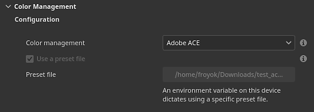

# Gestione del colore con Adobe - ICC

Questa pagina elenca le impostazioni di gestione del colore relative all’Adobe Color Engine (ACE) da utilizzare con l’immagine con profili ICC.

## Impostazioni progetto


Le impostazioni del progetto possono essere impostate durante la creazione di un nuovo progetto tramite la finestra [nuovo progetto](../../getting-started/project-creation.md) o la finestra [configurazione del progetto](../../interface/project-configuration.md).

>[!NOTE]
>
> Se viene caricata una variabile di ambiente (vedere di seguito) o un file di predefiniti, le impostazioni nell’interfaccia utente verranno disattivate.

Le impostazioni disponibili sono:

| Sezione | Impostazione | Descrizione |
| --- | --- | --- |
| **Configurazione** | **Gestione colore** | Definite il motore da utilizzare per gestire i colori.Valori possibili:<ul data-preserve-html="true"> <li data-preserve-html="true"><strong>Precedente</strong> (impostazione predefinita): utilizza la correzione del colore gamma sRGB/Linear sRGB predefinita.</li> <li data-preserve-html="true"><strong>OpenColorIO</strong>: utilizza l&#39;integrazione OCIO.</li> <li data-preserve-html="true"><strong>Adobe ACE</strong>: Adobe Color Engine per il supporto dei profili ICC.</li> </ul> |
|  | **Utilizzare un file predefinito** | Se questa opzione è attivata, consenti a tod di attivare le impostazioni di gestione del colore tramite un file di configurazione json. |
|  | **File predefinito** | Percorso del file predefinito, in formato json. Per ulteriori dettagli, consulta di seguito. |
|  |  |  |
| **Impostazioni colore** | **Spazio colore di lavoro** | Spazio cromatico utilizzato dal motore per lavorare all&#39;interno dell&#39;applicazione. Spazio colore da cui è possibile convertire le texture in (importazione) o da (esportazione).I valori possibili sono:<ul data-preserve-html="true"> <li data-preserve-html="true"><strong>Lineare sRGB IEC61966-2.1</strong> (impostazione predefinita)</li> <li data-preserve-html="true"><strong>ACEScg ACES Spazio di lavoro AMPAS S-2014-004</strong></li> <li data-preserve-html="true"><strong>Adobe RGB lineare (1998)</strong></li> </ul> |
|  | **Intento di rendering** | Specificate il metodo utilizzato per convertire il colore tra gli spazi colore.Valori possibili:<ul data-preserve-html="true"> <li data-preserve-html="true"><strong>Percettivo</strong></li> <li data-preserve-html="true"><strong>Saturazione</strong> (impostazione predefinita)</li> <li data-preserve-html="true"><strong>Cromatico relativo</strong></li> <li data-preserve-html="true"><strong>Assoluto cromatico</strong></li> </ul> |
|  |  |  |
| **Impostazioni predefinite spazio colore di importazione bitmap** | **immagini a 8 bit** | Spazio colore da usare per impostazione predefinita durante l’importazione di file di immagine a 8 bit. |
|  | **immagini a 16 bit** | Spazio colore da usare per impostazione predefinita durante l’importazione di file di immagine a 16 bit. |
|  | **Immagini a virgola mobile** | Spazio colore da usare per impostazione predefinita durante l’importazione di file di immagine HDR/EXR. |
|  | **Usa profili ICC incorporati se disponibili (consigliato)** | Se questa opzione è attivata, utilizzate i profili ICC dal file immagine per regolarne i colori. |
|  |  |  |
| **Substance materiale** | **Spazio colore predefinito del materiale** | Definite lo spazio colore da usare per l’input/output con gestione del colore dei materiali Substance. |
|  |  |  |
| **Esporta spazio colore** | **immagini a 8 bit** | Spazio colore da usare per impostazione predefinita durante l’esportazione di file di immagini a 8 bit. |
|  | **immagini a 16 bit** | Spazio colore da usare per impostazione predefinita durante l’esportazione di file di immagine a 16 bit. |
|  | **Immagini a virgola mobile** | Spazio colore da usare per impostazione predefinita durante l’esportazione di file di immagine HDR/EXR. |

## Utilizzo di un file di predefiniti



È possibile utilizzare un file predefinito (in formato json) per guidare le impostazioni ACE durante la creazione di nuovi progetti.

### Variabile di ambiente

La variabile di ambiente **PAINTER\_ACE\_CONFIG** può essere utilizzata per specificare il percorso di un file di predefiniti. Se presente, l’applicazione utilizzerà sempre un file di predefiniti per guidare le impostazioni di gestione del colore. Le impostazioni verranno disattivate nell&#39;interfaccia.

Per ulteriori dettagli, vedere la pagina [Variabili di ambiente](../../pipeline-and-integration/configuration/environment-variables.md).

### Esempio di predefinito

Di seguito è riportato un esempio di file json che può essere utilizzato come file di predefiniti:

```
{ 

  "color settings": { 

    "working color space": "Linear Adobe RGB (1998)", 

    "rendering intent": "Saturation" 

  }, 

  "bitmap import color space defaults" : { 

    "8 bit images": "image P3", 

    "16 bit images": "image P3", 

    "floating point images": "Raw", 

    "use embedded ICC profiles when available": false 

  }, 

  "substance material": { 

    "material color space default": "image P3" 

  }, 

  "export colors spaces" : { 

    "8 bit images": "image P3", 

    "16 bit images": "image P3", 

    "floating point images": "Raw" 

  } 

} 
```
