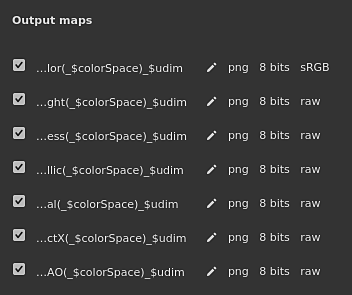

# Gestione del colore

La gestione del colore riguarda la gestione e la conversione dei colori. Dall’importazione delle risorse alla visualizzazione dei colori sullo schermo fino all’esportazione delle texture. La calibrazione del colore è importante per garantire lo stesso aspetto in tutte le applicazioni.

Nell&#39;applicazione la gestione del colore viene gestita tramite l&#39;integrazione di [OpenColorIO](https://opencolorio.org/) (OCIO in breve) versione 2. OCIO è lo standard per la conversione e la visualizzazione dei colori nelle pellicole e nelle animazioni. Per abilitare la gestione del colore, è sufficiente creare un nuovo progetto o aprirne uno esistente e attivare le impostazioni dedicate.

>[!NOTE]
>
> La gestione del colore è disponibile dalla versione 7.4.0.

## Impostazioni progetto

Impostazioni di gestione colore:

* [Gestione del colore con Adobe - ICC](color-management-with-adobe-ace-icc.md)
* [Gestione del colore con OpenColorIO](color-management-with-opencolorio.md)

## Vocabolario

Può essere utile conoscere alcuni termini tecnici relativi alla gestione del colore per comprendere meglio il flusso di lavoro associato:

| Parola chiave | Descrizione |
| --- | --- |
| **Spazio colore** | Sistema di coordinate in cui sono definiti i colori. |
| **Spazio di lavoro** | Spazio colore utilizzato all’interno dell’applicazione per fondere texture, colori, ecc. |
| **Trasformazione visualizzazione** | Trasformazione visualizzazione converte i colori lineari dallo spazio di lavoro allo spazio colore del monitor per visualizzare i colori percettivamente (visibili agli occhi dell’uomo). Le trasformazioni di visualizzazione spesso includono una passata di mappatura tonale per comprimere i colori e adattarli all’intervallo limitato di valori consentiti dallo schermo. |
| **Configurazione** | Un file di configurazione OCIO. Definisce lo spazio di lavoro, un elenco di spazi colore e un elenco di trasformazioni di visualizzazione. |
| **ACE** | ACES è l’acronimo di Academy Color Encoding System ed è lo standard in molte applicazioni per lo scambio di file di immagini digitali. Per impostazione predefinita, nell’applicazione sono incluse due versioni di questo standard. |
| **Mappatura tonalità** | È il processo di mappatura dei valori di colore da HDR (high dynamic range) a LDR (low dynamic range). Questo processo consente la visualizzazione approssimativa di un’ampia gamma di colori. |

## Elenco dei canali con gestione del colore

All’interno dell’applicazione, i canali con gestione del colore o meno (dati/passthrough) sono predefiniti.

| Canale | Il colore è gestito |
| --- | --- |
| **occlusione ambiente** | No |
| **Angolo di anistotropia** | No |
| **Livello di Anisotropia** | No |
| **Colore di base** | **Sì** |
| **Maschera di fusione** | No |
| **Colore pelo** | **Sì** |
| **Pelo normale** | No |
| **Opacità pelo** | No |
| **Rugosità pelo** | No |
| **specular level** | No |
| **Diffusione** | **Sì** |
| **Spostamento** | No |
| **Lucentezza** | No |
| **Height** | No |
| **Ior** | No |
| **Metallico** | No |
| **Normale** | No |
| **Opacità** | No |
| **Riflessione** | No |
| **Rugosità** | No |
| **Dispersione** | No |
| **Colore di dispersione** | **Sì** |
| **Colore di lucentezza** | **Sì** |
| **Opacità brillantezza** | No |
| **Rugosità brillantezza** | No |
| **Specular** | **Sì** |
| **Specular edge color** | **Sì** |
| **Specular level** | No |
| **Traslucidità** | No |
| **Trasmissivo** | **Sì** |
| **UtenteX (0-15)** | Dipende da [Impostazioni set texture](../../interface/texture-set/texture-set-settings.md). Per impostazione predefinita, i canali utente non sono sottoposti alla gestione del colore. 

 |

## Selettore colore

Quando la gestione del colore è attivata, il comportamento del [selettore colore](../../interface/color-picker.md) cambia leggermente:

* I colori vengono modificati in base alla visualizzazione corrente selezionata.
* Alcune informazioni aggiuntive vengono aggiunte all&#39;interfaccia.

Per ulteriori informazioni, consulta il selettore colore [pagina della documentazione](../../interface/color-picker.md).

## Controlli del riquadro di visualizzazione

Entrambe le viste 2D e 3D sono sottoposte alla gestione del colore e nella parte superiore della finestra della vista sono disponibili impostazioni dedicate che consentono di controllare la trasformazione della visualizzazione da utilizzare:

* **Pulsante sinistro**: attiva/disattiva la trasformazione della visualizzazione della finestra della vista. Se è disattivata, la finestra della vista visualizzerà i colori come raw/passthrough. Questo pulsante è attivato per impostazione predefinita.
* **Menu a discesa a destra**: specificate quale trasformazione di visualizzazione utilizzare per convertire i colori in modo da visualizzarli sullo schermo. Il valore predefinito è basato sulla configurazione OCIO. Questa impostazione non viene salvata con il progetto perché può essere dipendente dal monitoraggio.

>[!NOTE]
>
> In modalità Solo (visualizzazione dei singoli canali), la gestione del colore viene disattivata automaticamente durante la visualizzazione dei canali dati (vedere l’elenco sopra riportato).

## Impostazioni di esportazione

Le impostazioni di esportazione principali dipendono dalla configurazione del progetto (vedi sopra).

Nella finestra [esporta texture](../../export/export.md) è presente una parola chiave che può essere utilizzata per aggiungere ai nomi di file lo spazio colore utilizzato per texture: **$colorSpace**.

<table>
<tr style="border: 0;">
<td style="border: 0;" valign="top">

{width="320px"}

</td>
<td style="border: 0;" valign="top">

{width="500px"}

</td>
</tr>
</table>

## Sostituzione degli spazi colore

Potrebbe essere necessario specificare uno spazio colore alternativo affinché una risorsa differisca dalle impostazioni predefinite. Questa operazione può essere eseguita tramite il menu dello spazio colore.

### Modifica dello spazio colore di una risorsa

All&#39;interno della finestra [proprietà](../../interface/properties.md) è possibile ignorare lo spazio colore di una risorsa specifica (dove viene attualmente utilizzata).

A tale scopo, espandi la sezione spazio colore e usa il menu a discesa per specificare il nuovo spazio colore:

### Modifica dello spazio cromatico della mappa ambiente

All&#39;interno delle [impostazioni di visualizzazione](../../interface/display-settings/display-settings.md), abilitare lo **spazio colore della mappa dell&#39;ambiente**, quindi scegliere uno spazio colore nell&#39;elenco corrispondente alla risorsa.

