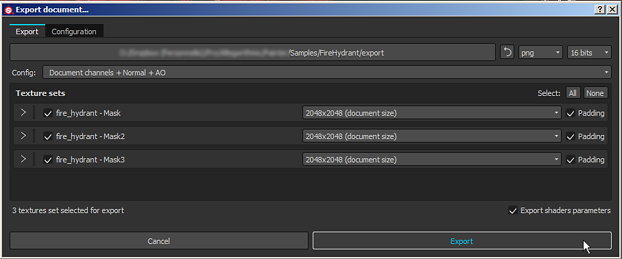
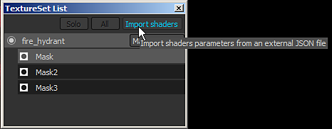

# Stratificazione dinamica dei materiali

{width="450px"}

**Stratificazione dinamica dei materiali** è un flusso di lavoro specifico in cui i materiali generici vengono combinati all&#39;interno di uno shader anziché in un&#39;unica texture. Il vantaggio principale di questo flusso di lavoro è che la fusione è dinamica e consente di controllare e preservare un certo livello di qualità lavorando i materiali generici all’interno dello shader. Sebbene i materiali siano generici, le maschere utilizzate per fondere i materiali sono specifiche della trama e pertanto non vengono ripetute.

{width="400px"}

Per abilitare il flusso di lavoro per la creazione di livelli di materiale, è necessario uno shader specifico.\
Lo shader &quot; **pbr-material-layering**&quot; fornito per impostazione predefinita con Substance 3D Painter consente di fondere 4 materiali con 3 maschere.

## Stack di sottolivelli

In questo shader è possibile definire sottopile che possono essere campionate direttamente dallo shader. Esempio con lo shader &quot;pbr-material-layering&quot; fornito con Substance 3D Painter:

```
//: stacks [ 

//:   { 

//:     "id": "Mask", 

//:     "channels": [ 

//:   {"id": "opacity"} 

//:  ] 

//:   }, 

[...] 

//: ]
```


 In questo esempio, lo shader creerà 3 sottopile su un determinato set di texture con un canale di &quot;opacità&quot; in ciascuna. È possibile accedere ai sottostack nella finestra dell&#39;elenco TextureSet:

Poiché i **canali** delle pile dei sottolivelli sono definiti **nello shader**, non è possibile aggiungere nuovi canali nelle impostazioni del set di texture. Per aggiungere o rimuovere un canale, è necessario aggiornare il file di shader.

Il numero massimo di canali supportati è definito dal numero totale di campionatori supportati dall&#39;hardware.\
Mentre Substance 3D Painter supporta texture senza binding (e quindi una quantità illimitata di texture) per i materiali caricati come parametri, i canali forniti dal motore per le Pile livelli sono limitati a 32 (in Windows). Questo limite include anche altre texture come Normale e l’Occlusione ambientale eseguita i baking sulla trama del progetto.

## Input di materiali

Sebbene sia possibile impostare sottopile per definire i materiali in aggiunta alle maschere, spesso è più pratico definire semplicemente gli input di materiale nello shader e utilizzare i materiali direttamente dallo scaffale. La maggior parte delle volte questi materiali esistono anche nell&#39;applicazione finale come Unity o Unreal Engine 4. La convenzione di denominazione dei materiali dichiarati nello shader &quot;pbr-material-layering&quot; è la seguente:

```
//: materials [ 

//:   { 

//:      "id": "Material1", 

//:      "label": "Material 1", 

//:      "default": "", 

//:      "size": 1024, 

//:      "default_color": [0.5, 0.5, 0.5] 

//:   }, 

[...] 

//: ]
```


 Di seguito è riportato il risultato al caricamento di alcuni materiali (materiali Substance o materiali predefiniti):

La risoluzione del materiale può essere definita con il parametro &quot;size&quot;. È inoltre possibile caricare i materiali per impostazione predefinita quando lo shader viene creato con il parametro &quot;default&quot; (utilizzando il nome/l&#39;etichetta della risorsa che deve essere caricata).

Per accedere ai materiali e alla maschera dello shader stesso, collegateli semplicemente con la parola chiave &quot;param auto&quot;:

```
//: param auto Material1.channel_basecolor 

uniform sampler2D color1; 

 

//: param auto Mask.channel_opacity 

uniform sampler2D mask;
```


In questo flusso di lavoro specifico, la parte più importante sono i parametri maschera e shader. Pertanto, nella finestra di esportazione di Substance 3D Painter si consiglia di abilitare l&#39;impostazione &quot; **Esporta parametri shader** &quot;. Verrà creato un file **JSON** sul disco accanto alle texture che conterrà informazioni sulla configurazione dei sottostack, sui materiali utilizzati e sugli shader e i relativi parametri. Esportazione e importazione di parametri

Al momento, l’impacchettamento di maschere in una singola texture non è supportato durante l’esportazione. Tuttavia, una soluzione alternativa potrebbe consistere nell’utilizzare le funzioni di scripting e chiamare gli strumenti batch di Substance per eseguire l’impacchettamento con una Substance.



Questo File JSON può quindi essere utilizzato per impostare le Pile livelli e gli shader di un progetto.\
In questo modo è possibile condividere facilmente i parametri comuni tra più applicazioni.


