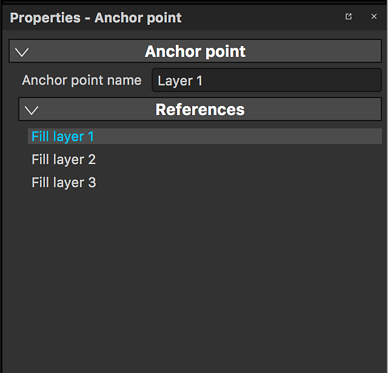

# Punto di ancoraggio

Un punto di ancoraggio è un modo per esporre qualsiasi risorsa o elemento nella pila di livelli e farvi riferimento in aree diverse della pila di livelli per scopi diversi e con un diverso set di regolazioni. Aprono un&#39;intera nuova serie di possibilità, consentendoti di collegare efficacemente livelli o maschere e avere un singolo punto di ancoraggio che influisce su più aspetti del tuo progetto, trasformando Substance 3D Painter in un&#39;esperienza davvero non lineare.

>[!NOTE]
>
> È possibile fare riferimento a un punto di ancoraggio solo se è stata creata la stessa texture. Non è possibile creare collegamenti tra un ancoraggio e i suoi riferimenti tra gli insiemi di texture.

## Aggiungere un punto di ancoraggio

Punto di ancoraggio è disponibile nel menu Effetti. Possono essere aggiunti sia su livelli che su maschere.

## Usare un punto di ancoraggio come riferimento

Un altro livello può fare riferimento a un punto di ancoraggio: in questo modo viene creata un’istanza del contenuto del punto di ancoraggio nel livello che vi fa riferimento.

I punti di ancoraggio possono essere utilizzati come riferimento nelle seguenti risorse:

* Livello di riempimento
* Effetto di riempimento
* Inserimento di un filtro sostanza (Effetto, Procedurale, Generatore)

Solo i punti di ancoraggio che si trovano **al di sotto** del livello a cui fanno riferimento possono essere utilizzati come riferimenti.\
Se spostate un punto di ancoraggio sopra un livello che vi fa riferimento, questo interromperà il riferimento. Se desideri annullare questa azione, puoi annullarla.

## Trovare riferimenti per un punto di ancoraggio

Facendo clic su un punto di ancoraggio potete vedere nelle proprietà l’elenco dei livelli in cui questo punto di ancoraggio viene utilizzato come riferimento.

## Trovare un punto di ancoraggio

Quando siete un livello/effetto Riempimento e utilizzate un Punto di ancoraggio come riferimento, potete passare direttamente al punto di ancoraggio.

