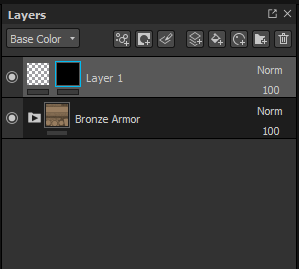

# Filtro

Gli effetti di filtro sono sostanze che Trasforma il contenuto di un livello o di una maschera.

## Come si applica un filtro?

A seconda del tipo di filtro, è necessario creare un effetto filtro sul contenuto o sulla maschera di un livello.\
Esistono due modi per applicare un filtro, uno dei quali dipende da come intendete utilizzare il filtro.

## Applicazione manuale di un filtro.

Nell’esempio seguente viene applicato un filtro di sfocatura al contenuto di un livello, ma questo viene generalmente utilizzato per applicare filtri alle maschere:

### 1 - Aggiungere un effetto filtro

Per iniziare, seleziona il contenuto di un livello (miniatura a sinistra), quindi fai clic sul pulsante dell’effetto (o clic con il pulsante destro del mouse per aprire il menu di scelta rapida).\
Selezionare l&#39;opzione &quot; **aggiungi filtro** &quot; nell&#39;elenco.

### 2 - Selezionare il filtro nella finestra delle proprietà

Nella finestra delle proprietà, i parametri o il filtro sono attualmente vuoti. È disponibile solo il pulsante di selezione.\
Fai clic sul pulsante per aprire il ripiano e seleziona il filtro desiderato; qui scegliamo il filtro sfocatura.

## Trascinare un filtro dallo scaffale

Questo metodo è destinato solo ai filtri che devono essere applicati all’intero gruppo di livelli. Verranno impostati automaticamente tutti i metodi di fusione di canale [&#128279;](../../interface/layer-stack/blending-modes.md). Non funziona per applicare filtri a una maschera.

### 1 - Aprire l’area Filtri dello scaffale

Nel Ripiano, fai clic sulla sezione &quot;Filtri&quot; a sinistra.

## 2 - Trascinare il filtro

Seleziona il filtro da usare nello scaffale. Trascinalo nel gruppo di livelli, per assicurarti che si trovi nella posizione corretta (ad esempio, per evitare di trascinarlo in gruppi indesiderati).

Nell’esempio precedente, il filtro rilasciato presenta già il metodo Fusione Passthrough. Questo vale per tutti i canali del documento.

## Aggiunta di nuovi tipi di filtri

Tutti i filtri sono Substance e possono essere creati con Substance 3D Designer.\
Come avvio rapido, Substance 3D Designer fornisce modelli pronti all’uso per Substance 3D Painter.

Per ulteriori informazioni, consulta questa pagina: [Creazione di effetti personalizzati](../../content/creating-custom-effects/creating-custom-effects.md)
