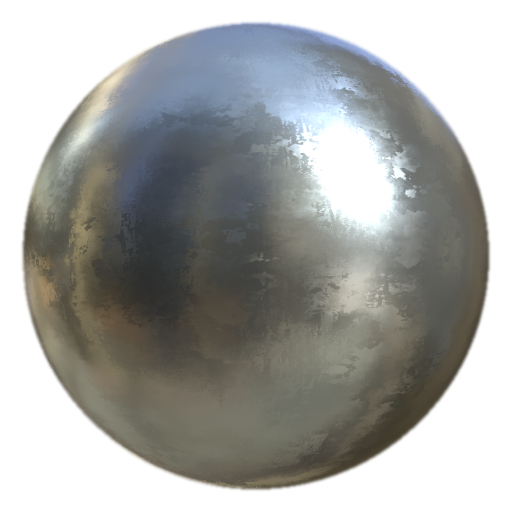

# Ruvido finitura mascherino

<table>
<tr style="border: 0;">
<td width="33.33%" style="border: 0;" valign="top">

<b>Entrata:</b> effetti/finitura, superficie

</td>
<td width="100.00%" style="border: 0;" valign="top">

## Descrizione

Il filtro MatFinish Rough fa parte di una raccolta di finiture metalliche ed è utilizzato per creare un effetto metallo grezzo.

Viene utilizzato su un livello di riempimento. Regolate il colore, la rugosità, il metallo e altre proprietà del livello di riempimento base, quindi aggiungete il filtro per il trattamento della superficie finale.

</td>
</tr>
</table>

## Input

| Nome di input | Descrizione |
| --- | --- |
| <b>Grunge personalizzata:</b> in scala di grigi | Usate una texture di grunge personalizzata o un punto di ancoraggio. |
| <b>Posizione:</b> colore | Usa la mappa Posizione eseguita i baking. |
| <b>Normali spazio globale:</b> colore | Utilizzare la mappa eseguita i baking World Space Normals. |

## Parametri

| Nome parametro | Descrizione |
| --- | --- |
| <b>Valore di inizializzazione:</b> | Assegna un valore casuale per creare una variazione diversa senza modificare le impostazioni generali. |
| <b>Scala:</b> | Regolate la scala complessiva della finitura. |
| <b>Grunge in scala:</b> | Regolate la scala del motivo della grunge. |
| <b>Intensità pennello:</b> | Regolate l’intensità dell’effetto pennello. |
| <b>Alterazione pennello:</b> | Regolate la quantità di alterazione applicata al pennello. |
| <b>Usa scaglia personalizzata:</b> | Attiva/disattiva l&#39;utilizzo dell&#39;input del flake personalizzato. |
| <b>Mappatura triplanare:</b> | Attiva/disattiva la mappatura triplanare. |
| <b>Usa Grunge personalizzata:</b> | Attivate/disattivate l’uso di una texture di grunge personalizzata. |

