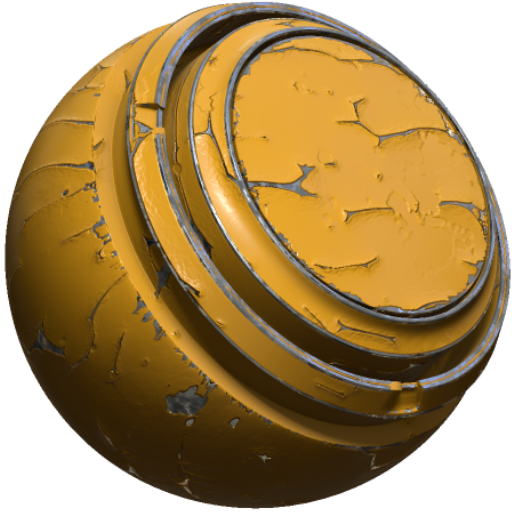

# Pittura di peeling MatFX

<table>
<tr style="border: 0;">
<td width="33.33%" style="border: 0;" valign="top">

<b>Ingresso:</b> Effetti/sfocatura, scala di grigi

</td>
<td width="100.00%" style="border: 0;" valign="top">

## Descrizione

Il filtro MatFX Peeling Pittura crea effetti di pittura di sfaldamento e sfaldamento.

Viene utilizzato su strati di texture o pile di materiale per simulare la pittura di sbucciatura, rivestimenti scheggiati ed esporre il materiale sottostante.

</td>
</tr>
</table>

>[!NOTE]
>
> Per esporre un materiale sottostante, utilizzare la Pittura di peeling MatFX all’interno di un gruppo. I livelli esterni al gruppo e sottostanti nella Pila livelli saranno esposti nel punto in cui la pittura sbucciata si allontana dalla superficie.

## Parametri

| Nome parametro | Descrizione |
| --- | --- |
| <b>Intensità sfocatura:</b> | Regolate l’intensità dell’effetto di sfocatura. |
| <b>Contorna con sfocatura:</b> | Attivate/disattivate l’opzione di ritorno a capo automatico. Quando è attivato, l’effetto campiona i pixel dal lato opposto della texture. |
| <b>Livello di peeling:</b> | Regolate il livello di pelatura complessivo. |
| <b>Distanza di peeling:</b> | Regolate la distanza di deformazione della pittura. |
| <b>Livello scaglia:</b> | Regolate la quantità di sfaldamento. |
| <b>Densità bolle d&#39;aria:</b> | Regolare la densità delle bolle d’aria. |
| <b>Densità sfarfallio:</b> | Regolate la densità della sfaldatura. |
| <b>Flaking X Quantità:</b> | Regolate la quantità di sfaldamento lungo l’asse X. |
| <b>Quantità Y sfocata:</b> | Regolate la quantità di sfaldamento lungo l’asse Y. |
| <b>Usa curvatura:</b> | Attiva/disattiva l’input di curvatura. |
| <b>Distanza curvatura:</b> | Regolate la distanza di campionamento della curvatura. |
| <b>Contrasto curvatura:</b> | Regola il contrasto dell&#39;input di curvatura. |

### Parametri tecnici

Questi parametri consentono di modificare la superficie superiore del materiale sbucciato.

| Nome parametro | Descrizione |
| --- | --- |
| <b>Luminosità:</b> | Regolate la luminosità. |
| <b>Contrasto:</b> | Regolate il contrasto o la dissolvenza del risultato. |
| <b>Scostamento tonalità:</b> | Regolate lo spostamento della tonalità. |
| <b>Saturazione:</b> | Regolate la saturazione. |
| <b>Intensità normale:</b> | Regolate l’intensità normale. |
| <b>Intervallo Height:</b> | Regola l’intervallo height usato dall’effetto. |
| <b>Posizione Height:</b> | Regola la posizione del height utilizzato dall’effetto. |
| <b>Intensità Occlusione ambientale:</b> | Regolate l’intensità dell’occlusione ambientale. |
