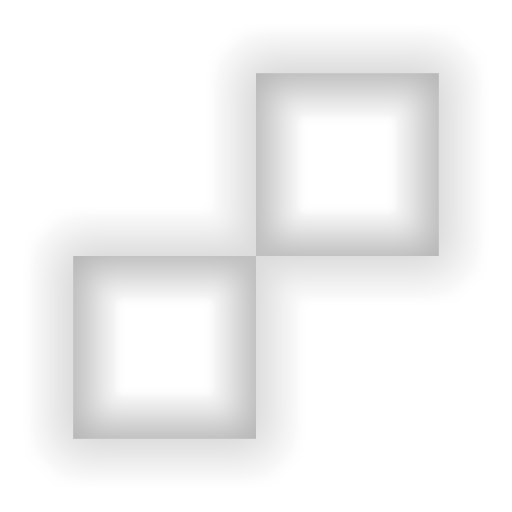

# Passa alte

<table>
<tr style="border: 0;">
<td width="33.33%" style="border: 0;" valign="top">

<b>Ingresso:</b> Effetti/sfocatura, raggio, dettagli

</td>
<td width="100.00%" style="border: 0;" valign="top">

## Descrizione

Il filtro passa-alto esegue un effetto passa-alto simile all’azione Photoshop con lo stesso nome. È utile per rimuovere grandi differenze di luminanza nelle immagini, ad Affiancamento durante la pulizia delle texture.

Viene utilizzato su un livello texture o su un livello maschera per rimuovere grandi differenze di luminanza.

</td>
</tr>
</table>

## Parametri

| Nome parametro | Descrizione |
| --- | --- |
| <b>Spazio cromatico:</b> | Selezionate lo spazio colore usato dal filtro. |
| <b>Raggio:</b> | Regolate il raggio dell&#39;evidenziatore. |
| <b>Applica all&#39;Alpha:</b> | Attivate/disattivate se il filtro agisce sul Canale alfa. |
