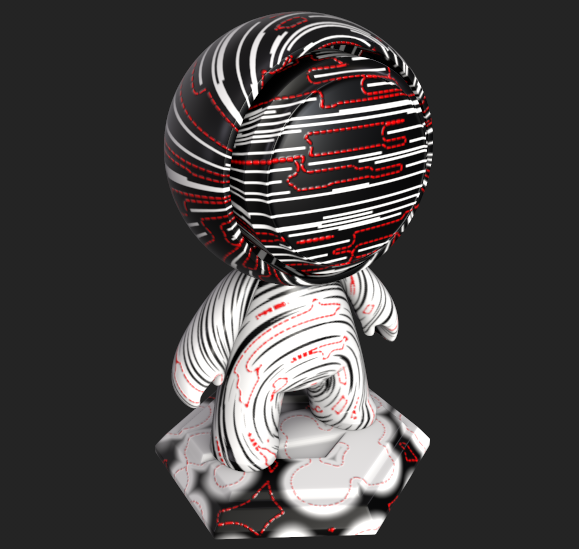

# Cucitrice automatica

<table>
  <tr style="border: 0;">
    <td style="border: 0;" valign="top"> <strong>Ingresso:</strong> punti, punti</td>
    <td style="border: 0;" valign="top"><strong>Descrizione</strong> Il generatore di cuciture automatiche crea automaticamente un effetto di giuntura lungo tracciati generati proceduralmente. Questi tracciati possono essere generati in base a cuciture UV, curvatura o una mappa di input personalizzata.  Il generatore di cuciture automatiche genera una texture monocromatica (in bianco e nero). Di conseguenza, è utile per generare maschere in modo da applicare effetti di giuntura.  Per utilizzare la modalità Maschera di curvatura, è necessaria una mappa di curvatura cotta. <a href="../../../baking/baking.md">Ulteriori informazioni sulla cottura</a>.</td>
  </tr>
</table>

## Input

<table>
  <tr>
    <th>Nome di input</th>
    <th>Descrizione</th>
  </tr>
  <tr>
    <td><strong>Curvatura</strong> Scala Di Grigi</td>
    <td>Selezionate come generare i tracciati di giuntura: <ul><li><strong>Maschera UV</strong> genera i tracciati lungo le giunture UV.</li><li><strong>La curvatura </strong>genera tracciati vicino ai bordi netti.</li><li><strong>L'input personalizzato</strong> consente di controllare la posizione in cui vengono generati i percorsi utilizzando una mappa. Quando si utilizza l'<strong>input personalizzato</strong>, i tracciati vengono generati in aree ad alto contrasto.</li></ul></td>
  </tr>
  <tr>
    <td><strong>Input personalizzato</strong> Scala di grigi</td>
    <td>Usate una texture personalizzata o un punto di ancoraggio.</td>
  </tr>
</table>

## Parametri

<table>
  <tr>
    <th>Nome parametro</th>
    <th>Descrizione</th>
  </tr>
  <tr>
    <td><strong>Modalità maschera</strong></td>
    <td>Selezionate la modalità Maschera. <ul><li>Maschera UV: maschere basate su Isole UV.</li><li>Curvatura: maschere basate sulla mappa Curvatura.</li><li>Input personalizzato: maschere basate su una texture di input personalizzata.</li></ul></td>
  </tr>
  <tr>
    <td><strong>Smoothness tracciato</strong></td>
    <td>Ammorbidite il tracciato su cui verranno applicati i punti.</td>
  </tr>
  <tr>
    <td><strong>Posizione tracciato</strong></td>
    <td>Spostate la posizione del tracciato.</td>
  </tr>
  <tr>
    <td><strong>Dimensione cucitura</strong></td>
    <td>Regola la scala dei punti.</td>
  </tr>
  <tr>
    <td><strong>Larghezza cucitura</strong></td>
    <td>Regola la larghezza dei punti.</td>
  </tr>
  <tr>
    <td><strong>Lunghezza cucitura</strong></td>
    <td>Regola la lunghezza dei punti.</td>
  </tr>
  <tr>
    <td><strong>Rotondità cucitura</strong></td>
    <td>Regolate la rotondità dei punti.</td>
  </tr>
  <tr>
    <td><strong>Variazione</strong></td>
    <td>Regola la variazione nella direzione del flusso dei punti.</td>
  </tr>
</table>

## Esempi

<table>
  <tr>
    <td></td>
    <td>In questo esempio viene illustrato come creare percorsi di giuntura con un input personalizzato.  <ul><li>Il colore di base bianco e nero mostra le texture del disturbo che stiamo utilizzando come input personalizzato per il generatore di autostitcher.</li><li>Il generatore di cuciture automatiche nasconde il livello rosso, lasciando visibili i tracciati rossi cuciti.</li><li>Notate come i tracciati rossi uniti si adattino a aree nere o bianche sufficientemente grandi della texture del disturbo di input personalizzata. La giuntura rossa non si incrocia mai da bianca a nera o da nera a bianca.</li></ul> L’immagine seguente mostra la semplice configurazione dei livelli utilizzata per creare questo esempio.  </td>
  </tr>
</table>
