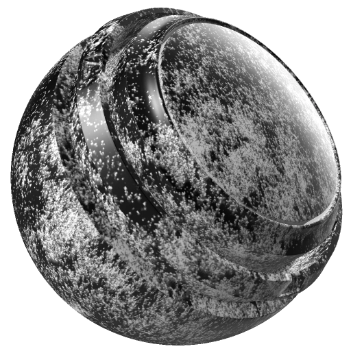

# Ruggine gocciolante

<table>
  <tr style="border: 0;">
    <td style="border: 0;" valign="top"> <strong>Ingresso:</strong> generatore, scala di grigi, colore</td>
    <td style="border: 0;" valign="top"><strong>Descrizione</strong> Il generatore di Ruggini gocciolanti crea striature di ruggini che scorrono verso il basso, simulando la corrosione causata dalla gravità e dallo scarico dell'acqua.  Il generatore di Ruggini gocciolanti genera una texture monocromatica (in bianco e nero). Di conseguenza, è utile generare maschere per creare un effetto ruggine gocciolante.  Per l'immissione dell'immagine sono necessari posizionamento al forno, curvatura e occlusione dell'ambiente. <a href="../../../baking/baking.md">Ulteriori informazioni sulla cottura</a>.</td>
  </tr>
</table>

## Input

| Nome di input | Descrizione |
| --- | --- |
| **Curvatura** Scala Di Grigi | Utilizzate la mappa di curvatura. |
| **occlusione ambiente** Scala di grigi | Utilizzate la mappa di Occlusione ambiente cotta. |
| Colore **Posizione** | Utilizzate la mappa di posizione al forno. |

## Parametri

<table>
  <tr>
    <th>Nome parametro</th>
    <th>Descrizione</th>
  </tr>
  <tr>
    <td><strong>Seed</strong></td>
    <td>Impostate il valore di partenza utilizzato per generare la texture del dirt.  <ul><li>Fate clic su Casuale per passare a un altro valore di inizializzazione casuale.</li><li>Fate clic sulla matita per visualizzare il valore iniziale corrente e immettete un valore specifico.</li></ul></td>
  </tr>
  <tr>
    <td><strong>Inverti</strong></td>
    <td>Invertite mappe interne specifiche (ad esempio, Curvatura, AO) prima di combinarle nella maschera finale.</td>
  </tr>
  <tr>
    <td><strong>Ruggine diffusione</strong></td>
    <td>Regolate l’espansione dell’effetto ruggine gocciolante.</td>
  </tr>
  <tr>
    <td><strong>Ruggine contrasto</strong></td>
    <td>Regolate il contrasto dell’effetto ruggine gocciolante.</td>
  </tr>
  <tr>
    <td><strong>Smoothness di diffusione</strong></td>
    <td>Regolate la morbidezza in espansione dell’effetto ruggine gocciolante.</td>
  </tr>
  <tr>
    <td><strong>Intensità gocce</strong></td>
    <td>Regolate la lunghezza dell’effetto ruggine gocciolante.</td>
  </tr>
  <tr>
    <td><strong>Gocce di Smoothness</strong></td>
    <td>Regolate la morbidezza dell’effetto ruggine gocciolante.</td>
  </tr>
  <tr>
    <td><strong>Quantità campioni gocce</strong></td>
    <td>Regolate la qualità dell'effetto (più campioni per una migliore qualità).</td>
  </tr>
  <tr>
    <td><strong>Asse posizione</strong></td>
    <td>Per cambiare la direzione dell’effetto ruggine gocciolante, passate dal canale Y-Verde al canale X-Rosso e al canale B-Blu.</td>
  </tr>
</table>
