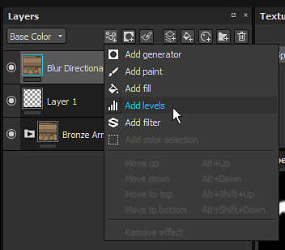

# Livelli

Il livello è un effetto utilizzato per regolare le gamme di colore di un’immagine. Consente di bilanciare e tonificare i colori e/o i valori dei grigi. Puoi aggiungerlo aprendo il menu degli effetti:

L’interfaccia principale presenta un istogramma (la montagna di colori al centro dell’interfaccia) che rappresenta la distribuzione dei pixel in un’immagine a ogni livello di intensità del colore. L’istogramma mostra i dettagli nelle ombre (parte sinistra), nei mezzitoni (parte centrale) e nelle luci (parte destra). L’istogramma consente inoltre di esaminare rapidamente la gamma tonale dei colori, in modo da determinare quanto sia scura o luminosa l’immagine.

Per regolare la gamma di colori dell’immagine, sono disponibili due serie di controlli nella parte superiore e inferiore dell’istogramma:

* I tre pulsanti superiori controllano le ombre, i mezzitoni e le luci e possono essere utilizzati per ridistribuire la gamma tonale per creare un contrasto complessivo dell’immagine.
* I due pulsanti in basso controllano il nero e il punto bianco dell’immagine (solitamente 0 e 255). Questo può essere utile ad esempio per invertire i colori di un’immagine.

>[!NOTE]
>
> L&#39;effetto Livelli può essere applicato solo a un canale alla volta, come selezionato dall&#39;opzione *Canale interessato*. Se desideri applicare un livello a più canali, dovrai creare più effetti Livelli.

* La casella a discesa Colori in alto a destra consente di modificare i livelli dell’immagine rgb completa o di uno solo dei canali rosso, verde e blu.
* L’opzione Blocca in basso a destra consente di bloccare i valori dei livelli tra 0 e 1 (0-255). Questa opzione deve essere sempre selezionata quando si lavora su canali non HDR (come il **colore di base**).

[Per capire meglio i Livelli, dovresti guardare il nostro corso sulla Substance Academy dedicato all&#39;argomento.](https://academy.substance3d.com/courses/Mastering-Levels-Histogram)
