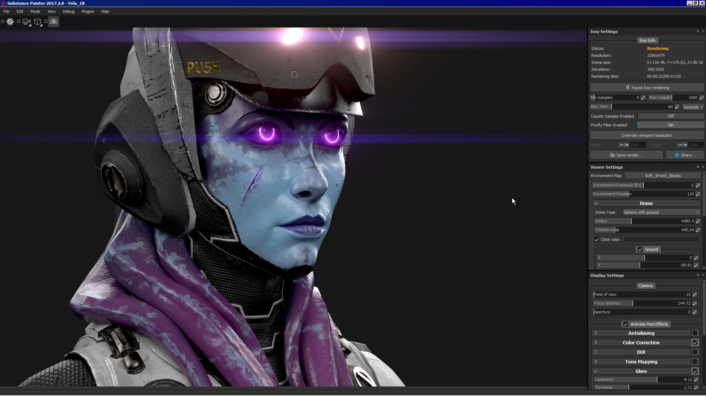

# Modulo di rendering Iray

{width="600px"}

**Iray** è un renderer con accelerazione GPU e traccia del percorso sviluppato da [Nvidia](http://www.nvidia.com/object/nvidia-iray.html).\
Con Iray è possibile creare immagini con una grande precisione di illuminazione nella scena e in alta definizione (alta risoluzione).

## Modalità Iray

Per avviare Iray, è necessario modificare la modalità di Substance 3D Painter.\
A tale scopo, è possibile premere in vari modi:

* Premendo il tasto **F10** (o **F9** per tornare alla modalità Disegno)
* Facendo clic sull&#39;icona della fotocamera nella barra degli strumenti principale
* Utilizzando il menu Modalità

<table>
<tr style="border: 0;">
<td style="border: 0;" valign="top">

</td>
<td style="border: 0;" valign="top">

</td>
</tr>
</table>

## Parametri Iray

Iray utilizza un insieme specifico di parametri ma anche proprietà comuni condivise dalla normale finestra della vista di Substance 3D Painter.

* [Impostazioni Iray](iray-settings.md)
* [Impostazioni visualizzatore e MDL](viewer-and-mdl-settings.md)

## Impostazioni di visualizzazione

Le impostazioni dello schermo consentono di controllare le impostazioni della fotocamera e degli effetti post.\
Sono identici al normale rendering della finestra della vista, per cui possono essere sincronizzati ed evitare differenze di illuminazione indesiderate.

Per ulteriori informazioni, consultate la pagina dedicata: [Impostazioni di visualizzazione](../../interface/display-settings/display-settings.md)
