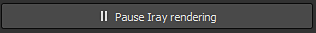

# Impostazioni Iray

Le impostazioni di Iray controllano il rendering della finestra della vista IRay, la durata e la qualità dell&#39;esecuzione.

## Informazioni Iray

Nella sezione superiore della finestra viene visualizzato lo stato di Iray insieme ad altre informazioni.

| *Impostazione* | *Descrizione* |
| --- | --- |
| **Stato** | Lo stato indica il funzionamento di Iray:<ul data-preserve-html="true"><li data-preserve-html="true"><strong>Rendering</strong> (Iray sta elaborando l&#39;immagine)</li><li data-preserve-html="true"><strong>Sospeso</strong> (Iray calcolato arrestato ma non terminato)</li><li data-preserve-html="true"><strong>Fine</strong> (calcolo Iray completato o raggiunto i valori delle impostazioni)</li></ul> |
| **Risoluzione** | La risoluzione dell&#39;immagine del raggio (per impostazione predefinita dipendente dalle dimensioni della finestra della vista). |
| **Dimensioni scena** | Dimensioni del rettangolo di selezione della scena/Trama 3D. Non esiste un&#39;unità, ma si presume che sia espressa in centimetri. |
| **Iterazioni** | Numero di passaggi di calcolo eseguiti da Iray oltre il valore massimo definito nelle impostazioni. |
| **Tempo di rendering** | Tempo trascorso durante l’esecuzione del rendering oltre il tempo massimo definito nelle impostazioni. |

>[!NOTE]
>
> Il numero di iterazioni definirà la qualità finale del rendering: più iterazioni = qualità migliore.\
> Tuttavia, le iterazioni possono richiedere del tempo, per cui è possibile definire un tempo massimo. Un’iterazione è definita dal numero di campioni.

## Impostazioni

Non appena un&#39;impostazione viene modificata, Iray inizierà a elaborare il rendering.\
È possibile mettere in pausa Iray per evitare questo comportamento con il pulsante dedicato:

| *Impostazione* | *Descrizione* |
| --- | --- |
| **Esempio minimo** | Quantità minima di campioni eseguita in pixel |
| **Esempio massimo** | Quantità massima di campioni eseguita in pixel |
| **Tempo massimo** | Quantità massima di tempo consentita per l&#39;esecuzione del calcolo da parte di Iray.  Il menu a discesa a destra consente di impostare l&#39;unità (secondi, minuti o ore). |
| **Sampler austico abilitato** | Questa opzione consente di calcolare riflessi di luce più avanzati (caustici). |
| **Filtro Firefly abilitato** | Questa opzione consente di eliminare i pixel isolati e molto luminosi che possono verificarsi a volte. |
| **Ignora risoluzione finestra vista** | Questa impostazione consente di definire dimensioni personalizzate per il rendering, anziché utilizzare le dimensioni della finestra della vista corrente. L&#39;impostazione **Larghezza** e **Height** consente di definirla in quantità di pixel. |
| **Salva rendering** | Azione per esportare il rendering corrente (anche se non completato) in un file. |
| **Condividi** | Consenti di condividere/esportare il rendering corrente in [ArtStation](https://www.artstation.com/). |
