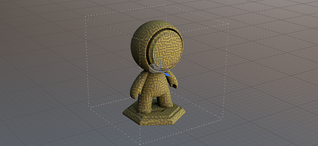

# Dimensione fisica

La dimensioni fisiche è una proprietà all&#39;interno dei materiali della Substance che ne definisce le dimensioni reali. Può essere utilizzato per abbinare con precisione le dimensioni e l&#39;aspetto dei materiali sulle superfici 3D. Painter usa i centimetri come unità interna predefinita.

Per utilizzare la dimensioni fisiche, applicate un materiale che ha questa proprietà con un valore diverso da 0,0,0, quindi attivate la modalità dimensioni fisiche nel livello (o effetto) di riempimento in Trasformazione UV > Scala.

Per ulteriori informazioni, consulta:

* <b>Dimensioni fisiche</b> parametri in [Riempi proiezioni](../painting/fill-projections/fill-projections.md)
* <b>Parametri Griglia</b> in [Impostazioni viewport](../interface/display-settings/viewport-settings.md)
* <b>Spostamento basato sulla dimensioni fisiche</b> in [Impostazioni shader](../interface/shader-settings/shader-settings.md)

>[!NOTE]
>
> * Dalla versione 8.3 di Painter, dimensioni fisiche è disponibile per tutti i tipi di proiezioni.
> * La maggior parte dei formati di file di mesh specifica l&#39;unità utilizzata durante la creazione della trama; questa unità verrà convertita automaticamente in centimetri durante l&#39;importazione.
> * Alcuni formati, come .obj, non dispongono di informazioni sulle unità; pertanto, quando un progetto viene creato utilizzando una trama .obj, per impostazione predefinita viene misurato in centimetri senza alcuna conversione.
