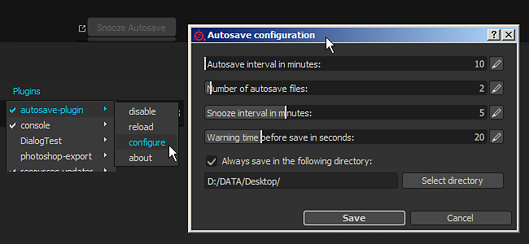

# Salvataggio automatico

{width="500px"}

I plug-in di salvataggio automatico consentono di **creare backup** del progetto attualmente aperto. Crea un file sul lato mantenendo inalterato il progetto corrente.

I file di backup si troveranno in tre posizioni possibili:

* Se il progetto corrente è stato salvato, i backup saranno accanto ad esso.
* Se il progetto non è mai stato salvato (senza titolo), i backup si troveranno nella cartella di salvataggio automatico all’interno della cartella Documenti dell’utente. ( **Documenti/Allegorithmic/Substance 3D Painter/autosave** )
* Se l&#39;impostazione di esclusione è stata abilitata, i backup si troveranno nel percorso indicato nelle impostazioni.

*Nell&#39;interfaccia è disponibile un pulsante di blocco per ritardare il salvataggio automatico.*

## Come viene attivato il salvataggio automatico?

Il salvataggio automatico si basa su un timer interno, una volta che il timer è sopra il processo di salvataggio automatico inizia.\
Il pulsante snooze si attiverà quando si avvicina alla fine del timer, consentendo di ritardare il salvataggio automatico per un certo periodo di tempo.

Tutti i valori basati sul tempo possono essere modificati tramite la finestra delle impostazioni.

## Come si disabilita il salvataggio automatico?

Se per qualsiasi motivo è necessario disabilitare il processo di salvataggio automatico, può essere fatto tramite il menu del plug-in. A tale scopo, fare clic sul menu **Plug-in** > **Salvataggio automatico** > **Disattiva**.

## Configurare il salvataggio automatico

Per configurare il comportamento di salvataggio automatico, fai clic sul menu **Plug-in** > **Salvataggio automatico** > **Configura**.

* **Intervallo di salvataggio automatico in minuti**: indicare il numero di attese tra ogni salvataggio automatico.
* **Numero di file salvati automaticamente**: numero massimo di file di backup creati per un determinato progetto.
* **Snooze intervallo in minuti**: il tempo di ritardo del salvataggio automatico quando si fa clic sul pulsante Snooze.
* **Tempo di avvertenza prima del salvataggio in secondi**: quanto tempo prima che il pulsante di snooze sia attivo e che la barra di avanzamento sia visibile prima dell&#39;attivazione del salvataggio automatico.

>[!NOTE]
>
> Il timer di salvataggio automatico verrà sospeso se:
> 
> * Il motore sta facendo un calcolo
> * Esportazione delle texture in corso
> * Finestra di configurazione aperta
> * Salvataggio del progetto in corso

Nella parte inferiore della finestra è possibile ignorare il percorso predefinito dei file di backup.\
Quando l&#39;impostazione &quot; **Salva sempre nella seguente directory** &quot; è abilitata, tutto il file di backup si troverà nella cartella specificata (il percorso predefinito è la cartella Documenti dell&#39;utente).
