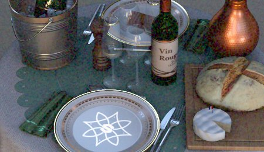

# Grana pellicola

Aggiunge all’immagine un pattern di disturbo della grana pellicola, simulando la texture organica della pellicola fotografica analogica.

| <b>Parametro</b> | <b>Descrizione</b> |
| --- | --- |
|  |  |
| --- | --- |
| <b>Importo</b> | Controlla la visibilità e l’intensità della granulosità. Più alti sono i valori, maggiore sarà il disturbo visibile. |
| <b>Raggio</b> | Imposta la dimensione delle singole particelle di granulosità in pixel. Con valori più bassi si ottiene una granulosità più fine e più sottile, mentre con valori più alti si ottiene una texture più grossolana e visibile. |
| <b>Tipo</b> | Consente di selezionare il disturbo monocromatico o colorato. |

>[!NOTE]
>
> Il disturbo generato da questo effetto viene rigenerato ogni volta che la finestra della vista viene aggiornata. Questo è il motivo per cui quando vengono generate le ombre o quando si ruota la fotocamera, il disturbo può aggiornarsi.
