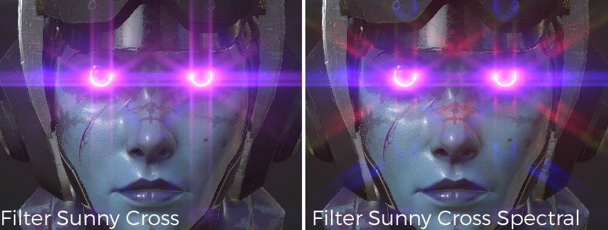

# Riflesso

Descrizione dei parametri :

| Impostazione | Descrizione |
| --- | --- |
| **Luminanza** | Questa è la luminosità complessiva dell’effetto riflesso. Impostando questo valore su 0,0, l’effetto viene completamente disattivato.  I valori realistici sono compresi nell’intervallo tra circa 0,5 e 4,0, fino a un massimo di circa 16,0. |
| **Soglia** | Vengono estratti solo i pixel più luminosi della soglia per generare il riflesso.  Per risultati dall’aspetto naturale, si consigliano valori compresi tra 0,0 e 1,0. |
| **Remap** **Fattore** | Specificando un valore diverso da 1,0, il componente di alta luminanza estratto viene ulteriormente espanso (o compresso) in modo non lineare. Se il valore supera 1,0, il riflesso diventa più forte per i pixel luminosi.  Utilizzatelo quando regolate la mappatura della luminanza del bagliore isolatamente, senza influire sugli altri effetti. La luminanza dopo la passata luminosa aumenta in una curva morbida, con valori di luminanza pari a 1,0 prossimi a **Fattore remapping** e maggiori di 1,0 prossimi (**Remap** **Fattore** ^2). |
| **Forma** | La forma definisce l&#39;aspetto del riflesso, sono disponibili diversi modelli:<ul data-preserve-html="true"><li data-preserve-html="true"><strong>Bloom</strong>: solo effetto fioritura.</li><li data-preserve-html="true"><strong>Riflesso obiettivo:</strong> Bloom / ghosts(riflesso obiettivo) / afterimage.</li><li data-preserve-html="true"><strong>Standard:</strong> Tipo che include un buon equilibrio di tutti gli elementi di base.</li><li data-preserve-html="true"><strong>Obiettivo economico:</strong> Effetti fantasma acuti e altre rappresentazioni di un obiettivo economico. </li><li data-preserve-html="true"><strong>Immagine dopo:</strong> digitate con una postimmagine molto forte. </li><li data-preserve-html="true"><strong>Filtro schermo incrociato:</strong> obiettivo con generatore di filtro a stella a forma di croce collegato.</li><li data-preserve-html="true"><strong>Filtro spettrale cross-screen</strong>: obiettivo con generatore di filtro a stella a forma di croce a forte spettro.</li><li data-preserve-html="true"><strong>Filtro Snow Cross</strong>: obiettivo con generatore di filtro a stella in sei direzioni.</li><li data-preserve-html="true"><strong>Filtro Snow Cross Spectral</strong>: obiettivo con generatore di filtro a stella con spettro forte in sei direzioni.</li><li data-preserve-html="true"><strong>Filtro Sunny Cross</strong>: obiettivo con generatore di filtro a stella in otto direzioni.</li><li data-preserve-html="true"><strong>Filtro Sunny Cross Spectral</strong>: obiettivo con generatore di filtro a stella con spettro forte in otto direzioni.</li><li data-preserve-html="true"><strong>Flusso orizzontale</strong>: questo tipo di riflesso dell&#39;obiettivo produce striature orizzontali forti.</li><li data-preserve-html="true"><strong>Striscia verticale</strong>: tipo con striature a stella forte in direzione verticale. Smears per fotocamera digitale CCD, ecc.</li></ul> |

## Esempi di forme

