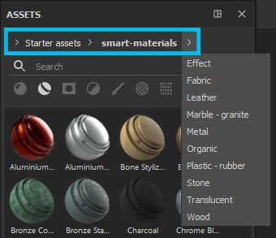
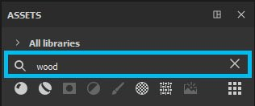

# Navigazione

Nella finestra Risorse sono disponibili diversi metodi di navigazione: navigazione, campo di ricerca e icona dei tipi di risorsa. Tutti i tipi di spostamento sono codipendenti, pertanto è possibile combinare tali ricerche a proprio vantaggio.\
Ad esempio, se avete selezionato Materiali nelle icone dei tipi di risorse, ma avete utilizzato gli indicatori di percorso per passare alla cartella Maschere avanzate, il pannello Risorsa non mostrerà alcun risultato: dovrete tornare a Tutte le librerie se desiderate visualizzare Materiali o deselezionare Materiali se desiderate sfogliare le Maschere avanzate.

## Breadcrumbs

I Breadcrumbs consentono di spostarsi rapidamente all&#39;interno della libreria. Facendo clic sulle frecce viene visualizzato il modo in cui le risorse sono memorizzate sul disco e potete selezionare una delle posizioni visualizzate. Se è disattivato, significa che non ci sono risorse del tipo selezionato all&#39;interno di quella cartella, ma puoi comunque passare a quella posizione.

## Campo di ricerca

Il campo di ricerca può essere utilizzato per filtrare le risorse che contengono la query digitata. Si noti che la ricerca non viene eseguita solo in base al titolo delle risorse, ma anche in base alla loro posizione e a qualsiasi tag contenuto nella risorsa.\
Le ricerche digitate possono inoltre essere più avanzate delle semplici parole chiave. Vedere [Query di ricerca avanzate](advanced-search-queries.md).

## Tipi di risorse

>[!NOTE]
>
> Le icone dei tipi di risorse possono essere selezionate più volte mantenendo **Ctrl** quando si fa clic.

La selezione predefinita è Materiali, ma facendo clic sulle icone di altri tipi di risorse vengono visualizzati altri tipi di risorse.

| Tipi di risorse | Descrizione |
| --- | --- |
| Materiali 

 | Contiene .sbsar importato come *materiale base* e materiali creati da un livello di riempimento (per ulteriori informazioni sulla creazione del predefinito, consulta [qui](https://helpx.adobe.com/it/substance-3d/unlisted/documentation/spdoc/creating-and-saving-a-preset-180191514.html)). Si tratta di materiali di base che possono essere utilizzati nei livelli di riempimento e che verranno applicati all’intera superficie della trama o del set di texture. |
| Materiali avanzati 

 | Contengono materiali più complessi costituiti da più livelli salvati all’interno di una cartella (anche i materiali avanzati sono predefiniti che potete creare voi stessi).Come i materiali di base, i materiali avanzati si applicheranno a tutta la trama/insieme di texture, ma tengono anche conto delle informazioni individuali della trama, come la curvatura, l’Occlusione o qualsiasi altro dettaglio della superficie. Per ottenere questi dettagli di superficie e utilizzare correttamente i materiali avanzati, la trama deve prima essere [cotta](../../baking/baking.md). |
| Maschere intelligenti 

 | Contengono maschere più complesse che utilizzano più effetti di livello e/o generatori. Potete [creare](https://helpx.adobe.com/it/substance-3d/unlisted/documentation/spdoc/managing-assets-217187091.html) predefiniti maschere avanzate.Analogamente ai materiali avanzati, le maschere intelligenti richiedono informazioni al forno dalla trama per funzionare correttamente. |
| Filtri 

 | Contiene file .sbsar importati come *filtro*.I filtri sono effetti che prendono la texture già presente e la trasformano in qualche modo. Alcuni filtri funzionano solo con informazioni in bianco e nero, altri solo con input di materiale, il che significa che non tutti i filtri possono essere utilizzati nelle maschere. |
| Pennelli 

 | Contiene pennelli, particelle e strumenti. Tutti i predefiniti che possono essere [creati](https://helpx.adobe.com/it/substance-3d/unlisted/documentation/spdoc/managing-assets-217187091.html) in Painter.**I pennelli** sono predefiniti di base in bianco e nero che utilizzano un canale alfa. Potete usare i pennelli per colorare in uno o tutti i canali o in una maschera.Le **particelle** hanno le stesse caratteristiche dei pennelli, ma hanno anche un set aggiuntivo di parametri che simulano l&#39;interazione fisica con la trama. Possono produrre gli effetti di fuoriuscite, gocce, pioggia o qualsiasi altro effetto che richieda una simulazione fisica.**Gli strumenti** possono contenere il comportamento Pennello e/o Particella, ma questo predefinito viene salvato anche con le informazioni sui canali dei materiali. |
| Alfa 

 | Contengono diversi tipi di alfa e diversi strumenti per la creazione di pennelli che consentono di [creare](https://helpx.adobe.com/it/substance-3d/unlisted/documentation/spdoc/managing-assets-217187091.html) pennelli con effetti più elaborati (come Photoshop, tratti dinamici o rulli di vernice). Gli Alpha sono immagini in scala di grigio in cui le parti nere appaiono trasparenti quando vengono utilizzate. |
| Texture 

 | Contengono grunge, procedure, mappe con baking, normali di superficie dura e LUT.**Le grunge** sono immagini in scala di grigio con disturbi e texture interessanti. Possono essere utilizzati per aggiungere variazioni alla superficie della trama, tramite maschera o collegandoli direttamente in un canale.**Procedurali** sono anche texture in scala di grigio che comprendono rumori o anche pattern regolari. A differenza di alcuni grunge statici, tuttavia, le routine sono bitmap dinamiche che possono essere ridimensionate senza ripetizioni e hanno infinite variazioni (tramite seme casuale).**Le Mappe con baking** rappresentano le informazioni sulla superficie e sulla forma estratte dalla trama. Per ulteriori informazioni sulla cottura al forno, consultate qui.**Normali di superficie dura** sono dettagli che potete applicare direttamente sulla trama utilizzando il canale Normale.**Le LUT** (tabelle di riferimento) sono texture di profili di colore che possono essere utilizzate nelle Impostazioni di visualizzazione per simulare il comportamento di un profilo di colore nella finestra della vista. Ulteriori informazioni sui profili colore [sono disponibili qui](../../features/post-processing/color-profile.md). |
| Mappe dell&#39;ambiente 

 | Contengono immagini importate come *ambiente* (più comunemente .hdr o .exr). Le mappe ambiente sono immagini di sfondo che generano automaticamente una configurazione dell&#39;illuminazione. È possibile utilizzare una mappa dell&#39;ambiente trascinandola direttamente nella finestra della vista o passando a Impostazioni schermo. |
