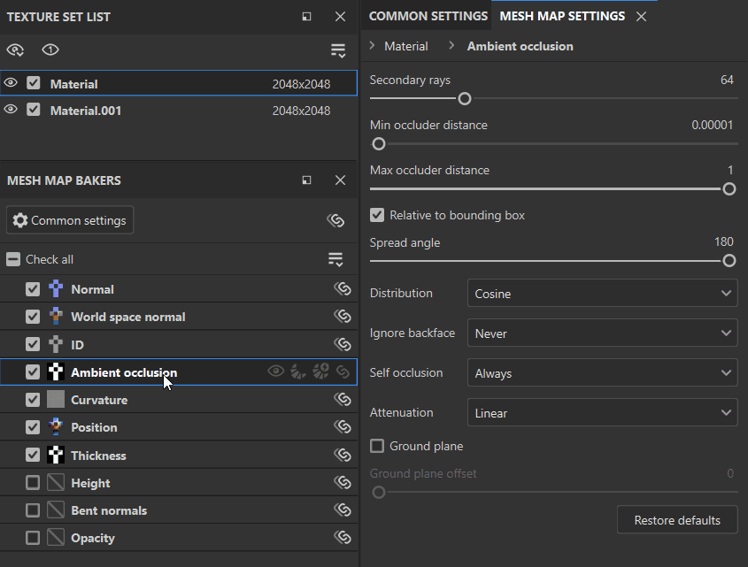

# Pannello baker mappa trama

<table>
  <tr style="border: 0;">
    <td style="border: 0;" valign="top"></td>
    <td style="border: 0;" valign="top">Il pannello <strong>baker mappe trama</strong> consente di selezionare le mappe da eseguire i baking e di accedere alle impostazioni per ogni tipo di mappa.</td>
  </tr>
</table>

## Controlli per mappa

Ogni mappa nell&#39;elenco delle mappe mesh ha una serie di controlli disponibili:

1. **Selezionare** o **deselezionare** in eseguita i baking della mappa.
1. **Visualizza** la mappa nella finestra della vista.
1. **esegue i baking rapida** solo questa mappa.
1. Attiva **Auto-rebake** per la mappa mesh selezionata. Le mappe **con rebaking automatico** verranno automaticamente ripristinate quando vengono apportate modifiche ai parametri di esegue i baking o alla correzione dell&#39;inclinazione.
1. **Sincronizzare** le impostazioni per questo tipo di mappa tra set di texture. Disattiva questa opzione per personalizzare le impostazioni di esegue i baking per le singole mappe.

## Gestire le impostazioni della mappa trama

Esistono diversi modi per gestire il progetto in modo che le impostazioni di esegue i baking siano condivise tra mappe di trama o set di texture. Per i progetti complessi, comprendere come condividere le impostazioni può aiutare a semplificare il processo di esegue i baking.

Esistono due tipi di impostazioni che potete condividere tra set di texture:

* Eseguire i baking le impostazioni: questi sono i parametri che è possibile modificare nei **Impostazioni comuni** e nei **pannelli delle impostazioni della mappa trama**.
* Controlla stato: utilizzate queste opzioni per attivare o disattivare la esegue i baking di mappe trama specifiche.

### Sincronizzare le impostazioni di esegue i baking tra set di texture

Quando il progetto contiene più set di texture, le opzioni per la sincronizzazione tra i set di texture verranno visualizzate nel **pannello baker di mappe trama**.

Selezionando il **pulsante Sincronizza impostazioni** nella parte superiore del **pannello baker mappa trama** si apre la **finestra di sincronizzazione delle impostazioni comuni**.

In questa finestra potete selezionare i set di texture su cui sincronizzare le impostazioni più comuni. Con tutti i set di texture selezionati, la modifica delle impostazioni comuni di qualsiasi set di texture li cambierà per tutti gli altri set di texture.

Allo stesso modo, se usate il **pulsante Sincronizza impostazioni** accanto a una singola mappa trama, potrete selezionare set di texture per condividere le impostazioni specifiche della mappa trama.

#### Condivisione delle impostazioni tra set di texture non sincronizzate

A volte può essere utile mantenere le mappe di trama non sincronizzate tra set di texture, ma si desidera comunque copiare le impostazioni di esegue i baking da un set di texture a un altro.

Per copiare le impostazioni comuni in set di texture specifici senza sincronizzarle, selezionate **Sincronizza tutte le impostazioni con altri set di texture...** dal menu a discesa **baker di mappe trama**.

Potete anche usare **Sincronizza tutte le impostazioni con tutti i set di texture** per copiare le impostazioni in tutti i set di texture del progetto.

In alternativa, se desiderate copiare le impostazioni per una singola mappa trama in set di texture specifici:

1. Fare clic con il pulsante destro del mouse sulla mappa della trama.
1. Seleziona **Applica impostazioni &lt;mappa trama> a più set di texture...**

*Nell&#39;esempio precedente, ogni set di texture inizia con impostazioni diverse per AO. Senza impostare la mappa della trama AO da sincronizzare, utilizziamo **Applicare le impostazioni di occlusione ambientale a più set di texture...**in modo da poter iniziare a modificare le impostazioni AO per il nuovo set di texture dalla stessa linea di base.*

### Gestire lo stato di controllo per le mappe trama

L&#39;opzione Controlla stato determina se una determinata mappa viene inclusa quando eseguite i baking mappe trama. Esistono molti modi per gestire lo stato di controllo per il set di texture corrente:

* Seleziona o deseleziona le singole mappe.
* Utilizza **Seleziona tutto** o **Deseleziona tutto** per controllare o deselezionare tutte le mappe mesh.
* Utilizza **Inverti mappe trama controllate** dal menu a discesa **baker di mappe trama** per cambiare lo stato di controllo di tutte le mappe.

>[!TIP]
>
> È possibile fare clic e trascinare da una casella di controllo per selezionare o deselezionare rapidamente più mappe (vedere l&#39;animazione sopra riportata).

*Nell&#39;esempio precedente, utilizziamo **Inverti mappe trama verificate**per cambiare rapidamente la selezione e quindi eseguire il baking delle mappe trama che non sono ancora state elaborate.*

Quando lavorate con più set di texture, potete anche copiare lo stato selezionato delle mappe in altri set di texture selezionando **Applica selezionato a più set di texture...** oppure copiare lo stato selezionato in tutti i set di texture con **Applica selezionato a tutti i set di texture**.

*Nell&#39;esempio precedente, non è stato ancora eseguito i baking il Height, la normali incurvate o l&#39;opacità nel set di texture **Material.001**. Abbiamo già selezionato queste mappe trama nel set di texture **Materiale**, quindi utilizziamo **Applica controllato a più set di texture...**e selezioniamo **Materiale.001**per copiare lo stato selezionato. Quindi eseguiamo i baking le mappe. Si noti che la visualizzazione passa in sequenza attraverso le mappe di trama due volte quanto le mappe vengono eseguite i baking: questo perché vengono eseguite i baking per entrambi i set di texture.*