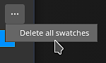

# Selettore colore

Il selettore colore consente di impostare un colore da colorare o proiettare sulla trama. Può essere utilizzato per scegliere i colori da immagini esterne o per regolarne una esistente all&#39;interno dell&#39;applicazione.

La finestra del selettore colore viene visualizzata quando si fa clic su un campo colore in Painter, disponibile in Proprietà o in altre impostazioni o menu aggiuntivi, come i parametri Schermo o Shader.

## Panoramica del selettore colore

Una volta aperto, il selettore colore è semi-persistente, il che significa che rimarrà aperto fino a quando non cambierà contesto, ad esempio quando si passa da un livello di pittura a un livello di riempimento. È possibile spostare la finestra e collocarla su uno degli schermi disponibili. Tuttavia, a differenza di altre finestre, il selettore colore non può essere ancorato.

La finestra ha un layout verticale ed è composta da tre sezioni:

* Selettore sfumatura (o spettro)
* Cursori (RGB/HSV)
* Campioni

{width="200px"}

### Selettore sfumatura (spettro)

| Nome e visuale | Descrizione |
| --- | --- |
| **Selettore visualizzazione** 

 | Consente di scegliere quale visualizzazione utilizzare per modificare i colori (spettro e cursori). Il valore predefinito corrisponde alla visualizzazione utilizzata dalla finestra principale.  **Nota:** questa impostazione è disponibile solo quando è abilitata la [gestione colore](../features/color-management/color-management.md). |
| **Spettro** 

 | Il cursore verticale è la tonalità generale. Consente di selezionare la tonalità di colore da visualizzare all’interno del campo sfumatura.Una volta selezionata la tonalità generale, è possibile tenere premuto e trascinare il cursore a croce nel campo sfumatura per selezionare il colore desiderato.  **Nota:** quando è abilitata la [gestione colore](../features/color-management/color-management.md), i colori HDR dello schermo corrente verranno bloccati (nello spazio cromatico di lavoro). In questo modo si evita di generare un valore HDR nei canali con gestione del colore. |
| **Colore corrente e precedente** 

 | Il rettangolo sinistro indica il colore finale che verrà generato dal selettore colore.Il rettangolo destro mostra il colore precedente (quando il selettore colore è stato aperto). È possibile fare clic su di esso per ripristinare il colore precedente e renderlo quello corrente. |
| **Campo esadecimale** 

 | I campi esadecimali rappresentano il colore corrente come valori esadecimali. I componenti RGB sono rappresentati da una coppia di lettere.Ad esempio, #FF0000 il rosso.  **Nota:** quando è abilitata la [gestione colore](../features/color-management/color-management.md), il campo esadecimale funziona sempre nello spazio cromatico sRGB standard per semplificare la copia/incolla dei valori tra i software, indipendentemente dallo spazio di visualizzazione o di lavoro corrente utilizzato dal progetto. |
| **Contagocce** 

 | Il contagocce può essere utilizzato per selezionare un colore da una sorgente esterna. Per utilizzarlo, **fai clic** sull&#39;icona, quindi sposta il mouse e copia di nuovo il colore desiderato.  **Nota:** quando si seleziona un colore all&#39;interno della finestra della vista, è possibile utilizzare il modificatore **Maiusc** per selezionare il canale corrente modificato direttamente. In questo modo si evita di effettuare conversioni di colore con perdita tra la texture originale e il colore visualizzato sullo schermo. Questa funzione è utile anche per selezionare i colori senza dover passare dalla modalità di visualizzazione **Materiale**. 

  **Nota:** i campi a colori dispongono anche di un contagocce e possono essere utilizzati per selezionare rapidamente i colori senza dover aprire il selettore colore. 

  **Nota:** nel sistema operativo Mac, il contagocce potrebbe non essere in grado di selezionare i colori al di fuori dell&#39;interfaccia dell&#39;applicazione a causa delle impostazioni di privacy. Per risolvere il problema, assegnare i diritti appropriati all&#39;applicazione in: `System Preferences > Security & Privacy > Privacy > Screen Recording` |

### Impostazioni del colore

| Impostazione | Descrizione |
| --- | --- |
| **Spazio cromatico contagocce** | Specificate lo spazio cromatico per il colore selezionato all’esterno della finestra della vista.L&#39;impostazione **auto** utilizza lo spazio colore sRGB standard delle impostazioni del progetto. 

 **Nota:** questa impostazione si applica anche ai contagocce accanto ai pulsanti colore.  **Nota:** anche i colori selezionati nella finestra della vista utilizzano questo profilo quando non si utilizza il modificatore Maiusc. |

### Cursori

I cursori del colore consentono di regolare manualmente i singoli valori.

I cursori possono essere impostati in due modalità diverse, **HSV** o **RGB**. Per cambiare modalità, utilizza il menu a discesa dedicato.

#### HSV

**HSV** sta per **H** ue, **S** aturazione e **V** valore.

**Tonalità** consente di scorrere le famiglie di colori globali, in modo molto simile al cursore sfumatura verticale.

**Saturazione** controlla l&#39;intensità del colore selezionato e va dalla scala di grigi alla saturazione completa.

**Il valore** determina quanto è scuro o chiaro un colore e varia dal nero al bianco.

#### RGB

**RGB** è l&#39;acronimo di **R** ed, **G** reen e **B** lue.

Si tratta dei componenti principali utilizzati digitalmente per memorizzare i colori nella computergrafica. Ogni cursore rappresenta la quantità di componente presente nel colore finale.

Esempio: l’immagine seguente ha un colore che contiene il 100% di rosso, ma il 50% di blu e verde.

È più comune che i cursori dei RGB vengano misurati con valori compresi tra 0 e 255. Questa operazione può essere eseguita disabilitando l&#39;opzione **Valori a virgola mobile**.

### Impostazioni cursori

Il menu delle impostazioni consente di configurare alcuni comportamenti aggiuntivi:

| Impostazione | Descrizione |
| --- | --- |
| **Cursori dinamici** | Se questa opzione è attivata, il colore di sfondo dei cursori verrà regolato in base al colore corrente. |
| **Valori a virgola mobile** | Se questa opzione è attivata, i valori dei cursori sono rappresentati da 0,0 a 1,0. Se è disattivata:<ul data-preserve-html="true"> <li data-preserve-html="true"><strong>HSV</strong>: il cursore della tonalità viene misurato in gradi (come una ruota dei colori). Saturazione e valore usano percentuali. </li> <li data-preserve-html="true"><strong>RGB</strong>: i componenti sono rappresentati come un valore compreso tra 0 e 255.</li> </ul> |

## Spazio cromatico di lavoro

Questa sezione mostra il valore del colore finale dato lo spazio cromatico di lavoro corrente.

Passando il cursore del mouse sul titolo **Spazio colore di lavoro** è possibile visualizzare il nome dello spazio colore corrente.

>[!NOTE]
>
> Questa sezione è disponibile solo quando è abilitata la [gestione colore](../features/color-management/color-management.md).

## Campioni

I campioni colore offrono un modo per salvare i colori in modo che possano essere riutilizzati in un secondo momento. I campioni sono disponibili per proiezioni e sessioni diverse.

### Aggiungi campione

Facendo clic su questo pulsante si crea un nuovo colore campione nel set corrente.

Il colore campione viene creato solo se l’ultimo colore (quello accanto al pulsante) è diverso dal colore attualmente modificato.

>[!NOTE]
>
> I colori campione vengono gestiti e salvati come colori sRGB, indipendentemente dall&#39;impostazione della configurazione corrente di [gestione colore](../features/color-management/color-management.md).

### Colore campione

Fate clic su un colore campione per caricarlo.

Passando il cursore del mouse sul campione, viene visualizzato il valore esadecimale.

>[!NOTE]
>
> Quando è attivata la [gestione colore](../features/color-management/color-management.md), la visualizzazione dei colori viene regolata in base allo schermo attualmente selezionato.

### Impostazioni campione

Fate clic con il pulsante destro del mouse su un colore campione per aprire il menu ed eliminarlo.

### Menu Impostazioni

Usate il menu delle impostazioni per eliminare tutti i campioni.

>[!NOTE]
>
> I campioni vengono salvati in un file di configurazione disponibile nella cartella dei documenti dell&#39;utente. Per ulteriori informazioni, consulta la pagina relativa alla [posizione dello scaffale e delle risorse](../pipeline-and-integration/resource-management/shelf-and-assets-location.md).
