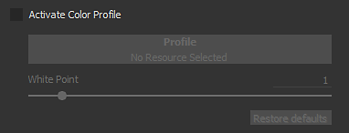

# Impostazioni della videocamera

Questa sezione delle **Impostazioni schermo** controlla il comportamento della videocamera e l&#39;aspetto finale della finestra della vista.

## Fotocamera

| *Impostazione* | *Descrizione* |
| --- | --- |
| **Campo di visualizzazione** | Consente di controllare il campo di visualizzazione della videocamera (in gradi) |
| **Distanza focale** | Definisce la distanza alla quale si trova il punto focale.  Questo punto viene utilizzato dall’effetto Profondità campo. 

 **Nota:** la distanza focale può essere impostata automaticamente facendo clic su un punto della trama con la scelta rapida **CTRL + pulsante centrale del mouse** |
| **Apertura** | Definisce l’ampiezza della Profondità di Campo. 

 **Nota:** se Iray controlla questo parametro, modificandolo verrà riattivato un calcolo. |

## Effetti post

Per ulteriori informazioni, consulta la [pagina post-effetto](../../features/post-processing/post-processing.md).

## Anti-alias temporale

Se abilitato, l&#39;**Anti-alias temporale** (**TAA**) rimuoverà i bordi scalettati nella finestra della vista.\
**Il TAA** funziona accumulando informazioni su più fotogrammi di rendering. Questo significa che l&#39;effetto è disabilitato fino a quando la videocamera non smette di muoversi o non viene eseguita un&#39;altra operazione.

| *Impostazione* | *Descrizione* |
| --- | --- |
| **Accumulazioni** | Definisce quanti fotogrammi verranno accumulati per ridurre l’effetto di aliasing.<ul data-preserve-html="true"> <li data-preserve-html="true">16: valore consigliato per la maggior parte dei casi</li> <li data-preserve-html="true">64: utile per eliminare i valori di contrasto elevato (come l’Alpha Test shader e dithering combinati)</li> </ul>  **Nota:** questa impostazione non ha alcun impatto sulle prestazioni; tuttavia, un valore elevato potrebbe richiedere più tempo per produrre risultati soddisfacenti. |

{width="500px"}

L&#39;antialiasing può essere utilizzato anche per filtrare lo shader **Alpha-Test** se l&#39;impostazione &quot;**Dithering alfa**&quot; è abilitata:

{width="500px"}

## Dispersione sotto la superficie

Per ulteriori informazioni, vedere la pagina [Dispersione sottosuperficie](../../features/subsurface-scattering/subsurface-scattering.md).

## Profilo colore

Per ulteriori informazioni, vedere la [pagina Profilo colore](../../features/post-processing/color-profile.md).

## Mappatura toni

| Impostazione | Descrizione |
| --- | --- |
| **Funzione** | Consente di specificare la funzione utilizzata per adattare i valori di colore che superano le capacità di visualizzazione del monitor (modifica dei valori HDR in un intervallo LDR).I valori possibili sono:<ul data-preserve-html="true"><li data-preserve-html="true"><strong>Lineare</strong> (impostazione predefinita): nessuna trasformazione. I valori superiori a 1,0 sono bloccati.</li><li data-preserve-html="true"><strong>ACE</strong>: utilizzate la curva di mappatura dei toni cinematografici di ACES.</li></ul> 

 **Nota:** alcuni motori di gioco e software di rendering utilizzano la mappatura toni ACES. L’attivazione di questa funzione consente di far corrispondere i colori tra le applicazioni ed evitare differenze. |
