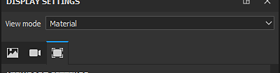

# Impostazioni di visualizzazione

{width="320px"}

Nella finestra **Impostazioni schermo** sono raggruppate le impostazioni dell&#39;ambiente, della fotocamera e della finestra della vista. Queste impostazioni sono globali per il progetto e possono influire sull&#39;aspetto della finestra della vista.

## Modalità di visualizzazione

La modalità di visualizzazione consente di controllare l&#39;aspetto della finestra della vista. Il menu a discesa è diviso in tre sezioni:

| Sezione | Descrizione |
| --- | --- |
| **Illuminazione** | Visualizza il modello 3D nella finestra della vista con l’illuminazione completa, comprese le ombre se attivate. |
| **Canale singolo** | Chiamata anche modalità Solo. Visualizzate la trama nella finestra della vista solo con un canale o una texture specifica senza illuminazione. |
| **Mappe trama** | Visualizzate la trama nella finestra della vista solo con una texture cotta specifica senza illuminazione. |

>[!NOTE]
>
> È inoltre possibile modificare la modalità di visualizzazione utilizzando il <b>menu a discesa</b> disponibile negli angoli delle [finestre](../../interface/viewport/viewport.md). Sono disponibili anche [scelte rapide](../settings/shortcuts.md) per passare rapidamente da un canale all&#39;altro, da mappe a trama all&#39;altra e persino per tornare alla modalità materiale.

## Sezioni Impostazioni di visualizzazione

Per maggiori dettagli su ciascuna sezione, vedere la pagina dedicata:

* [Impostazioni ambiente](environment-settings.md)
* [Impostazioni della videocamera](camera-settings.md)
* [Impostazioni dell&#39;area di visualizzazione](viewport-settings.md)
