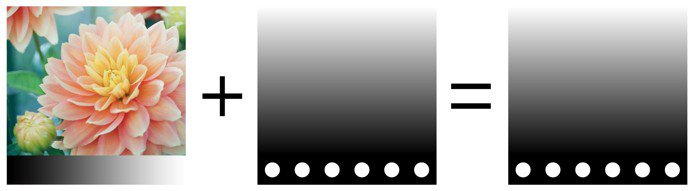
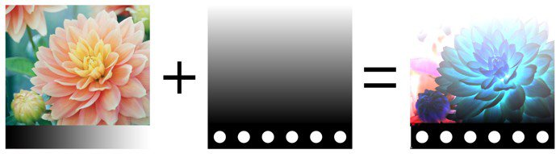
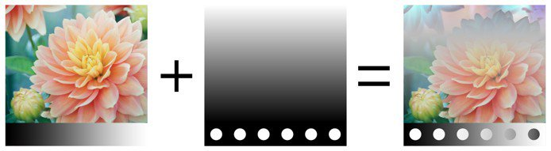
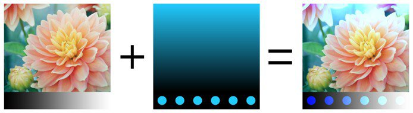

# Metodi fusione

I livelli e gli effetti hanno accesso a molti **metodi di fusione**. Consentono di miscelare il risultato di un livello con gli altri livelli sottostanti in modi diversi.

Non tutti i metodi di fusione sono adatti a tutti i casi d’uso. I metodi di fusione **Mappa normale**, ad esempio, sono utili solo per il **canale normale** in un set di texture.

## Ordine metodo di fusione

Per capire come e quando viene applicato un metodo di fusione, è importante capire l&#39;ordine in cui vengono eseguite le operazioni nella **Pila livelli**:

1. Viene calcolato il livello in basso.
1. Il livello in alto viene calcolato e miscelato con il livello sottostante in base al metodo di fusione (esempio: Moltiplica).
1. La maschera viene applicata per dare l&#39;aspetto finale al livello Superiore.

## Modifica Del Metodo Di Fusione

Il metodo di fusione può essere modificato per **ogni canale** in un livello. Per passare da un canale all’altro, usa il menu a discesa in alto a sinistra disponibile nella finestra Pila livelli.

Per cambiare il metodo di fusione è sufficiente fare clic sul menu a discesa Metodo di fusione su un livello specifico:

>[!NOTE]
>
> Se il menu a discesa è attivo, è possibile passare rapidamente da un metodo di fusione all’altro con le seguenti scelte rapide:
> 
> * Scelte rapide da tastiera Freccia su o Freccia giù
> * Rotellina del mouse in alto o in basso

## Elenco dei metodi di fusione

Di seguito è riportato l’elenco di tutti i metodi di fusione disponibili nei livelli e negli effetti di Substance 3D Painter. La maggior parte dei metodi di fusione funziona tramite operazioni in RGB (o in scala di grigio), ma alcune operazioni vengono eseguite anche tramite una modalità diversa, ovvero [HSV (Tonalità, Saturazione, Valore)](https://en.wikipedia.org/wiki/HSL_and_HSV). Tutti i metodi di fusione vengono eseguiti internamente in **spazio gamma lineare**.

| *Nome* | *Descrizione* |
| --- | --- |
| Normale | Visualizza il livello Superiore sul livello Inferiore senza trasformazione (modalità di copia). Se il livello Superiore ha una trasparenza (alfa), il livello Inferiore viene visualizzato attraverso i pixel trasparenti. 

 |
| Passthrough | Appiattisce il livello Inferiore al livello Superiore. Soprattutto utile nei seguenti casi:<ul data-preserve-html="true"> <li data-preserve-html="true">Per applicare un effetto a tutti i livelli sottostanti il livello Superiore</li> <li data-preserve-html="true">Per sfumare o Clona /Clone i livelli sotto il livello superiore</li> </ul> 

 **Nota:** gli **effetti** possono essere **trascinati** direttamente nella Pila livelli. In questo modo verrà creato un livello con il metodo di fusione impostato su Passthrough per tutti i relativi canali. |
| Disabilita | Elimina la fusione del livello, visualizzando solo i livelli precedenti. Può essere utilizzato per ottimizzare il calcolo di un canale ignorandolo nel livello Superiore. 

 |
| Sostituisci | Sovrascrive il livello Inferiore. Questa funzione è utile, ad esempio, per evitare di fondere le informazioni con i livelli sottostanti. Sostituisci funziona in modo diverso dalla fusione Normale perché ignora anche l&#39;alfa presente nel livello Superiore, che potrebbe risultare in pixel Trasparenti. 

 |
|  |  |
| Moltiplica | Moltiplica il livello Superiore sul livello Inferiore. Il risultato sarà sempre un colore più scuro. 

 |
| Dividi | Divide i livelli sottostanti per le informazioni sul colore del livello corrente. L’immagine risultante è spesso più chiara e a volte può apparire sovraesposta. 

 |
| Divisione inversa | Identico al metodo di fusione Dividi, ma i livelli Superiore e Inferiore vengono scambiati durante l’operazione di fusione. 

 |
| Scurisci (min) | Mantiene il valore del colore minimo tra il livello Superiore e il livello Inferiore. 

 |
| Schiarisci (max) | Mantiene il valore massimo del colore tra il livello Superiore e il livello Inferiore. 

 |
|  |  |
| Scherma lineare (Aggiungi) | Aggiunge il valore del colore del livello Superiore al livello Inferiore. Il risultato può dare colori inferiori a 0 o superiori a 1, nel qual caso il risultato verrà bloccato/ritagliato se il canale non è HDR. Questo metodo di fusione è utile ad esempio per accumulare informazioni sul height. 

 |
| Sottrai | Sottrae il colore del livello superiore dal livello inferiore. Il risultato può dare colori inferiori a 0, nel qual caso il risultato verrà bloccato/ritagliato se il canale non è HDR. 

 |
| Sottrai inverso | Identico al metodo di fusione Sottrai, ma i livelli Superiore e Inferiore vengono scambiati durante l’operazione di fusione. 

 |
| Differenza | Sottrae il colore del livello superiore dal livello inferiore, ma accetta il valore assoluto del risultato (i valori negativi diventeranno positivi). 

 |
| Esclusione | Simile al metodo di fusione Differenza, ma produce un risultato con un contrasto inferiore. 

 |
| Aggiunta firmata (AddSub) | Entrambi aggiungono e sottraggono le informazioni sul colore dal livello inferiore in base ai colori del livello superiore. I valori della scala di grigi non hanno effetto, mentre i colori più scuri sottraggono informazioni e quelli più chiari aggiungono informazioni. 

 |
|  |  |
| Sovrapposizione | Combinate i metodi di fusione Schermo e Moltiplica. I valori in scala di grigio nel livello Superiore non avranno effetto, ma i colori scuri moltiplicheranno i colori, mentre i colori chiari schiariranno i colori. 

 |
| Schermo | Le informazioni sui colori dei livelli Superiore e Inferiore vengono invertite, quindi moltiplicate l’una per l’altra; questo risultato viene invertito di nuovo. In questo modo si ottiene un risultato visivo opposto al metodo di fusione Moltiplica e si ottiene un’immagine più luminosa. 

 |
| Brucia lineare | Aggiunge le informazioni sul colore dei livelli Superiore e Inferiore e quindi sottrae 1 dal risultato. 

 |
| Colore brucia | Divide il livello Inferiore per il livello Superiore. Il livello Inferiore viene invertito prima dell’esecuzione dell’operazione. Questa operazione di fusione scurisce il livello Superiore e ne aumenta il contrasto per mostrare i colori del livello Inferiore. Più è scuro il livello inferiore, più ne viene usato il colore. 

 |
| Colore scherma | Divide il livello inferiore per il livello superiore invertito. Questa operazione schiarisce il livello Inferiore a seconda del valore del livello Superiore. Più è luminoso il livello Superiore, più i suoi colori influiscono sul livello Inferiore. 

 |
|  |  |
| Luce soffusa | Simile al metodo di fusione Sovrapponi, ma applicato con una curva diversa per fondere le informazioni sul colore e ottenere un’immagine con contrasto inferiore. 

 |
| Luce intensa | Simile al Metodo fusione sovrapposizione (combina le operazioni Moltiplica e Schermo). La differenza è che l’ordine delle operazioni viene invertito, il che si traduce in un’immagine con colori più scuri o più chiari ma con meno contrasto. 

 |
| Luce vivida | Combina i metodi di fusione Colore scherma e Colore brucia. Lo scordino viene applicato ai colori più chiari del grigio e la masterizzazione viene applicata ai colori più scuri del grigio. I valori dei grigi non vengono modificati. Il risultato è un’immagine con maggiore contrasto. 

 |
| Luce lineare | Combina Scherma lineare e Brucia lineare. Lo scordino viene applicato ai colori più chiari del grigio e la masterizzazione viene applicata ai colori più scuri del grigio. I valori dei grigi non vengono modificati. Il risultato è simile a Luce vivida ma con meno contrasto. 

 |
| Luce puntiforme | Schiarisce e scurisce le informazioni sui colori in base ai colori del livello Superiore. Se i colori scuri del livello Superiore sono più scuri dei colori del livello Inferiore, saranno visibili; in caso contrario, verranno eliminati. Lo stesso principio si applica ai colori brillanti. Questo metodo di fusione può produrre patch o macchie (disturbo grande) e rimuove completamente tutti i mezzitoni. 

 |
|  |  |
| Tinta | Esegue l&#39;operazione con il modello HSV. Mantiene solo la Tonalità del livello superiore e utilizza la Saturazione e il Valore del livello inferiore. I colori neri e molto scuri non hanno alcuna Tonalità, pertanto i colori del livello Inferiore rimarranno invariati. 

 |
| Saturazione | Esegue l&#39;operazione con il modello HSV. Mantiene solo la saturazione del livello superiore e usa i valori Tonalità e Valore del livello inferiore. I colori neri e molto scuri sono desaturi, quindi i colori del livello inferiore diventeranno valori in scala di grigio. 

 |
| Colora | Esegue l&#39;operazione con il modello HSV. Mantiene solo la tonalità e la saturazione del livello superiore e utilizza il valore del livello inferiore. I colori neri e molto scuri non hanno alcuna tonalità e sono desaturati, pertanto i colori del livello Inferiore diventeranno valori in scala di grigio. 

 |
| Valore | Esegue l&#39;operazione con il modello HSV. Mantiene solo il valore del livello superiore e utilizza la tonalità e la saturazione del livello inferiore. 

 |
|  |  |
| Combinazione mappa normale | Operazione di fusione sbianca. Mantenere i dettagli assicurandosi che le normali piatte funzionino correttamente. Per ulteriori informazioni, vedere [Mappa normale disegno](../../painting/advanced-channel-painting/normal-map-painting.md). 

 |
| Dettagli mappa normale | Operazione di fusione orientata ai dettagli (mappatura normale riorientata), più precisa della Combinazione mappa normale. Mantenere le mappe normali piatte e l&#39;intensità delle due sorgenti. Per fare in modo che il risultato del livello Superiore normale venga riorientato in modo da seguire la superficie del livello inferiore. Per ulteriori informazioni, vedere [Mappa normale disegno](../../painting/advanced-channel-painting/normal-map-painting.md). 

 |
| Dettaglio inverso mappa normale | Stesso comportamento dell’operazione di fusione dei Dettagli mappa normale; tuttavia, è il livello Inferiore che viene Trasforma per adattarsi alla superficie del livello Superiore. Per ulteriori informazioni, vedere [Mappa normale disegno](../../painting/advanced-channel-painting/normal-map-painting.md). 

 |

>>
