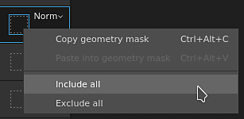
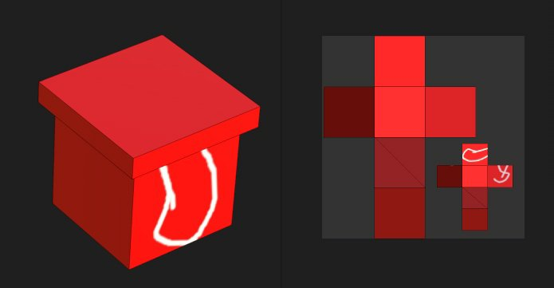

# Maschera Geometria

\
La maschera Geometria è una maschera secondaria sui livelli che consente di mascherare un livello in base alla geometria del modello 3D dell’insieme di texture associato. Può essere mascherata in base ai nomi delle trame o alle Porzioni UV.

## Panoramica

La maschera Geometria (Geometry) funziona specificando su quale parte del modello 3D deve essere applicato il livello tramite un elenco di inclusione/esclusione.

La maschera Geometria (Geometry) è uno strumento utile per eliminare rapidamente gran parte della geometria del modello 3D. Offre diversi vantaggi alla maschera pittura:

* In genere è più veloce da configurare e utilizzare con le modalità di selezione della finestra della vista.
* Offre prestazioni migliori in quanto la geometria può essere completamente eliminata durante la generazione delle texture.
* Non è distruttivo e verrà aggiornato quando il modello 3D viene modificato dopo una reimportazione.
* Consente di colorare la geometria che si trova sotto la geometria mascherata, consentendo di colorare le parti nascoste.
* Analogamente alla maschera pittura, la maschera di geometria può essere applicata a un gruppo per agire su più livelli contemporaneamente.

### Stati icona

L&#39;icona della maschera di geometria può indicare lo stato:

| Icona | Descrizione |
| --- | --- |
| 

 | Non è stata esclusa alcuna geometria, il livello viene applicato all&#39;intera trama dell&#39;insieme di texture associato. Si tratta dello stato predefinito di qualsiasi nuovo livello o cartella. |
| 

 | Uno o più nomi di mesh sono stati esclusi. Il numero indica la quantità di elementi rimanenti ancora interessati dal livello. |
| 

 | Una o più Porzioni UV sono state escluse. Il numero indica la quantità di elementi rimanenti ancora interessati dal livello. |
| 

 | Non sono inclusi i nomi delle trame, il livello non avrà alcun effetto effettivo. |

## Modifica della maschera Geometria

Per modificare la maschera Geometria di un determinato livello, fate clic sull’icona dedicata. Per uscire dalla modalità di modifica, fate clic su un’altra parte del livello come il contenuto o la maschera della pittura:

### Tipi di mascheratura

La maschera di geometria supporta due tipi di mascheratura:

| Tipo | Descrizione |
| --- | --- |
| **Porzioni UV** | La mascheratura viene eseguita specificando il numero di Porzione UV (UDIM) da includere. Questo è il metodo più performante ha permette di scartare completamente una texture da essere calcolato. |
| **Nomi trama** | La mascheratura viene eseguita specificando quale sottosorta deve essere inclusa nel modello 3D. La geometria viene raggruppata in base al nome della trama. |

### Pila livelli azioni

Lo stato della maschera Geometria può essere modificato rapidamente dalla Pila livelli facendo clic con il pulsante destro del mouse sull&#39;icona.

Offre le seguenti azioni:

| Azione | Descrizione |
| --- | --- |
| **Copia maschera di geometria** | Copiate il tipo e la selezione della maschera Geometria del livello specificato. |
| **Incolla nella maschera della geometria.** | Incollate le proprietà della maschera Geometria copiate in precedenza. |
| **Includi tutti** | Contrassegna tutti gli elementi della maschera specificata come selezionati. |
| **Escludi tutti** | Contrassegna tutti gli elementi della maschera come deselezionati. |

## Colorare attraverso la geometria mascherata

Quando parti della geometria sono state escluse, possono essere nascoste nella finestra della vista. Ciò consente di creare pitture sulla geometria che era precedentemente sotto e non accessibile.

Per nascondere la geometria esclusa, utilizzare il pulsante nella parte superiore della finestra della vista sulla barra degli strumenti contestuale:

Nell’esempio seguente, il modello 3D è stato suddiviso in due oggetti: una parte superiore e una inferiore. Per impostazione predefinita, i tratti del pennello entrano in collisione con tutti gli oggetti. escludendo la parte superiore è ora possibile solo pittura sulla parte inferiore esclusivamente.

>[!NOTE]
>
> L’elenco delle maschere di inclusione/esclusione della geometria è dinamico e la modifica del suo stato attiverà un nuovo calcolo dei tratti di pennello nel livello. Ciò consente di regolare la mascheratura senza perdere i tratti del pennello quando si reimporta una trama con nuove porzioni UV o se i nomi della trama sono cambiati. Tuttavia significa anche che i tratti del pennello non sono eseguiti i baking, quindi qualsiasi modifica nella maschera di geometria potrebbe in seguito causare una proiezione errata del pennello.

| Visivo | Descrizione |
| --- | --- |
| 

 | Nella maschera Geometria non è stata esclusa alcuna geometria; il livello di pittura in cui è stata eseguita la collisione del tratto bianco del pennello colliderà tutta la geometria.Il pulsante **Nascondi geometria esclusa** è disabilitato. |
| 

 | La parte superiore è stata esclusa nella maschera di geometria e il tratto bianco del pennello entra in collisione solo con la parte inferiore della geometria.Il pulsante **Nascondi geometria esclusa** è abilitato. |
| 

 | La parte superiore è stata esclusa nella maschera di geometria e il tratto bianco del pennello entra in collisione solo con la parte inferiore della geometria.Il pulsante **Nascondi geometria esclusa** è disabilitato. |
