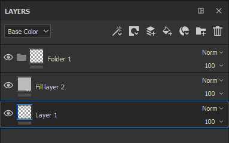

# Gestione dei livelli

Ecco le possibili manipolazioni all&#39;interno della Pila livelli:

| *Azione* | *Dimostrazione* |
| --- | --- |
| Fate clic e trascinate per spostare un livello. Quando si sposta un livello, può essere visibile una barra che indica dove verrà inserito il livello:<ul data-preserve-html="true"><li data-preserve-html="true"><strong>Barra sopra un livello</strong>: il livello verrà posizionato sopra il livello</li><li data-preserve-html="true"><strong>Barra tra due livelli</strong>: il livello verrà inserito tra i due livelli</li><li data-preserve-html="true"><strong>Barra sotto un livello</strong>: il livello verrà posizionato sotto il livello</li></ul> | 

 |
| **Spostarsi in una cartella**: fare clic su un livello e rilasciarlo al passaggio del mouse su una cartella per inserirlo all&#39;interno | 

 |
| **Selezione multipla**: può essere eseguita in due modi diversi:<ul data-preserve-html="true"><li data-preserve-html="true">Tenere premuto il tasto Ctrl o Comando</li><li data-preserve-html="true">Premi il tasto Maiusc mentre fai clic sul primo e sull’ultimo livello</li></ul> | 

 |
| **Raggruppamento livelli**: è possibile creare una cartella con il livello attualmente selezionato mediante una delle azioni seguenti:<ul data-preserve-html="true"><li data-preserve-html="true">Fate clic con il pulsante destro del mouse su > Raggruppa livelli (Group Layers).</li><li data-preserve-html="true">Premete Ctrl+G o Comando+G</li></ul> | 

 |
