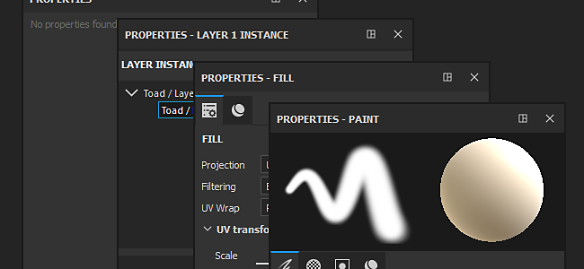

# Proprietà

Nella finestra Proprietà è possibile modificare i parametri degli strumenti e dei pennelli, nonché le proprietà dei livelli. È possibile accedere alla finestra Proprietà utilizzando la [barra degli strumenti Dock](toolbars.md) o **facendo clic con il pulsante destro del mouse** nel [menu Finestra vista](https://helpx.adobe.com/substance-3d/unlisted/documentation/spdoc/viewport-170460351.html).

Per ulteriori informazioni sui parametri disponibili e sulle operazioni da eseguire, consultare la documentazione relativa a ogni strumento e livello:

* [Proprietà strumenti](../painting/painting.md)
* [Proprietà livello riempimento](../painting/fill-projections/fill-projections.md)
* [Proprietà effetti](../features/effects/effects.md)
