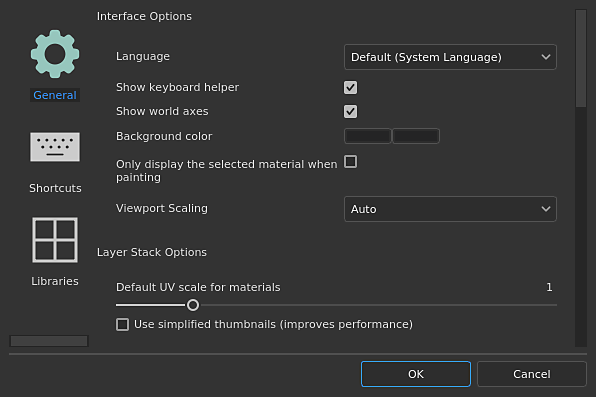

# Impostazioni

{width="400px"}

Apri <b>Impostazioni </b>dal <b>menu Modifica </b>per regolare le preferenze in base al tuo modo di lavorare con Painter.

Le <b>impostazioni </b> sono divise in tre sezioni:

* [Preferenze generali](general-preferences.md)
* [Scelte rapide](shortcuts.md)
* [Configurazione delle librerie](libraries-configuration.md)
