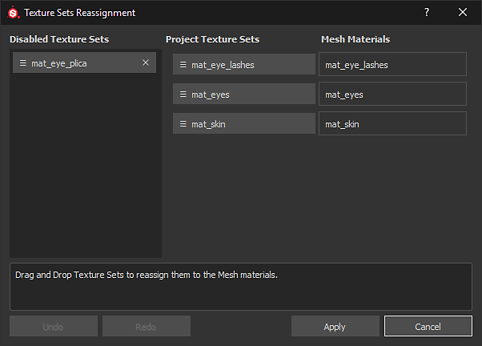

# Riassegnazione set di texture

La finestra Riassegnazione set di texture consente di cambiare l’assegnazione della Pila livelli in una parte diversa della trama della scena. Ciò è utile ad esempio quando, dopo aver importato una nuova trama in un progetto esistente, alcuni set di texture vengono disattivati. Ciò accade perché la Pila livelli è stata assegnata a un materiale che non esiste più. Con la finestra di riassegnazione è possibile ripristinare quella Pila livelli (vedere &quot;Ripristino di set di texture disabilitati&quot; di seguito).

Per accedere alla finestra Riassegnazione set di texture, accedete alla finestra [Elenco set di texture](texture-set-list.md) e scegliete **Impostazioni > Riassegna set di texture**.

La finestra è suddivisa in tre sezioni:

* **Set di texture disabilitati**: elenca tutti i set di texture attualmente inutilizzati.
* **Set di texture del progetto**: elenca tutti i set di texture attualmente assegnati a un materiale di trama.
* **Materiali trama**: elenca i materiali trama del progetto.

Nella finestra è inoltre disponibile un pulsante aggiuntivo che consente di eseguire le azioni seguenti:

* **Annulla**: ripristina lo stato precedente della finestra
* **Ripeti**: riapplicare una modifica annullata.
* **Applica**: chiudere la finestra ed eseguire le riassegnazioni.
* **Annulla**: chiudere la finestra ed eliminare le modifiche in corso.

## Riassegnazione di set di texture

La riassegnazione degli insiemi di texture può essere effettuata mediante un semplice trascinamento dei pulsanti.

## Ripristino dei set di texture disabilitati

Un insieme di texture può essere disattivato quando non è più associato a un materiale trama.\
Ciò può verificarsi quando si importa una nuova trama in un progetto in cui i nomi dei materiali differiscono tra il progetto e la nuova trama.

Per ripristinare un set di texture basta **scambiare** la sua posizione con una nell&#39;elenco &quot;**Set di texture del progetto**&quot;.

## Eliminazione di set di texture disabilitati

Facendo clic sulla **croce** accanto a un set di texture nell&#39;elenco **Set di texture disabilitati**, **verrà contrassegnato per l&#39;eliminazione**.\
L&#39;eliminazione avviene quando si fa clic sul pulsante **Applica** nella parte inferiore della finestra.

>[!WARNING]
>
> Questa azione non è annullabile una volta chiusa la finestra con il pulsante &quot;Applica&quot;.
