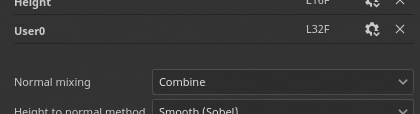

# Impostazioni set texture

{width="300px"}

Le **impostazioni del set di texture** controllano i parametri del set di texture attualmente selezionato. È qui che è possibile gestire la risoluzione, i canali e le mappe mesh associate.

## Proprietà generali

| Impostazione | Descrizione |
| --- | --- |
| **Nome** | Nome del set di texture. Ereditato per il nome del materiale assegnato al modello 3D. |
| **Descrizione** | Campo di testo che consente di aggiungere informazioni su un set di texture. Questo testo viene visualizzato nelle finestre [Elenco set di texture](texture-set-list.md) e [Baking](../../baking/baking.md). |
| **Dimensioni** | Controlla la risoluzione dei canali in pixel all’interno di un set di texture. Per utilizzare le risoluzioni **non quadrate** (ad esempio 2048x1024), disattiva il **pulsante di blocco** tra i due menu a discesa.Le risoluzioni del set di texture sono **dinamiche** a causa del **flusso di lavoro non distruttivo**. Ciò significa che è possibile lavorare a bassa risoluzione per ottenere buone prestazioni e quindi utilizzare una risoluzione più elevata in un secondo momento per ottenere una qualità migliore. All’interno dell’applicazione la risoluzione massima di un canale è di 4096x4096 pixel, mentre quando si esporta il massimo è invece di 8192x8192 (se supportato dalla GPU). La modifica della risoluzione può comportare un lungo calcolo del motore. |
| **Istanza dello shader** | Definite quale [shader](../shader-settings/shader-settings.md) usare per eseguire il rendering del set di texture specificato nella [finestra della vista](../viewport/viewport.md). |

## Canali

### Elenco canali

L’elenco può essere modificato in qualsiasi momento aggiungendo o rimuovendo canali (a meno che non venga ignorato dal flusso di lavoro [Livellamento dei materiali](../../features/dynamic-material-layering.md)).

| Pulsante/Icona | Descrizione |
| --- | --- |
| <b>Aggiungi canale</b>  

 | Fare clic su questo pulsante per aggiungere un nuovo canale all&#39;elenco.Il menu a comparsa che si apre è diviso in tre categorie:<ul data-preserve-html="true"><li data-preserve-html="true"><strong>Canali supportati</strong>: questi canali possono essere utilizzati dallo shader corrente nella finestra della vista.</li><li data-preserve-html="true"><strong>Canali non supportati</strong>: questi canali vengono ignorati dallo shader corrente nella finestra della vista.</li><li data-preserve-html="true"><strong>Canali utente</strong>: canali aggiuntivi per colorare più informazioni, in genere non supportati dagli shader.</li></ul>  **Nota:** non esiste un limite al numero di canali che è possibile aggiungere, tuttavia troppi canali possono influire notevolmente sulle prestazioni e richiederanno più memoria. |
| <b>Rimuovi canale</b>  

 | Rimuovere un canale dall&#39;elenco.  **Nota:** le informazioni di colorazione all&#39;interno del progetto non vengono eliminate con il canale, quindi il canale può essere aggiunto nuovamente in un secondo momento se necessario per recuperare la texture (dopo una ricalcolo). |
| <b>Nome canale</b>  

 | Nome di un determinato canale.I canali utente possono essere rinominati facendo doppio clic sul nome corrente: 

 |
| <b>Impostazioni canale</b>  

 | Questo pulsante consente di aprire il menu delle impostazioni del canale con diverse azioni.Il primo elenco di azioni controlla il tipo di storage e la precisione del canale:<ul data-preserve-html="true"><li data-preserve-html="true"><strong>sRGB8</strong>: colori RGB, valori corretti per il valore gamma, memorizzati su 8 bit.</li><li data-preserve-html="true"><strong>L8</strong>: valori in scala di grigio, memorizzati su 8 bit.</li><li data-preserve-html="true"><strong>RGB8</strong>: colori RGB, memorizzati su 8 bit.</li><li data-preserve-html="true"><strong>L16</strong>: valori in scala di grigio, memorizzati su 16 bit.</li><li data-preserve-html="true"><strong>RGB16</strong>: colori RGB, memorizzati su 16 bit.</li><li data-preserve-html="true"><strong>L16F</strong>: valori in scala di grigi - positivi e negativi, memorizzati su 16 bit in virgola mobile.</li><li data-preserve-html="true"><strong>RGB16F</strong>: colori RGB - positivi e negativi, memorizzati su 16 bit in virgola mobile.</li><li data-preserve-html="true"><strong>L32F</strong>: valori in scala di grigi - positivi e negativi, memorizzati su 32 bit in virgola mobile.</li><li data-preserve-html="true"><strong>RGB32F</strong>: colori RGB - positivi e negativi, memorizzati su 32 bit mobili.</li></ul>  **Nota:** il tipo di archiviazione **non è** un controllo spazio colore/gamma. I dati utilizzati per memorizzare le informazioni di un canale (ad esempio sRGB8 o L32F) non hanno alcun effetto sul modo in cui verranno letti dall’applicazione. Ad esempio, il canale Rugosità verrà comunque considerato come dati/raw e il colore di base verrà comunque considerato come corretto per il gamma.  L&#39;ultima azione del menu può essere utilizzata per abilitare o disabilitare la [gestione colore](../../features/color-management/color-management.md) sul canale:<ul data-preserve-html="true"><li data-preserve-html="true"><strong>Canale colore</strong>: se abilitato, il canale è sottoposto alla gestione del colore. Questa opzione può essere modificata solo manualmente per i canali utente.</li></ul> |
| <b>Gestione del colore</b>  

 | Se presente, indica che il canale è sottoposto alla gestione del colore. Solo i canali utente possono essere contrassegnati come gestiti o meno dal colore; il comportamento degli altri canali è fisso.Per un elenco dettagliato dei canali con gestione del colore, vedere: [Gestione del colore](../../features/color-management/color-management.md). |

### Impostazioni di mixaggio

Queste impostazioni controllano vari comportamenti sulla generazione dei canali, in particolare il modo in cui i canali vengono combinati con le texture cotte (mappe trama).

| Impostazione | Descrizione |
| --- | --- |
| **Mixaggio normale** | Controlla il modo in cui la &quot;mappa normale al forno&quot; deve essere combinata con il canale &quot;Normale&quot;. I valori possibili sono:<ul data-preserve-html="true"><li data-preserve-html="true"><strong> Sostituisci </strong>: ignora la &quot;mappa normale&quot; e utilizzerà solo il canale &quot;Normale&quot; per questo set di texture. Può essere usato per dipingere su una mappa normale cotta. Per ulteriori informazioni, consultate la documentazione [Advanced channel painting](../../painting/advanced-channel-painting/normal-map-painting.md). se il canale Normale non è presente o se l&#39;output del canale Normale è vuoto, verrà comunque utilizzata la mappa normale.</li><li data-preserve-html="true"><strong> Combina </strong> (impostazione predefinita): utilizzare una funzione orientata ai dettagli per combinare il canale &quot;Normale&quot; e la mappa &quot;Normale&quot;.</li></ul>  **Nota:** questa impostazione potrebbe essere disabilitata se il canale non è presente nell&#39;elenco dei canali. Se manca il canale, viene utilizzato il valore di mixaggio predefinito. |
| **Height al metodo normale** | Controlla il metodo da utilizzare per convertire il canale del height in una mappa normale. I valori possibili sono:<ul data-preserve-html="true"><li data-preserve-html="true"><strong>Nitido</strong>: crea una mappa normale più definita a rischio di introdurre disturbo e aliasing. Adattato per pattern ripetuti come tessuti.</li><li data-preserve-html="true"><strong>Uniforme (Sobel)</strong> (impostazione predefinita): crea una mappa normale più uniforme con un filtro Sobel, rischiando di perdere i dettagli. Adattata per la maggior parte dei casi.</li></ul> |
| **Mixaggio occlusioni ambiente** | Controlla il modo in cui &quot;baked ambient occlusione&quot; deve essere combinato con il canale &quot;Ambient Occlusione&quot;. I valori possibili sono:<ul data-preserve-html="true"><li data-preserve-html="true"><strong> Sostituisci </strong>: ignora l&#39;&quot;occlusione ambiente in forno&quot; e utilizzerà solo il canale &quot;Occlusione ambiente&quot; per questo set di texture. Può essere usato per dipingere su un ambiente cotto occlusione. Per ulteriori informazioni, consulta la documentazione di [Advanced channel painting](../../painting/advanced-channel-painting/ambient-occlusion-painting.md).  </li><li data-preserve-html="true"><strong> Moltiplica </strong> (impostazione predefinita): utilizzare un&#39;operazione di moltiplicazione per combinare il canale &quot;Occlusione ambiente&quot; e &quot;occlusione ambiente cotto&quot;.  </li></ul>  **Nota:** questa impostazione potrebbe essere disabilitata se il canale non è presente nell&#39;elenco dei canali. Se manca il canale, viene utilizzato il valore di mixaggio predefinito. |
| **Spaziatura UV** | Controlla il modo in cui viene generata la spaziatura interna esterna all’Isola UV. I valori possibili sono:  <ul class="steps" data-preserve-html="true"> <li class="step" data-preserve-html="true">    <strong>Spazio adiacente 3D</strong> (impostazione predefinita): osserva l&#39;altro lato della giunzione UV per trovare il colore del pixel adiacente e usarlo al bordo UV. Questa impostazione è consigliata quando si colorano le giunture UV con pattern continui. Esempio con spaziatura interna regolare a sinistra e Vicina 3D a destra:           </li> <li class="step" data-preserve-html="true">    <strong>Spazio adiacente 2D</strong>: prima di generare la spaziatura interna, copiare il pixel all&#39;interno di un&#39;Isola UV nel bordo esterno dell&#39;Isola UV. Questa impostazione è consigliata quando le Isole UV contengono informazioni contrastanti e non si sovrappongono. Esempio con una sfera in cui le bande hanno ciascuna un colore univoco per Isola UV, a sinistra con l&#39;impostazione 2D adiacente e 3D adiacente a destra (notare il sanguinamento):           </li> </ul>  **Nota:** questa impostazione di spaziatura interna viene salvata per set di texture e ne viene tenuto conto durante l&#39;esportazione e la visualizzazione della texture nella finestra della vista.A causa del funzionamento dello spazio 3D adiacente, non può essere utilizzato con il canale normale e utilizzerà invece la versione 2D. |

## Mappe delle mesh

Le mappe Trama sono trame cotte specifiche della trama e del set di texture utilizzate per migliorare la qualità della texture con l’aiuto di filtri, materiali intelligenti e maschere intelligenti. Per ulteriori informazioni, consulta la documentazione [baking](../../baking/baking.md).
