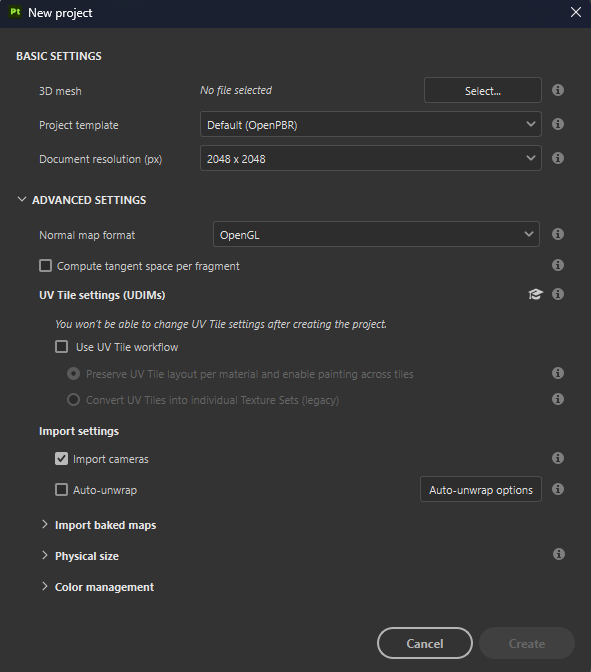

# Gestione delle telecamere

Le videocamere create in Maya, Max, Blender, Modo e DAE possono essere importate in Substance 3D Painter.

>[!NOTE]
>
> Le fotocamere ortografiche e le proporzioni di visualizzazione non sono correttamente supportate in formato ABC (Alembic).

## Importare le fotocamere in Substance 3D Painter

Le fotocamere devono essere incluse nel file mesh, in formato FBX o ABC (Alembic).

Vengono importati il nome, i parametri di trasformazione, il FOV e le proporzioni (se presenti).

Nella finestra Nuovo progetto, seleziona il file mesh che include le fotocamere e verifica che la casella di controllo **Importa fotocamere** sia selezionata. Se attivi **Reimporta trama** nella finestra di configurazione **Modifica > Progetto**, puoi anche attivare **Importazione di fotocamere** se le hai mancate durante la creazione iniziale del progetto.

Quindi fare clic su **OK**:

<table>
  <tr style="border: 0;">
    <td style="border: 0;" valign="top"></td>
    <td style="border: 0;" valign="top"></td>
  </tr>
</table>

## Seleziona videocamere

Quando le fotocamere sono state importate nel progetto corrente, puoi selezionare la videocamera attiva dal **menu a discesa** nella **finestra della vista 3D**.

Per impostazione predefinita, la fotocamera Painter denominata &quot;Videocamera predefinita&quot; è selezionata ed è in modalità prospettiva.

Nell’esempio precedente, vengono importate 3 videocamere, per un totale di 4 videocamere nel menu a discesa quando la videocamera predefinita è inclusa.

## Controllare le telecamere

Quando è selezionata una videocamera importata, se si sposta la videocamera con il panning, lo zoom o la rotazione nella finestra della vista si passa alla videocamera predefinita. In questo modo si evita che le videocamere importate vengano spostate nella scena.

>[!NOTE]
>
> Se devi cambiare la posizione della videocamera importata, puoi aggiornarla nell&#39;applicazione di modifica delle scene scelta e reimportare la scena con **Modifica > Configurazione progetto**.

È possibile controllare i parametri delle fotocamere importate nella **finestra Impostazioni schermo**.

Utilizza il menu a discesa **Predefinito** per selezionare la fotocamera da modificare.

Se uno degli attributi viene modificato, è possibile ripristinare i valori originali con il **pulsante Ripristina**.

Se un parametro è stato modificato per una videocamera importata, il nome della videocamera viene scritto in corsivo e al nome viene aggiunto &quot;\*&quot;.

### Attributi fotocamera

Il campo visivo o FOV è espresso in gradi.

La Lunghezza focale è espressa in mm.

In modalità Finestra vista (OpenGL), la distanza focale e l’apertura sono disattivate. Per attivarli, devono essere attivati gli effetti di post-produzione e il valore DOF.

### Rapporto di visualizzazione

Se le proporzioni di visualizzazione sono presenti nel file mesh, vengono visualizzate nella sezione Fotocamera. Se una videocamera non dispone di un rapporto di visualizzazione definito, verrà elencata come **Non specificato** (come la videocamera predefinita).

### Blocca

È possibile bloccare una videocamera facendo clic sull’icona a forma di lucchetto. Bloccando una videocamera si evita di modificare i parametri della videocamera.

## Telaio della fotocamera

È possibile attivare/disattivare il fotogramma della fotocamera in **Impostazioni schermo > Impostazioni finestra vista**:

Potete anche regolare l&#39;opacità dell&#39;area esterna all&#39;inquadratura con **Opacità maschera cancello**.

<table>
  <tr style="border: 0;">
    <td style="border: 0;" valign="top"></td>
    <td style="border: 0;" valign="top"></td>
  </tr>
</table>
