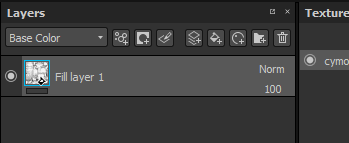

# Occlusione ambientale pittura

Il canale di occlusione ambientale consente di colorare i dettagli nelle ombre ambientali di un oggetto. Può essere utilizzato per aggiungere dettagli AO provenienti da Materiali, o semplicemente correggere manualmente gli errori di cottura quando necessario.

&#x200B;>> 

Nella computergrafica, l’occlusione ambientale è una tecnica di ombreggiatura e rendering utilizzata per calcolare l’esposizione di ciascun punto di una scena all’illuminazione ambientale. L&#39;interno di un tubo è tipicamente più occluso (e quindi più scuro) rispetto alle superfici esterne esposte, e più si va all&#39;interno del tubo, più occlusa (e più scura) diventa l&#39;illuminazione. L’occlusione ambiente può essere vista come un valore di accessibilità calcolato per ciascun punto della superficie.\
Fonte: &lt;https://en.wikipedia.org/wiki/Ambient_occlusion>

Il **risultato** di questo calcolo è archiviato in una bitmap denominata mappa &quot;Occlusione ambiente&quot;. Questa mappa può essere cotta direttamente nell&#39;applicazione, vedere: [Cottura](../../baking/baking.md).

## Occlusione ambiente pittura

Per colorare i dettagli delle occlusioni personalizzate, è necessario un canale di Occlusione ambiente. Può essere aggiunto tramite le [impostazioni del set di texture](../../interface/texture-set/texture-set-settings.md):

Una volta aggiunto il canale a un set di texture, potete usare qualsiasi livello per colorare nuove informazioni. Poiché il canale AO contiene solo informazioni in scala di grigio, i metodi di fusione consigliati sono **Normale** (colore sopra) e **Moltiplica** (combinazione).

Per ulteriori informazioni su questi metodi e su come modificarli per canale, consultate: [Metodi di fusione](../../interface/layer-stack/blending-modes.md).

## Dipingere sulla mappa aggiuntiva Occlusione ambiente

In alcune situazioni, può essere utile colorare sull’Occlusione Ambiente cotto per nascondere i dettagli o anche risolvere i problemi di cottura.

La configurazione predefinita di un progetto in Substance 3D Painter combinerà l&#39;Occlusione ambiente **canale** con la mappa Occlusione ambiente dalle **mappe aggiuntive**. Ciò significa che, per impostazione predefinita, non è possibile colorare sulla mappa aggiuntiva al forno; i risultati di ogni mappa (le mappe con baking e i canali) verranno moltiplicati insieme. Questa impostazione può tuttavia essere modificata con la seguente:

### 1 - Aggiungere un canale di Occlusione ambientale

Aggiunge un canale di occlusione ambiente nel set di texture corrente:\

Impostate la modalità di mixaggio su &quot; **replace** &quot; invece di &quot; **multiply** &quot;:\

### 2 - Impostazione di un livello di riempimento con l’occlusione dell’ambiente cotto

Crea un nuovo livello di riempimento e inserisci l’occlusione ambiente cotto nello slot &quot;occlusione ambiente&quot;, tramite il pannello proprietà. Non dimenticare di modificare la lavorazione predefinita del livello di riempimento, se non è già impostata su 1.\

### 3 - Modificare il metodo di fusione del livello di riempimento

Per impostazione predefinita, il metodo di fusione del canale AO su qualsiasi nuovo livello è impostato su &quot; **Moltiplica** &quot;. Poiché è preferibile utilizzare il livello di riempimento come base, abbiamo scelto il metodo di fusione &quot;normale&quot;, in quanto la bitmap non ha alcun canale alfa, sostituirà tutto ciò che segue (incluso il colore predefinito dello shader).\

### 4 - Creazione di un livello da colorare sulla mappa di occlusione dell&#39;ambiente cotto

Create un nuovo livello (regolare o di riempimento) e impostatene il metodo di fusione su &quot;normale&quot; per il canale AO. Una volta completata questa configurazione, tutto ciò che viene dipinto sul canale AO assumerà il controllo della mappa dell’AO cotta che si trova sul livello sottostante.\

