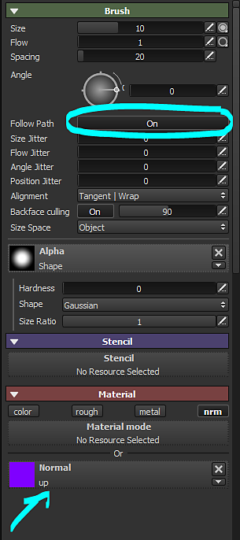

# Pittura mappa di flusso

È previsto un canale dedicato, ma nel frattempo utilizzando il canale Normale e alcuni parametri del pennello è possibile colorare le mappe di flusso in Substance 3D Painter.

## Passaggio 1: crea la mappa normale

Create una texture mappa normale di 16x16 pixel. Il colore deve essere 128, 255, 128, che dovrebbe dare il colore seguente: \
(Questo colore equivale a un vettore che cerca verso l’alto, in DirectX)

## Passaggio 2: aggiungi canale normale

Nel progetto Substance 3D Painter, aggiungete un canale **Normale** tramite le **impostazioni del set di texture** se questo canale non esiste già.

## Passaggio 3: impostazione del pennello

Abilitate la funzione Segui tracciato nei parametri del pennello. Caricate la texture della mappa normale (punto 1) nello slot del canale normale. Disattivate gli altri canali.

{width="300px"}

## Passaggio 4 : Dipingi!

Dipingendo sulla trama con l’impostazione Segui tracciato attivata, i tratti del pennello disegneranno le direzioni nella mappa normale.

{width="700px"}
