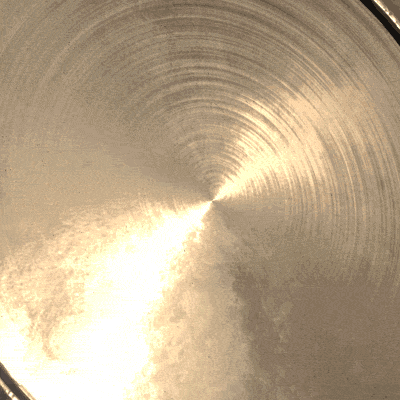

# Tratti dinamici

<table>
<tr style="border: 0;">
<td style="border: 0;" valign="top">

{width="400px"}

</td>
<td style="border: 0;" valign="top">

{width="350px"}

</td>
</tr>
</table>

I **Tratti dinamici** sono tratti di pennello regolari basati su **file di Substance** che possono **cambiare** per ogni timbro all&#39;interno di un **tratto di pennello**.

Ogni singolo elemento associato a un tratto di pennello può essere modificato in base al comportamento specifico progettato nel file di Substance stesso.

Per maggiori dettagli, consultate le pagine seguenti:

* [Abilitazione della funzione Tratto dinamico](enabling-dynamic-stroke-feature.md)
* [Prestazioni del tratto dinamico](dynamic-stroke-performances.md)
* [Creazione di Tratti dinamici personalizzati](creating-custom-dynamic-strokes.md)
