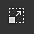
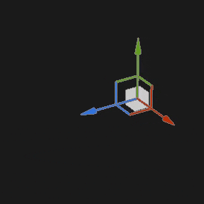
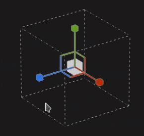

# Proiezione triplanare

La proiezione triplanare del riempimento è una proiezione 3D che combina più proiezioni planari e le fonde per coprire l&#39;intera trama 3D. È molto utile proiettare rumori e pattern senza creare cuciture visibili.

## Proprietà

| *Impostazione* | *Descrizione* |
| --- | --- |
| **Filtraggio** | Controlla il modo in cui la texture o il materiale verranno filtrati. Questa impostazione può influire sull’aspetto della texture quando viene ripetuta più volte. Con valori di ridimensionamento elevati, l’utilizzo di un filtro diverso da quello predefinito può produrre risultati migliori. Impostazioni correnti disponibili:<ul data-preserve-html="true"> <li data-preserve-html="true"><b>Bilineare - HQ</b> (impostazione predefinita): filtro bilineare avanzato che tenta di migliorare la qualità della texture quando i valori di suddivisione in porzioni sono elevati.</li> <li data-preserve-html="true"><b>Bilineare - Nitido</b>: filtro bilineare semplice che ammorbidisce leggermente la texture, ma tenta di mantenere i dettagli.</li> <li data-preserve-html="true"><b>Più vicino</b>: nessun filtro utile se il filtro bilineare produce un risultato sfocato e interrompe i dettagli più fini. Può introdurre l’alias nella texture.</li> </ul> |
| **Ritaglio forma** | Definite se la texture proiettata deve essere visibile all&#39;esterno dell&#39;area di proiezione. I valori possibili sono:<ul data-preserve-html="true"><li data-preserve-html="true"><strong>Progetto ritagliato in forma</strong>: la proiezione è limitata all&#39;interno dell&#39;area di proiezione.</li><li data-preserve-html="true"><strong>La proiezione si estende oltre la forma</strong> (impostazione predefinita): la proiezione continua oltre l&#39;area di proiezione.</li></ul>   <table> <tr style="border: 0;"> <td style="border: 0;" valign="top">  

  </td> <td style="border: 0;" valign="top">  

  </td> </tr> </table> |
| **Durezza** | Controllate l&#39;intensità e la morbidezza delle transizioni tra i piani della proiezione. Un valore o 1,0 indica che tra ogni piano sarà presente un taglio netto. 

 **Nota:** la transizione di ciascun piano è definita dalla normale del vertice della trama (senza tener conto della normale mappa della trama). Ciò significa che normali di vertici bruschi o spezzati possono portare a risultati inattesi quando si fondono piani insieme. |

### Trasformazione UV

Le impostazioni di trasformazione UV controllano la texture/il materiale all’interno della proiezione.

<table data-preserve-html="true" style="width: 100.0%;"><colgroup> <col style="width: 40.0%;"/> <col style="width: 20.0%;"/> <col style="width: 40.0%;"/> </colgroup><tbody><tr><th>Modalità scala</th><th>Impostazione</th><th>Descrizione</th></tr><tr><td>
<strong>Affiancatura</strong> (impostazione predefinita)<strong>  </strong>

Consente di impostare manualmente la quantità di ripetizione per la texture corrente.
</td><td><strong>Affiancamento</strong></td><td>Controlla quante volte la texture viene ripetuta.</td></tr><tr><td rowspan="2">  </td><td colspan="1"><strong>Rotazione</strong></td><td colspan="1">Controlla l’angolo di proiezione della texture sulla trama.</td></tr><tr><td colspan="1"><strong>Offset</strong></td><td colspan="1">Controlla da dove verrà proiettata la texture. Il valore predefinito indica che il centro della texture si trova al centro degli UV della trama.</td></tr><tr><th colspan="1"> </th><th colspan="1"> </th><th colspan="1"> </th></tr><tr><td rowspan="4">
<strong>Dimensione fisica</strong>

Regolazione automatica di una texture in base alla dimensione della trama e alla dimensioni fisiche incorporata. Utilizza la larghezza e la lunghezza (misurazioni X e Y) per calcolare la dimensioni fisiche corretta. La misurazione Z non è presa in considerazione.

(Per ulteriori informazioni, consultare la [pagina della documentazione](https://experienceleague.adobe.com/en/docs/substance-3d-painter/using/features/physical-size))
</td><td><strong>Dimensioni personalizzate</strong></td><td>
Se questa opzione è attivata, consente di immettere manualmente una dimensioni fisiche e di sostituire quella fornita da una risorsa.

Viene selezionata automaticamente se non viene rilevata alcuna dimensioni fisiche o se vengono utilizzate più risorse con dimensioni fisiche diverse nello stesso livello/effetto.
</td></tr><tr><td colspan="1"><strong>Dimensioni (cm)</strong></td><td colspan="1">Le dimensioni fisiche incorporate sono espresse in centimetri. È possibile lavorare con un file mesh creato utilizzando diverse unità di misura, mantenendo proporzioni corrette. Tuttavia, le dimensioni delle risorse sono attualmente visualizzate solo in centimetri.</td></tr><tr><td colspan="1"><strong>Rotazione</strong></td><td colspan="1">Controlla l’angolo di proiezione della texture sulla trama.</td></tr><tr><td colspan="1"><strong>Offset</strong></td><td colspan="1">
Controlla da dove verrà proiettata la texture. Il valore predefinito indica che il centro della texture si trova al centro degli UV della trama.
</td></tr></tbody></table>

>[!NOTE]
>
> L&#39;impostazione **Offset** non è disponibile con la proiezione triplanare.

### Impostazioni progetto 3D

Le impostazioni di proiezione 3D controllano la trasformazione della proiezione nello spazio 3D.

| Impostazione | Descrizione |
| --- | --- |
| **Scostamento** | Posizione dell&#39;origine della proiezione nello spazio 3D. Le unità si basano sul rettangolo di selezione dell’intera scena. 0 è il centro di questa casella. |
| **Rotazione** | Angoli in gradi per ruotare l’intera proiezione su ciascun asse. |
| **Scala** | Dimensione dell&#39;intera proiezione su ciascun asse. |

## Barra degli strumenti contestuale

Nella [barra degli strumenti contestuale](../../interface/toolbars.md) che si trova nella parte superiore della finestra della vista, sono disponibili varie impostazioni e strumenti che consentono di controllare il manipolatore e la proiezione:

| Icona | Nome | Descrizione |
| --- | --- | --- |
| 

 | Mostra/nascondi il manipolatore | Se questa opzione è attivata, il manipolatore è visibile e controllabile nella finestra della vista. |
| 

 | Impostazioni manipolatore | Questo menu contiene tre impostazioni:<ul data-preserve-html="true"><li data-preserve-html="true"><strong>Dimensione manipolatore</strong>: controlla la dimensione del manipolatore nella finestra della vista.</li><li data-preserve-html="true"><strong>Passaggi griglia</strong>: definisci la dimensione del passaggio durante la traduzione con un vincolo.</li><li data-preserve-html="true"><strong>Passaggi angolari</strong>: definisci l&#39;angolo del passo quando si ruota con un vincolo.</li></ul> |
| 

 | Manipolatore di traduzione | Consente di spostare la proiezione nella scena lungo gli assi principali (X, Y, Z). |
| 

 | Manipolatore di rotazione | Consente di ruotare la proiezione nella scena lungo gli assi principali (X, Y, Z). |
| 

 | Manipolatore scala | Consente di ridimensionare la proiezione nella scena lungo gli assi principali (X, Y, Z). |
| 

 | manipolatore di superficie | Consente di spostare la proiezione agganciandola sulla superficie del modello 3D.  **Nota:** questo manipolatore è disponibile solo con i tipi di proiezione Planar e Warp. |
| 

 | Spazio manipolatore | Definisce lo spazio in cui viene eseguita la trasformazione. I valori possibili sono:<ul data-preserve-html="true"><li data-preserve-html="true"><strong>Spazio locale</strong>: gli assi sono allineati alla trasformazione corrente.</li><li data-preserve-html="true"><strong>Spazio globale</strong>: gli assi sono allineati alla scena.</li></ul> |
| 

 | Speculare su X | Invertite la trasformazione sull&#39;asse X. |
| 

 | Speculare su Y | Invertite la trasformazione sull&#39;asse Y. |
| 

 | Speculare su Z | Invertite la trasformazione sull&#39;asse Z. |
| 

 | Reimposta la trasformazione | Ripristina lo stato predefinito della trasformazione di proiezione. |

## Manipolatore

Questo manipolatore di proiezione è disponibile solo nella [finestra della vista 3D](../../interface/viewport/3d-view.md).

| Azione | Scelta rapida | Descrizione |
| --- | --- | --- |
| **Traduzione** | Clic del mouse | Con il manipolatore Traslazione (Translation), fate clic sugli assi per spostare la proiezione:<ul data-preserve-html="true"><li data-preserve-html="true"><strong>Un asse</strong>: spostarsi solo in una direzione della proiezione.</li><li data-preserve-html="true"><strong>Due assi</strong>: spostate la proiezione sui piani allineati agli assi.</li><li data-preserve-html="true"><strong>Tre assi</strong>: spostate la proiezione nello spazio della fotocamera (piano rivolto verso di essa).</li></ul>   <table> <tr style="border: 0;"> <td style="border: 0;" valign="top">  

  </td> <td style="border: 0;" valign="top">  

  </td> <td style="border: 0;" valign="top">  

  </td> </tr> </table> |
| **Traduzione vincolata** | MAIUSC+clic del mouse | Con il manipolatore Traslazione (Translation), spostate la proiezione lungo gli assi selezionati, ma solo a intervalli specifici (stepping). La dimensione dell&#39;intervallo viene definita tramite le impostazioni del manipolatore. 

 |
| **Rotazione** | Clic del mouse | Con il manipolatore Rotazione, facendo clic su un asse si ruota la proiezione. Fate clic tra gli assi per consentire la rotazione di tutti gli assi contemporaneamente.   <table> <tr style="border: 0;"> <td style="border: 0;" valign="top">  

  </td> <td style="border: 0;" valign="top">  

  </td> </tr> </table> |
| **Rotazione vincolata** | MAIUSC+clic del mouse | Con il manipolatore Rotazione, fare clic su un asse per ruotare la proiezione solo a intervalli specifici. Il passo viene definito da un angolo tramite le impostazioni del manipolatore. 

 |
| **Scala** | Clic del mouse | Con il manipolatore Scala, facendo clic su una maniglia dell&#39;asse potete ridimensionare la proiezione lungo l&#39;asse specificato.   <table> <tr style="border: 0;"> <td style="border: 0;" valign="top">  

  </td> <td style="border: 0;" valign="top">  

  </td> <td style="border: 0;" valign="top">  

  </td> </tr> </table> |
| **Scala vincolata** | MAIUSC+clic del mouse | Con il manipolatore Scala (Scale), facendo clic su una maniglia dell&#39;asse mantenendo la scelta rapida da tastiera, la proiezione viene ridimensionata gradualmente. La dimensione del passo è uguale a quella del manipolatore di traslazione. 

 |
| **Superficie** | Clic del mouse | Con il manipolatore Superficie (Surface), fate clic e trascinate sul modello 3D per eseguirne lo snap sulla superficie. 

 **Nota:** questo manipolatore è disponibile solo con i tipi di proiezione **Planar** e **Warp**. |
