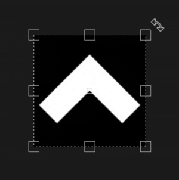
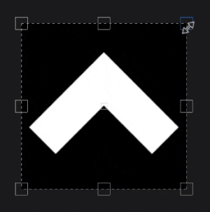

# Proiezione UV

La Proiezione UV del riempimento è una proiezione 2D che funziona solo nello spazio della texture 2D. Offre controlli per spostare, ruotare e ridimensionare un’immagine.

## Proprietà

| *Impostazione* | *Descrizione* |
| --- | --- |
| **Filtraggio** | Controlla il modo in cui la texture o il materiale verranno filtrati. Queste impostazioni possono influire sull’aspetto della texture quando viene ripetuta più volte. Con valori di ridimensionamento elevati, l’utilizzo di un metodo di filtraggio diverso da quello predefinito può produrre risultati migliori. Impostazioni attualmente disponibili:<ul data-preserve-html="true"><li data-preserve-html="true"><strong>Bilineare | HQ </strong>: (impostazione predefinita) Filtro bilineare avanzato che tenta di migliorare la qualità della texture quando i valori di affiancatura sono elevati.</li><li data-preserve-html="true"><strong>Bilineare | Nitidezza </strong>: filtro bilineare semplice che ammorbidisce leggermente la texture ma tenta di preservare i dettagli.</li><li data-preserve-html="true"><strong>Più vicino a </strong>: nessun filtro utile se il filtro bilineare produce un risultato sfocato e interrompe i dettagli più fini. Può introdurre l’alias nella texture.</li></ul> |
| **Involucro UV** | Controlla la modalità di ripetizione del Materiale/Immagine proiettata all&#39;interno della forma di proiezione. I valori possibili sono:<ul data-preserve-html="true"><li data-preserve-html="true"><strong>Nessuno</strong>: la proiezione non viene ripetuta.</li><li data-preserve-html="true"><strong>Ripetizione orizzontale</strong>: ripetizione solo orizzontale.</li><li data-preserve-html="true"><strong>Ripeti verticalmente</strong>: ripeti solo verticalmente.</li><li data-preserve-html="true"><strong>Ripetizione</strong> (impostazione predefinita): la ripetizione avviene sia in orizzontale che in verticale.</li></ul> 

 |

### Trasformazione UV

Le impostazioni di trasformazione UV controllano la texture/il materiale all’interno della proiezione.

<table data-preserve-html="true" style="width: 100.0%;"><colgroup> <col style="width: 40.0%;"/> <col style="width: 20.0%;"/> <col style="width: 40.0%;"/> </colgroup><tbody><tr><th>Modalità scala</th><th>Impostazione</th><th>Descrizione</th></tr><tr><td>
<strong>Affiancatura</strong> (impostazione predefinita)<strong>  </strong>

Consente di impostare manualmente la quantità di ripetizione per la texture corrente.
</td><td><strong>Affiancamento</strong></td><td>Controlla quante volte la texture viene ripetuta.</td></tr><tr><td rowspan="2">  </td><td colspan="1"><strong>Rotazione</strong></td><td colspan="1">Controlla l’angolo di proiezione della texture sulla trama.</td></tr><tr><td colspan="1"><strong>Offset</strong></td><td colspan="1">Controlla da dove verrà proiettata la texture. Il valore predefinito indica che il centro della texture si trova al centro degli UV della trama.</td></tr><tr><th colspan="1"> </th><th colspan="1"> </th><th colspan="1"> </th></tr><tr><td rowspan="4">
<strong>Dimensione fisica</strong>

Regolazione automatica di una texture in base alla dimensione della trama e alla dimensioni fisiche incorporata. Utilizza la larghezza e la lunghezza (misurazioni X e Y) per calcolare la dimensioni fisiche corretta. La misurazione Z non è presa in considerazione.

(Per ulteriori informazioni, consultare la [pagina della documentazione](https://experienceleague.adobe.com/en/docs/substance-3d-painter/using/features/physical-size))
</td><td><strong>Dimensioni personalizzate</strong></td><td>
Se questa opzione è attivata, consente di immettere manualmente una dimensioni fisiche e di sostituire quella fornita da una risorsa.

Viene selezionata automaticamente se non viene rilevata alcuna dimensioni fisiche o se vengono utilizzate più risorse con dimensioni fisiche diverse nello stesso livello/effetto.
</td></tr><tr><td colspan="1"><strong>Dimensioni (cm)</strong></td><td colspan="1">Le dimensioni fisiche incorporate sono espresse in centimetri. È possibile lavorare con un file mesh creato utilizzando diverse unità di misura, mantenendo proporzioni corrette. Tuttavia, le dimensioni delle risorse sono attualmente visualizzate solo in centimetri.</td></tr><tr><td colspan="1"><strong>Rotazione</strong></td><td colspan="1">Controlla l’angolo di proiezione della texture sulla trama.</td></tr><tr><td colspan="1"><strong>Offset</strong></td><td colspan="1">
Controlla da dove verrà proiettata la texture. Il valore predefinito indica che il centro della texture si trova al centro degli UV della trama.
</td></tr></tbody></table>

## Barra degli strumenti contestuale

Nella [barra degli strumenti contestuale](../../interface/toolbars.md) che si trova nella parte superiore della finestra della vista, sono disponibili varie impostazioni e strumenti che consentono di controllare il manipolatore e la proiezione:

| Icona | Nome | Descrizione |
| --- | --- | --- |
| 

 | Mostra/nascondi il manipolatore | Se questa opzione è attivata, il manipolatore è visibile e controllabile nella finestra della vista. |
| 

 | Dimensioni maniglie manipolatore | Questo menu contiene tre impostazioni che definiscono la dimensione delle maniglie della trasformazione nella finestra della vista:<ul data-preserve-html="true"><li data-preserve-html="true"><strong>Piccolo</strong></li><li data-preserve-html="true"><strong>Medio</strong></li><li data-preserve-html="true"><strong>Grande</strong></li></ul> |
| 

 | Speculare su X | Invertite la trasformazione sull&#39;asse X. |
| 

 | Speculare su Y | Invertite la trasformazione sull&#39;asse Y. |
| 

 | Reimposta il punto cardine | Ripristinate il punto fulcro al centro della trasformazione. |
| 

 | Reimposta la trasformazione | Ripristina lo stato predefinito della trasformazione di proiezione. |

## Manipolatore

La Proiezione UV utilizza un manipolatore disponibile solo nella [vista 2D](../../interface/viewport/2d-view.md).

| Azione | Scelta rapida | Descrizione |
| --- | --- | --- |
| **Traduci** | Clic del mouse | Fate clic e trascinate un’area all’interno della trasformazione per spostarla. 

 |
| **Traduci con vincolo** | MAIUSC+clic del mouse | Fate clic e trascinate qualsiasi area all&#39;interno della trasformazione tenendo premuto e mantenendo la scelta rapida per spostarla solo lungo un asse. L&#39;asse può essere orizzontale o verticale e allineato alla videocamera, in base alla direzione del mouse. 

 |
| **Rotazione** | Clic del mouse | Facendo clic e trascinando dall&#39;esterno della trasformazione è possibile ruotarla. Spostando il perno è anche possibile modificare il punto di origine della rotazione.   <table> <tr style="border: 0;"> <td style="border: 0;" valign="top">  

  </td> <td style="border: 0;" valign="top">  

  </td> </tr> </table> |
| **Rotazione vincolata** | MAIUSC+clic del mouse | Facendo clic e trascinando dall&#39;esterno della trasformazione tenendo premuto e mantenendo la scelta rapida, è possibile ruotarla solo ogni 45 gradi. 

 |
| **Scala** | Clic del mouse | Facendo clic e trascinando le maniglie del manipolatore è possibile deformare la trasformazione.   <table> <tr style="border: 0;"> <td style="border: 0;" valign="top">  

  </td> <td style="border: 0;" valign="top">  

  </td> </tr> </table> |
| **Scala vincolata** | MAIUSC+clic del mouse | Premendo e mantenendo la scelta rapida mentre trascinate una maniglia, la trasformazione viene forzata a mantenere le proporzioni.   <table> <tr style="border: 0;"> <td style="border: 0;" valign="top">  

  </td> <td style="border: 0;" valign="top">  

  </td> </tr> </table> |
| **Scala con mirroring** | CTRL+clic del mouse | Quando si sposta una maniglia premendo la scelta rapida, le altre maniglie eseguiranno uno spostamento simile. Permette di deformare la trasformazione in simmetria attorno al punto fulcro.   <table> <tr style="border: 0;"> <td style="border: 0;" valign="top">  

  </td> <td style="border: 0;" valign="top">  

  </td> </tr> </table> |
| **Scala con mirroring e vincolo** | MAIUSC+CTRL+clic del mouse | La combinazione di entrambe le scelte rapide consente di deformare la trasformazione in simmetria mantenendo le proporzioni. 

 |
