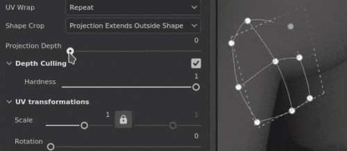
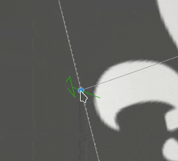
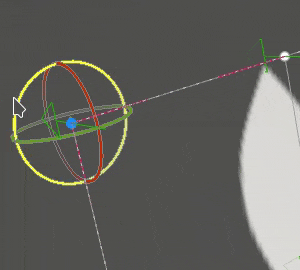

# Deforma la proiezione

La proiezione Altera del riempimento è una proiezione 3D che consente di deformare una texture modificando i punti di una griglia. Può essere utilizzato per adattare pattern e logo su una superficie non piana.

## Configurazione rapida

È possibile impostare rapidamente un livello con la proiezione di alterazione trascinando una risorsa dalla [finestra Risorse](../../interface/assets/assets.md) nella trama. Quando si rilascia il mouse, viene aperto un menu che consente di scegliere in quale canale deve essere assegnata la risorsa.

I tipi di risorse compatibili sono:

* **Alpha**
* **Procedurale**
* **Texture**
* **Materiale** (è necessario premere il tasto ALT)

## Proprietà

| Impostazione | Descrizione |
| --- | --- |
| **Filtraggio** | Controlla il modo in cui la texture o il materiale verranno filtrati. Questa impostazione può influire sull’aspetto della texture quando viene ripetuta più volte. Con valori di ridimensionamento elevati, l’utilizzo di un filtro diverso da quello predefinito può produrre risultati migliori. Impostazioni correnti disponibili:<ul data-preserve-html="true"><li data-preserve-html="true"><strong>Bilineare | HQ</strong> (impostazione predefinita): filtro bilineare avanzato che tenta di migliorare la qualità della texture quando i valori di suddivisione in porzioni sono elevati.</li><li data-preserve-html="true"><strong>Bilineare | Nitidezza</strong>: filtro bilineare semplice che ammorbidisce leggermente la texture, ma tenta di mantenere i dettagli.</li><li data-preserve-html="true"><strong>Più vicino</strong>: nessun filtro utile se il filtro bilineare produce un risultato sfocato e interrompe i dettagli più fini. Può introdurre l’alias nella texture.</li></ul> |
| **Involucro UV** | Controllate la modalità di ripetizione della texture all’interno della proiezione. I valori possibili sono:<ul data-preserve-html="true"><li data-preserve-html="true"><strong>Nessuno</strong>: la texture non viene ripetuta. Tutto ciò che si trova al di fuori della texture è nero/trasparente.</li><li data-preserve-html="true"><strong>Ripetizione orizzontale</strong>: la texture si ripete solo orizzontalmente.</li><li data-preserve-html="true"><strong>Ripeti verticalmente</strong>: la texture si ripete solo verticalmente.</li><li data-preserve-html="true"><strong>Ripetizione</strong> (impostazione predefinita): la texture si ripete su entrambi gli assi.</li></ul> |
| **Ritaglio forma** | Definite se la texture proiettata deve essere visibile all&#39;esterno dell&#39;area di proiezione. I valori possibili sono:<ul data-preserve-html="true"><li data-preserve-html="true"><strong>Progetto ritagliato in forma</strong>: la proiezione è limitata all&#39;interno dell&#39;area di proiezione.</li><li data-preserve-html="true"><strong>La proiezione si estende oltre la forma</strong> (impostazione predefinita): la proiezione continua oltre l&#39;area di proiezione.</li></ul> 

 |
| **profondità proiezione** | Controlla la distanza della proiezione lungo il suo asse Z. Questa impostazione consente di raggiungere la superficie della trama quando il punto della griglia o il piano di proiezione è troppo lontano.Le frecce verdi indicano la direzione e la distanza della proiezione per ciascun punto della griglia. 

 **Avviso:** un valore elevato può influire negativamente sulle prestazioni. Si consiglia di mantenere questo parametro il più basso possibile. |
| **Sfoltimento profondità** | Applica la dissolvenza alla proiezione in base alla distanza. È disponibile un parametro:<ul data-preserve-html="true"><li data-preserve-html="true"><strong>Durezza</strong>: controlla la durezza della transizione di dissolvenza.</li></ul> 

 |

### Trasformazione UV

Le impostazioni di trasformazione UV controllano la texture/il materiale all’interno della proiezione.

<table data-preserve-html="true" style="width: 100.0%;"><colgroup> <col style="width: 40.0%;"/> <col style="width: 20.0%;"/> <col style="width: 40.0%;"/> </colgroup><tbody><tr><th>Modalità scala</th><th>Impostazione</th><th>Descrizione</th></tr><tr><td>
<strong>Affiancatura</strong> (impostazione predefinita)<strong>  </strong>

Consente di impostare manualmente la quantità di ripetizione per la texture corrente.
</td><td><strong>Affiancamento</strong></td><td>Controlla quante volte la texture viene ripetuta.</td></tr><tr><td rowspan="2">  </td><td colspan="1"><strong>Rotazione</strong></td><td colspan="1">Controlla l’angolo di proiezione della texture sulla trama.</td></tr><tr><td colspan="1"><strong>Offset</strong></td><td colspan="1">Controlla da dove verrà proiettata la texture. Il valore predefinito indica che il centro della texture si trova al centro degli UV della trama.</td></tr><tr><th colspan="1"> </th><th colspan="1"> </th><th colspan="1"> </th></tr><tr><td rowspan="4">
<strong>Dimensione fisica</strong>

Regolazione automatica di una texture in base alla dimensione della trama e alla dimensioni fisiche incorporata. Utilizza la larghezza e la lunghezza (misurazioni X e Y) per calcolare la dimensioni fisiche corretta. La misurazione Z non è presa in considerazione.

(Per ulteriori informazioni, consultare la [pagina della documentazione](https://experienceleague.adobe.com/en/docs/substance-3d-painter/using/features/physical-size))
</td><td><strong>Dimensioni personalizzate</strong></td><td>
Se questa opzione è attivata, consente di immettere manualmente una dimensioni fisiche e di sostituire quella fornita da una risorsa.

Viene selezionata automaticamente se non viene rilevata alcuna dimensioni fisiche o se vengono utilizzate più risorse con dimensioni fisiche diverse nello stesso livello/effetto.
</td></tr><tr><td colspan="1"><strong>Dimensioni (cm)</strong></td><td colspan="1">Le dimensioni fisiche incorporate sono espresse in centimetri. È possibile lavorare con un file mesh creato utilizzando diverse unità di misura, mantenendo proporzioni corrette. Tuttavia, le dimensioni delle risorse sono attualmente visualizzate solo in centimetri.</td></tr><tr><td colspan="1"><strong>Rotazione</strong></td><td colspan="1">Controlla l’angolo di proiezione della texture sulla trama.</td></tr><tr><td colspan="1"><strong>Offset</strong></td><td colspan="1">
Controlla da dove verrà proiettata la texture. Il valore predefinito indica che il centro della texture si trova al centro degli UV della trama.
</td></tr></tbody></table>

### Impostazioni progetto 3D

Le impostazioni di proiezione 3D controllano la trasformazione della proiezione nello spazio 3D.

| Impostazione | Descrizione |
| --- | --- |
| **Scostamento** | Posizione dell&#39;origine della proiezione nello spazio 3D. Le unità si basano sul rettangolo di selezione dell’intera scena. 0 è il centro di questa casella. |
| **Rotazione** | Angoli in gradi per ruotare l’intera proiezione su ciascun asse. |
| **Scala** | Dimensione dell&#39;intera proiezione su ciascun asse. |

## Barra degli strumenti contestuale

Nella [barra degli strumenti contestuale](../../interface/toolbars.md) che si trova nella parte superiore della finestra della vista, sono disponibili varie impostazioni e strumenti che consentono di controllare il manipolatore e la proiezione:

| Icona | Nome | Descrizione |
| --- | --- | --- |
| 

 | Mostra/nascondi il manipolatore | Se questa opzione è attivata, il manipolatore è visibile e controllabile nella finestra della vista per modificare la trasformazione della proiezione o i punti della griglia. Se è disattivata, sia il manipolatore che la griglia sono nascosti. |
| 

 | Impostazioni manipolatore | Questo menu contiene tre impostazioni:<ul data-preserve-html="true"><li data-preserve-html="true"><strong>Dimensione manipolatore</strong>: controlla la dimensione del manipolatore nella finestra della vista.</li><li data-preserve-html="true"><strong>Passaggi griglia</strong>: definisci la dimensione del passaggio durante la traduzione con un vincolo.</li><li data-preserve-html="true"><strong>Passaggi angolari</strong>: definisci l&#39;angolo del passo quando si ruota con un vincolo.</li></ul> |
| 

 | Menu Altera edizione | Questo menu contiene cinque azioni:<ul data-preserve-html="true"><li data-preserve-html="true"><strong>Alterazione della trasformazione</strong>: modificate la trasformazione di alterazione. Consente di manipolare la posizione, la rotazione e la scala della griglia globale.</li><li data-preserve-html="true"><strong>Modificare i vertici</strong>: modificate i punti della griglia di alterazione singolarmente o in gruppo.</li><li data-preserve-html="true"><strong>Dividi alterazione a croce</strong>: avviate lo strumento Dividi alterazione per inserire una nuova divisione della griglia sia in orizzontale che in verticale.</li><li data-preserve-html="true"><strong>Dividi alterazione in orizzontale</strong>: avviate lo strumento Dividi alterazione per inserire una nuova divisione della griglia in orizzontale.</li><li data-preserve-html="true"><strong>Dividi alterazione in verticale</strong>: avviate lo strumento Dividi alterazione per inserire una nuova divisione della griglia in verticale.</li></ul> |
| 

 | Alterare le impostazioni di proiezione | Questo menu raggruppa le impostazioni che influiscono solo sulla proiezione dell’alterazione corrente:<ul data-preserve-html="true"><li data-preserve-html="true"><strong>Riga e colonne</strong>: specificate il numero di divisioni della griglia di alterazione. Questa impostazione può essere modificata solo se non è stato modificato alcun punto della griglia.</li><li data-preserve-html="true"><strong>Dimensioni maniglia</strong>: definite le dimensioni dei punti della griglia in modalità <strong>Modifica vertici</strong>.</li><li data-preserve-html="true"><strong>Colore griglia</strong>: definite il colore delle linee della griglia di alterazione.</li></ul> |
| 

 | Tangenti automatiche | Se questa opzione è attivata, quando vengono spostate le tangenti di un punto vengono allineate automaticamente verso i punti vicini. |
| 

 | Manipolatore di traduzione | Consente di spostare la proiezione o i punti della griglia lungo gli assi principali (X, Y, Z). |
| 

 | Manipolatore di rotazione | Consente di ruotare la proiezione o i punti della griglia lungo gli assi principali (X, Y, Z). |
| 

 | Manipolatore scala | Consente di ridimensionare la proiezione nella scena lungo gli assi principali (X, Y, Z). |
| 

 | manipolatore di superficie | Consente di spostare i punti della proiezione o della griglia agganciandoli sulla superficie del modello 3D. |
| 

 | Spazio manipolatore | Definire lo spazio in cui vengono eseguite le trasformazioni. Valori possibili:<ul data-preserve-html="true"><li data-preserve-html="true"><strong>Spazio locale</strong>: gli assi sono allineati alla trasformazione corrente.</li><li data-preserve-html="true"><strong>Spazio globale</strong>: gli assi sono allineati alla scena.</li></ul> |
| 

 | Speculare su X | Invertite la trasformazione sull&#39;asse X. |
| 

 | Speculare su Y | Invertite la trasformazione sull&#39;asse Y. |
| 

 | Speculare su Z | Invertite la trasformazione sull&#39;asse Z. |
| 

 | Reimposta la trasformazione | Questo menu contiene tre azioni:<ul data-preserve-html="true"><li data-preserve-html="true"><strong>Ripristinare la trasformazione globale</strong>: ripristinare i valori iniziali della posizione, rotazione e scala della proiezione. Questa azione non influisce sui punti della griglia stessi.</li><li data-preserve-html="true"><strong>Ripristina tutti i vertici</strong>: ripristinate tutte le posizioni e le tangenti dei punti della griglia di alterazione.</li><li data-preserve-html="true"><strong>Ripristina vertici selezionati</strong>: ripristinate solo la posizione e le tangenti dei punti selezionati della griglia di alterazione.</li></ul> |

## Manipolatore

Questo manipolatore di proiezione è disponibile solo nella [finestra della vista 3D](../../interface/viewport/3d-view.md).

| Azione | Scelta rapida | Descrizione |
| --- | --- | --- |
| **Traduzione** | Clic del mouse | Con il manipolatore Traslazione (Translation), fate clic sugli assi per spostare la proiezione:<ul data-preserve-html="true"><li data-preserve-html="true"><strong>Un asse</strong>: spostarsi solo in una direzione della proiezione.</li><li data-preserve-html="true"><strong>Due assi</strong>: spostate la proiezione sui piani allineati agli assi.</li><li data-preserve-html="true"><strong>Tre assi</strong>: spostate la proiezione nello spazio della fotocamera (piano rivolto verso di essa).</li></ul>   <table> <tr style="border: 0;"> <td style="border: 0;" valign="top">  

  </td> <td style="border: 0;" valign="top">  

  </td> <td style="border: 0;" valign="top">  

  </td> </tr> </table> |
| **Traduzione vincolata** | MAIUSC+clic del mouse | Con il manipolatore Traslazione (Translation), spostate la proiezione lungo gli assi selezionati, ma solo a intervalli specifici (stepping). La dimensione dell&#39;intervallo viene definita tramite le impostazioni del manipolatore. 

 |
| **Rotazione** | Clic del mouse | Con il manipolatore Rotazione, facendo clic su un asse si ruota la proiezione. Fate clic tra gli assi per consentire la rotazione di tutti gli assi contemporaneamente.   <table> <tr style="border: 0;"> <td style="border: 0;" valign="top">  

  </td> <td style="border: 0;" valign="top">  

  </td> </tr> </table> |
| **Rotazione vincolata** | MAIUSC+clic del mouse | Con il manipolatore Rotazione, fare clic su un asse per ruotare la proiezione solo a intervalli specifici. Il passo viene definito da un angolo tramite le impostazioni del manipolatore. 

 |
| **Scala** | Clic del mouse | Con il manipolatore Scala, facendo clic su una maniglia dell&#39;asse potete ridimensionare la proiezione lungo l&#39;asse specificato.   <table> <tr style="border: 0;"> <td style="border: 0;" valign="top">  

  </td> <td style="border: 0;" valign="top">  

  </td> <td style="border: 0;" valign="top">  

  </td> </tr> </table> |
| **Scala vincolata** | MAIUSC+clic del mouse | Con il manipolatore Scala (Scale), facendo clic su una maniglia dell&#39;asse mantenendo la scelta rapida da tastiera, la proiezione viene ridimensionata gradualmente. La dimensione del passo è uguale a quella del manipolatore di traslazione. 

 |
| **Superficie** | Clic del mouse | Con il manipolatore Superficie (Surface), fate clic e trascinate sul modello 3D per eseguirne lo snap sulla superficie. 

 **Nota:** questo manipolatore è disponibile solo con i tipi di proiezione **Planar** e **Warp**. |

## Modifica dei punti della griglia

La proiezione di alterazione è rappresentata da un piano e da una griglia di punti. Ogni punto può essere modificato per adattare meglio la proiezione al modello 3D, ma anche per distorcere la texture.

Per modificare il punto della griglia, impostate la modalità edizione su **Modifica vertici** dalla barra degli strumenti contestuale:

>[!NOTE]
>
> È disponibile una scelta rapida da tastiera per passare rapidamente da **Alterazione della trasformazione** a **Modifica vertici**. Consultate **Attivare/disattivare la modalità edizione alterata** nella pagina [Scelte rapide](../../interface/settings/shortcuts.md).

### Selezione dei punti

| Azione | Descrizione |
| --- | --- |
| 

 | <ul data-preserve-html="true"><li data-preserve-html="true">Un singolo clic su un punto lo selezionerà.</li><li data-preserve-html="true">Se si fa clic fuori da un punto o dal manipolatore, i punti vengono deselezionati.</li><li data-preserve-html="true">Facendo clic sui punti mentre si preme <strong>MAIUSC</strong> è possibile selezionare più punti.</li><li data-preserve-html="true">Facendo clic su un punto mentre si preme <strong>CTRL</strong> è possibile deselezionare solo questo punto e non l&#39;altro.</li></ul> |
| 

 | <ul data-preserve-html="true"><li data-preserve-html="true">Facendo clic e trascinando si consente di effettuare una selezione rettangolare. Tutti i punti all&#39;interno del rettangolo verranno selezionati al rilascio del mouse.</li><li data-preserve-html="true">Facendo clic e trascinando mentre si preme <strong>MAIUSC</strong> è possibile aggiungere altri punti alla selezione corrente.</li><li data-preserve-html="true">Facendo clic e trascinando mentre si preme <strong>CTRL</strong> è possibile rimuovere i punti dalla selezione corrente.</li></ul> |

### Spostamento di punti

| Azione | Descrizione |
| --- | --- |
| 

 | <ul data-preserve-html="true"><li data-preserve-html="true">Usate il manipolatore Traslazione (Translation) per spostare un punto.</li><li data-preserve-html="true">Utilizzate il manipolatore Superficie (Surface) per spostare il punto sulla superficie del modello 3D.</li></ul> |
| 

 | <ul data-preserve-html="true"><li data-preserve-html="true">Fai clic e trascina un punto per spostarlo rapidamente senza doverlo prima selezionare.</li><li data-preserve-html="true">Facendo clic e trascinando un punto, questo verrà spostato come il manipolatore Superficie.</li><li data-preserve-html="true">Se si fa clic e si trascina un punto tenendo premuto <strong>CTRL</strong>, questo verrà spostato come il manipolatore di traslazione (nello spazio videocamera su tre assi).</li></ul> |

### Regolazione delle tangenti

La griglia di proiezione di Altera è una [patch di Bézier](https://en.wikipedia.org/wiki/B%C3%A9zier_surface). Ciò significa che ogni punto ha un proprio insieme di tangenti per controllare la curva delle linee che uniscono insieme i punti. La regolazione delle tangenti consente un maggiore controllo sulla deformazione della texture.

| Azione | Descrizione |
| --- | --- |
| 

 | <ul data-preserve-html="true"><li data-preserve-html="true">Per modificare le tangenti di un punto (visualizzato in rosso), è sufficiente selezionare il punto specificato, quindi utilizzare il manipolatore Rotazione o Scala.</li></ul> |

>[!NOTE]
>
> La tangente verrà reimpostata e regolata automaticamente quando si spostano i punti se l&#39;impostazione **Tangenti automatiche** dalla barra degli strumenti contestuale è abilitata.
> 
> 

### Aumento o riduzione del numero di punti

Potete suddividere la griglia di alterazione per aumentare il numero di punti e controllare meglio la deformazione della texture.

| Azione | Descrizione |
| --- | --- |
| 

 | <ul data-preserve-html="true"><li data-preserve-html="true">Dividete la griglia per righe e colonne nel menu delle impostazioni di Altera. (Ciò è possibile solo se non sono stati spostati punti)</li><li data-preserve-html="true">Suddividete la griglia utilizzando uno dei tre strumenti di divisione.</li><li data-preserve-html="true">È possibile annullare uno degli strumenti di divisione premendo <strong>Esc</strong>.</li></ul> |
