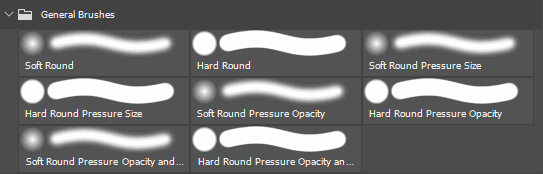

# Esportazione di pennelli predefiniti da Photoshop

I file ABR (predefiniti pennello di Photoshop) possono essere creati solo da Adobe Photoshop. Per creare un ABR contenente predefiniti, seguite i passaggi riportati di seguito:

1. <b>Apri Adobe Photoshop.</b>

   I file ABR possono essere creati solo da Photoshop.
1. <b>Aprite il pannello Pennelli.</b>

   Apri il pannello Pennelli da <b>Finestra > Pennelli. </b>

   {width="500px"}
1. <b>Selezionare i pennelli predefiniti (o i gruppi) da esportare.</b>

   Tenete premuto CTRL per selezionare più pennelli o predefiniti.

   {width="500px"}
1. <b>Esporta in un file ABR.</b>

   Apri il menu delle impostazioni della finestra Pennello e seleziona <b>Esporta pennelli selezionati</b>.

   Verrà visualizzata una finestra di dialogo in cui viene richiesto un nome file e un percorso per salvare il file ABR esportato.

   
