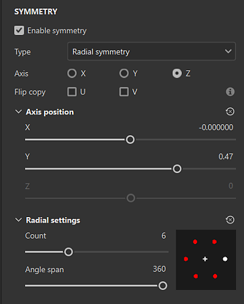

# Simmetria

La simmetria è un’impostazione utile che potete utilizzare sui livelli di pennello e riempimento per duplicare in modo semplice e preciso il contenuto in base ai vincoli geometrici:

* Con i livelli Pennello, utilizzate la simmetria per duplicare i singoli tratti del pennello in altre posizioni sulla trama in base all’asse di simmetria.
* Con i livelli Riempimento, utilizzate la simmetria per duplicare l’intero livello di riempimento attorno all’asse di simmetria.

Ulteriori informazioni sui tipi di simmetria che è possibile utilizzare in Painter:

* [Simmetria speculare](mirror-symmetry.md)
* [Simmetria radiale](radial-symmetry.md)

## Usare la simmetria con lo strumento pittura

È possibile attivare la simmetria con il pulsante <b> Simmetria</b> nella barra degli strumenti contestuale.

Regolate le opzioni di simmetria con il <b>pulsante Impostazioni simmetria</b> nella barra degli strumenti contestuale.

>[!NOTE]
>
> La proiezione del colore e la proiezione dello stencil nella vista 2D non supportano la simmetria. Se necessario, si consiglia di utilizzare la vista 3D.

## Usa simmetria con livelli di riempimento

Quando è selezionato un livello di riempimento, potete utilizzare il <b>pulsante Simmetria</b> nella barra degli strumenti contestuale, proprio come con la simmetria dello strumento Pennello. Con i livelli di riempimento, puoi anche abilitare e accedere alle opzioni di simmetria dal <b>pannello Proprietà</b>. La simmetria è disponibile solo con i seguenti metodi di proiezione:

<table>
<tr style="border: 0;">
<td style="border: 0;" valign="top">

* Proiezione triplanare
* Proiezione planare
* Proiezione della sfera
* Proiezione cilindrica
* Deforma la proiezione

Quando è selezionato un metodo di proiezione idoneo, Attiva simmetria nella sezione Simmetria del pannello Proprietà per accedere alle opzioni di simmetria.

Se viene selezionato un metodo di proiezione non supportato, l&#39;opzione <b>Attiva simmetria</b> non sarà disponibile e il <b>pulsante Simmetria</b> nella barra degli strumenti contestuale sarà disattivato.

</td>
<td style="border: 0;" valign="top">

{width="400px"}

</td>
</tr>
</table>

>[!NOTE]
>
> Le opzioni di visualizzazione della simmetria sono disponibili solo dal <b>pulsante Impostazioni simmetria</b> nella barra degli strumenti contestuale. Non è possibile modificare le impostazioni di visualizzazione della simmetria dal <b>pannello Proprietà</b>.
