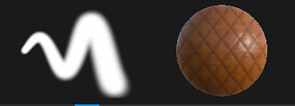
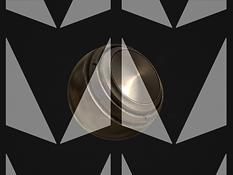

# Pennello artistico

Lo strumento pittura è lo strumento predefinito di Substance 3D Painter per applicare colori e proprietà del materiale su una trama 3D. Contiene parametri specifici che possono essere modificati tramite [Proprietà](../../interface/properties.md).

Lo strumento Disegno simula i tratti di pennello in base a vari comportamenti e impostazioni per dare la sensazione di dipingere sulla trama 3D.

## Barra degli strumenti

Le [barre degli strumenti](../../interface/toolbars.md) visualizzeranno le seguenti scelte rapide (vedere la relativa spiegazione nelle sezioni successive):

* Dimensioni
* Flusso
* Opacità tratto
* Spaziatura

Sono disponibili altre scelte rapide comuni ad altri strumenti:

* [Mouse lento](../lazy-mouse.md)
* [Simmetria](../symmetry/symmetry.md)

## Anteprima

Nella parte superiore delle [Proprietà](../../interface/properties.md) si trovano il pennello e le anteprime del materiale. Possono essere utilizzati per visualizzare rapidamente la configurazione dello strumento corrente.

| *Nome* | *Descrizione* |
| --- | --- |
| **Anteprima pennello** | L’anteprima del pennello mostra come si comporterà il pennello in base ai parametri del pennello. È possibile fare clic nell’anteprima per disegnare un tratto personalizzato.   <table> <tr style="border: 0;"> <td style="border: 0;" valign="top">  

  </td> <td style="border: 0;" valign="top">  

  </td> </tr> </table>   **Nota:** l&#39;anteprima del pennello non supporta la pressione della penna. |
| **Anteprima materiale** | L’anteprima del materiale mostra le proprietà del materiale attualmente utilizzato per dipingere. È possibile fare clic nell’anteprima per ruotare l’illuminazione e vedere meglio come si comporterà il materiale prima di dipingere.   <table> <tr style="border: 0;"> <td style="border: 0;" valign="top">  

  </td> <td style="border: 0;" valign="top">  

  </td> </tr> </table> |

## Pennello

I parametri Pennello definiscono l’aspetto del tratto del pennello quando viene eseguito sulla trama 3D.

>[!NOTE]
>
> Quando si utilizza una tavoletta grafica, alcuni parametri possono essere controllati dalla pressione della penna. Queste informazioni possono essere salvate anche in [Predefiniti](../presets/presets.md).\
> Fare clic sul pulsante dedicato per attivare o disattivare la pressione:
> 
> 

| Nome | Descrizione |
| --- | --- |
| **Dimensioni** | Controlla la dimensione dei timbri all’interno di un tratto del pennello. La dimensione relativa del pennello può variare a seconda dello spazio relativo definito in (vedere il parametro Spazio della dimensione di allineamento di seguito). *Questo parametro può essere controllato dalla pressione della penna.* |
| **Flusso** | Intensità o opacità dei singoli timbri presenti nel tratto del pennello. *Questo parametro può essere controllato dalla pressione della penna.* |
| **Opacità tratto** | Opacità globale massima di un tratto pennello. A differenza del parametro Flusso, l’opacità del tratto non può essere controllata mediante Pressione penna perché viene applicata alla fine del processo di disegno del tratto.Differenza tra opacità di flusso e di traccia:<ul data-preserve-html="true"><li data-preserve-html="true"><strong> A sinistra di </strong>: flusso al 50%, opacità traccia al 100%</li><li data-preserve-html="true"><strong> Destra </strong>: flusso al 100%, opacità traccia al 50%</li></ul> 

 **Nota:** è possibile continuare un tratto precedente come nell&#39;animazione precedente premendo la scelta rapida &quot;A&quot;. |
| **Spaziatura** | Distanza tra i singoli timbri di un tratto del pennello. I valori piccoli consentono di creare linee continue, ma sono più ampi da calcolare poiché disegnano più timbri in totale. Valori alti permettono di creare uno spazio tra il timbro che può essere più adatto a motivi specifici (come Unghie su legno). |
| **Angolo** | Orientamento dei timbri all’interno del tratto del pennello. Utile per ruotare l&#39;Alpha se non è allineato correttamente. Può essere combinato con il percorso Segui. |
| **Segui percorso** | Orienta i timbri all’interno del tratto del pennello in modo da seguire la direzione del disegno. 

 **Nota:** per calcolare la direzione del tratto, Substance 3D Painter confronta il timbro precedente con quello corrente. Per questo motivo, quando è abilitata l&#39;opzione Segui tracciato, un singolo clic disegnato non produce alcun risultato. Per colorare un tratto di pennello con questa funzione attivata sono necessari almeno due timbri. |
| **Variazione dimensioni** | Applica un valore di dimensione casuale per timbro all’interno del tratto del pennello. Un valore pari a 0 indica assenza di casualità, un valore pari a 1 indica casualità completa. 

 |
| **Variazione flusso** | Applica un valore di flusso casuale per timbro all’interno del tratto del pennello. Un valore pari a 0 indica assenza di casualità, un valore pari a 1 indica casualità completa. 

 |
| **Variazione angolo** | Applica un angolo di rotazione aggiuntivo casuale per timbro all’interno del tratto del pennello. Un valore pari a 0 indica assenza di casualità, un valore pari a 1 indica casualità completa. 

 |
| **Variazione posizione** | Applica uno scostamento di posizione casuale per timbro all’interno del tratto del pennello. Un valore pari a 0 indica assenza di casualità, un valore pari a 1 indica casualità completa. 

 |
| **Allineamento** | Determina la modalità di proiezione/orientamento dei timbri all’interno del tratto del pennello sulla superficie della trama 3D. Sono disponibili i valori seguenti:<ul data-preserve-html="true"><li data-preserve-html="true"><strong> videocamera </strong>: orientare il timbro verso il punto di vista della finestra della vista</li><li data-preserve-html="true"><strong> Tangente | A capo (impostazione predefinita) </strong>: orientare il timbro per allinearlo alla superficie della trama 3D. Il timbro verrà inoltre deformato per adattarsi alla superficie.</li><li data-preserve-html="true"><strong> Tangente | Planare </strong>: orientate il timbro per allinearlo alla superficie della trama 3D. Il timbro sfumerà il bordo troppo lontano dalla superficie della trama 3D. </li><li data-preserve-html="true"><strong> UV </strong>: orientare il timbro in base agli UV della trama 3D.</li></ul> |
| **Eliminazione sfondo** | Consente di ignorare le superfici sulla trama 3D non allineate con il timbro. Per calcolare quali parti della trama 3D devono essere ignorate, il motore di pittura osserva la normale alla superficie della trama 3D e confronta il suo angolo con il valore definito. |
| **Dimensione spazio** | Controlla lo spazio relativo in cui viene calcolata la dimensione del pennello. I valori possibili sono:<ul data-preserve-html="true"><li data-preserve-html="true">Oggetto <strong> (predefinito) </strong>: la dimensione del pennello è sincronizzata con la dimensione della trama 3D. Lo spostamento della videocamera nella finestra della vista influisce sulle dimensioni in modo da mantenerla relativa alla trama 3D.</li><li data-preserve-html="true"><strong> Finestra di visualizzazione </strong>: la dimensione del pennello è collegata alla finestra di visualizzazione. Il ridimensionamento dell’interfaccia influisce sulla dimensione del pennello. Lo spostamento della fotocamera non avrà alcun effetto.</li><li data-preserve-html="true"><strong> Texture </strong>: la dimensione del pennello è collegata al livello di zoom della finestra della vista 2D.</li></ul> |

## Alfa

L’Alpha è la maschera in scala di grigio applicata a ogni timbro all’interno del tratto del pennello. Può essere un file di Substance o una bitmap.

>[!NOTE]
>
> Se un grafico a Substance presenta un parametro &quot;durezza&quot; (identificatore) esposto, può essere controllato con la Durezza [Scelte rapide](../../interface/settings/shortcuts.md).

## Fisica

Le proprietà Fisica consentono di controllare le particelle che vengono proiettate quando si dipinge.

Per impostazione predefinita, le proprietà Fisica non sono disponibili, ma possono essere attivate in due modi:

* Impostando lo strumento su &quot;Fisico&quot; nelle [Barre degli strumenti](../../interface/toolbars.md) (o tramite la scelta rapida da tastiera).
* Facendo clic su un predefinito Pennello particella nella finestra [Risorse](../../interface/assets/assets.md).

## Stencil

Lo Stencil è una maschera aggiuntiva in scala di grigio per il tratto del pennello. Contrariamente al canale alfa applicato a ogni singolo timbro, lo Stencil è una maschera globale applicata dal punto di vista [Finestra di visualizzazione](../../interface/viewport/viewport.md).

>[!NOTE]
>
> È possibile reimpostare la trasformazione Stencil premendo il tasto **S** e facendo clic sul pulsante &quot; **Reimposta**&quot; in alto a destra nella finestra della vista:
> 
> 

| *Modalità* | *Viewport* |
| --- | --- |
| **Nessuna risorsa caricata** | Se non viene caricata alcuna risorsa, lo stencil non avrà alcun effetto. 

 **Nota:** è possibile disattivare temporaneamente la maschera Stencil senza rimuovere la risorsa premendo e mantenendo inalterata la [Scelte rapide](../../interface/settings/shortcuts.md) &quot;N&quot;. |
| **Sposta stencil** | Per spostare lo stencil, premere il tasto **S** e fare clic e trascinare con il pulsante **Mouse centrale**. 

 |
| **Ruota stencil** | Per ruotare lo stencil, premere il tasto **S** e fare clic e trascinare con il pulsante **Mouse sinistro**. Inoltre, premendo il tasto **Maiusc** è possibile allineare la rotazione ogni **90 gradi**. 

 |
| **Ridimensiona stencil** | Per ridimensionare lo stencil, premere il tasto **S** e fare clic e trascinare con il pulsante **Mouse destro**. 

 |

L’impostazione della modalità di suddivisione in porzioni controlla il modo in cui la maschera Stencil viene ripetuta nella finestra della vista (questa impostazione influisce anche sulla texture):

| *Modalità Porzione* | *Descrizione* |
| --- | --- |
| **Nessuna porzione (impostazione predefinita)** | La maschera Stencil non viene ripetuta. 

 |
| **Verticale in porzioni** | Ripetere la maschera Stencil solo sull&#39;asse orizzontale. 

 |
| **Porzione verticale** | Ripetere la maschera Stencil solo sull&#39;asse verticale. 

 |
| **Inclinazione orizzontale e verticale** | Ripetere la maschera Stencil sull&#39;asse orizzontale e verticale. 

 |

## Materiale

Un Materiale è composto da più canali in cui ciascuno mantiene proprietà specifiche. L&#39;elenco dei canali dipende da quelli definiti nelle [impostazioni del set di texture](../../interface/texture-set/texture-set-settings.md).

Il pulsante **Modalità materiale** è un modo semplice per caricare un file di Substance o un predefinito e assegnare e modificare rapidamente più canali contemporaneamente.

Facendo clic sul pulsante di un canale, questo viene selezionato o deselezionato. Se questa opzione è deselezionata, la proprietà del canale non può essere modificata e non verrà utilizzata durante il processo di pittura.

