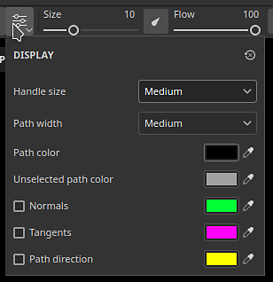
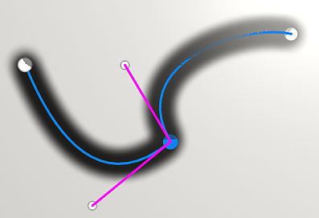

# Panoramica dello strumento tracciato

<table>
<tr style="border: 0;">
<td style="border: 0;" valign="top">

<b>Audio</b>

Regola o aggiungi audio al progetto.

* Regola il volume del video sorgente se dispone di audio.
* Aggiungere, rimuovere o sostituire un file audio esterno.
* Regola il volume del file audio esterno.

</td>
<td style="border: 0;" valign="top">

</td>
</tr>
</table>

Gli <b>strumenti tracciato</b> consentono di definire una curva con punti sulla superficie della trama. Una volta creata la curva, i diversi strumenti Tracciato consentono di creare diversi effetti lungo la curva.

## Creazione di un tracciato

I tracciati possono essere creati su livelli di disegno ed effetti di disegno. Esistono due modi per accedere allo strumento Tracciato:

* <b>Tramite l&#39;interfaccia</b>: accedi alla barra degli strumenti dello strumento sul lato sinistro e fai clic sulla terza icona dall&#39;alto.
* <b>Tramite una scelta rapida da tastiera</b>: per impostazione predefinita allo strumento non è assegnato alcun elemento. Questa impostazione può essere modificata nel menu Impostazioni modificando la scelta rapida &quot;Seleziona strumento dipingi lungo tracciato&quot;.

Una volta selezionato l’utensile, è possibile posizionare i punti facendo clic sulla superficie del modello 3D all’interno della finestra della vista 3D. Per creare un tracciato sono necessari almeno due punti (o vertici).

Lo strumento Tracciato ha diverse modalità, che possono essere simili agli altri strumenti di disegno disponibili nell’applicazione:

* Dipingi lungo il tracciato: disegnate un tratto di pennello regolare lungo un tracciato definito.
* [Percorso dei nastri](ribbon-tool.md): disegna un&#39;immagine ripetuta o estesa lungo un tracciato.
* [Tracciato riempito](filled-path.md): riempite l&#39;interno di un tracciato con un colore uniforme.
* Cancella lungo tracciato: disegna un tratto che cancella/rimuove informazioni lungo un tracciato definito.
* Sfumino lungo il tracciato: disegna un tratto che sfuma/sfoca le informazioni lungo un tracciato definito.

Ad esempio, lo strumento tracciato in modalità <b>Sfumino</b> influisce su altre informazioni di pittura:

>[!NOTE]
>
> Gli <b>strumenti tracciato</b> funzionano solo nello spazio 3D sulla superficie della geometria. La creazione di un tracciato nello spazio UV o come proiezione dello spazio su schermo non è attualmente supportata.

### Modifica di un tracciato

I punti di tracciato (o vertici) aderiscono automaticamente alla superficie della trama. Possono essere spostate e regolate in qualsiasi momento. È possibile aggiungere nuovi vertici a un tracciato esistente facendo clic in un punto qualsiasi della linea. 

* Premendo <b>Esc </b>o <b>Invio </b>verrà chiusa l&#39;edizione del percorso.
* Una volta uscito, facendo clic su una superficie vuota della trama si inizierà un nuovo tracciato.
* Passando con il mouse su un tracciato esistente e facendo clic su di esso, puoi selezionarlo e continuare o modificare il tracciato. I tracciati possono essere riselezionati anche tramite il pannello <b>Tracciati</b> (vedi di seguito).

Alcune proprietà sono specifiche di un tracciato nel suo insieme. Questo è il caso delle opzioni trovate nella finestra <b>Proprietà </b>. Proprio come con un tratto regolare (consulta la [documentazione dello strumento di pittura](paint-brush.md)), è possibile definire le seguenti proprietà per un tracciato:

* <b>Pennello</b>
* <b>Alpha</b>
* <b>Materiale</b>

La sezione <b>pennello </b> contiene opzioni aggiuntive disponibili solo con lo strumento Tracciato:

| <b>Impostazione</b> | <b>Descrizione</b> |
| --- | --- |
| <b>profondità proiezione</b> | Determina la distanza minima del tracciato rispetto alla superficie della trama per visualizzare i timbri del pennello. Per visualizzare questo feedback visivo direttamente nella finestra della vista, è possibile abilitare <b>Normali</b> nelle <b>Impostazioni di visualizzazione percorso </b>(vedere di seguito). |
| <b>Asse superiore</b> | L&#39;asse utilizzato per orientare i timbri del pennello quando <b>Segui percorso</b> è disattivato.   In un certo contesto, ha più senso avere tutti i timbri allineati lungo un asse/direzione globale e non lungo il tracciato. Ad esempio con rivetti su una superficie metallica. |

Altre proprietà vengono definite per punti (vertici) sul tracciato, ad esempio la pressione. Per modificare un punto specifico, fate clic su di esso (o utilizzate la selezione rettangolare). Utilizzare quindi la barra degli strumenti contestuale per modificare i valori dei punti selezionati.

### Controllo delle tangenti

In alcuni casi, un tracciato arrotondato potrebbe non essere ideale, in quanto non segue al meglio la superficie del modello 3D oppure perché non si adatta a un aspetto specifico. Per risolvere questi problemi, è possibile modificare le tangenti di un dato vertice. Le tangenti sono le direzioni di un punto che controllano la piegatura del tracciato.

Per passare da tangenti lisce a tangenti lineari/spezzate, è sufficiente fare doppio clic su un vertice (o utilizzare il pulsante dedicato nella barra degli strumenti contestuale):

Per controllare con maggiore precisione l&#39;orientamento delle tangenti, utilizzare il pulsante Tangenti personalizzate nella barra degli strumenti contestuale per ignorarle manualmente:

Utilizza la scelta rapida da tastiera <b>ALT</b> per interrompere le tangenti durante lo spostamento se il punto non era già presente.

Utilizzate la scelta rapida da tastiera <b>CTRL</b> per ridimensionare entrambe le tangenti contemporaneamente.

>[!NOTE]
>
> I controlli della tangente sono definiti lungo il piano che si allinea con la normale del punto specificato nel tracciato. Ciò significa che le tangenti non possono piegarsi in alcune direzioni.

### Barra degli strumenti contestuale

La <b>barra degli strumenti contestuale</b> quando lo strumento <b>Percorso</b> è selezionato fornisce diverse impostazioni che consentono di controllare il percorso attualmente selezionato:

| <b>Parametro</b> | <b>Descrizione</b> |
| --- | --- |
| <b>Mostra/nascondi interfaccia viewport</b>  

 | Se questa opzione è attivata, i tracciati e i vertici in sovrapposizione saranno visibili nella finestra della vista. |
| <b>Impostazioni schermo</b>  

 | Controllare l&#39;aspetto del feedback visivo del percorso nella finestra della vista:<ul data-preserve-html="true"> <li data-preserve-html="true"><b>Dimensione maniglia</b>: controlla la dimensione dei punti del tracciato.</li> <li data-preserve-html="true"><b>Larghezza percorso</b>: controlla il thickness della linea del percorso.  </li> <li data-preserve-html="true"><b>Colore tracciato</b>: controlla il colore della linea tracciato.  </li> <li data-preserve-html="true"><b>Colore tracciato non selezionato</b>: controlla il colore dei tracciati non attivi.  </li> <li data-preserve-html="true"><b>Normali</b>: se attivata, mostra la direzione di proiezione in ogni punto di un tracciato.  </li> <li data-preserve-html="true"><b>Tangenti</b>: se attivata, mostra la direzione della curva dei punti di controllo del percorso.  </li> <li data-preserve-html="true"><b>Direzione tracciato</b>: se attivata, mostra una piccola freccia alla fine del tracciato per indicarne la direzione di colorazione. Questo è utile per sapere come verranno orientati i timbri all’interno del tratto.</li> </ul>  

 |
| <b>Direzione percorso inversa</b>  

 | Invertite la direzione del tracciato corrente. La direzione definisce l’orientamento generale utilizzato per colorare i timbri all’interno del tratto. L&#39;inversione del tracciato può aiutare a riorientare il pattern disegnato. |
| <b>Attiva/Disattiva angolo/Arrotonda</b>  

 | Interrompere o allineare la tangente dei vertici attualmente selezionati, per passare da una curva liscia a una lineare.  

  **Nota:** per passare da un comportamento angolo a uno uniforme, è anche possibile fare doppio clic su un punto direttamente sul tracciato. |
| <b>Tangenti personalizzate</b>  

 | Se questa opzione è attivata, potete controllare manualmente le tangenti di un determinato punto sul tracciato.  

 |
| <b>Apri/chiudi percorso</b>  

 | Apre o chiude il percorso corrente. Per chiudere un tracciato, è necessario selezionare prima uno dei due punti finali del tracciato corrente.  

 |
| <b>Elimina vertice</b>  

 | Rimuovete i vertici attualmente selezionati su un tracciato. |
| <b>Simmetria</b>  

 | Attivate o disattivate la simmetria per il tracciato corrente. Per ulteriori informazioni, consultate la [documentazione sulla simmetria](../symmetry/symmetry.md).  

 |
| <b>Nascondere/ignorare la geometria esclusa</b>  

 | Se questa opzione è attivata, fate in modo che il tracciato corrente passi attraverso la geometria nascosta. Per ulteriori informazioni, consultate la [documentazione della maschera Geometria](../../interface/layer-stack/geometry-mask.md). |

### Pannello Tracciati

>[!NOTE]
>
> Il pannello è nascosto quando lo strumento corrente non è lo strumento Tracciato o se è selezionato un livello di riempimento o una cartella.

All’interno della finestra della vista è presente il pannello <b>Tracciati</b> in cui sono elencati tutti i tracciati del livello/effetto di disegno attualmente selezionato. Offre un modo semplice per selezionare e gestire i tracciati.

Con questo pannello, è possibile:

* Fai doppio clic su un percorso per <b>rinominarlo</b>.
* <b>Eliminare</b> un percorso selezionandolo e premendo il tasto Canc.
* <b>Copia</b>/<b>Incolla</b>/<b>Duplica</b> un percorso con le scelte rapide da tastiera dedicate.
* <b>Mostra</b> o <b>nascondi</b> un tracciato con l&#39;icona occhio (che controlla se il tracciato è applicato alla creazione della texture).

Per comodità, è anche possibile fare clic con il pulsante destro del mouse su un tracciato per aprire il menu di scelta rapida che offre le stesse azioni:

Facendo clic con il pulsante destro del mouse si aprono anche azioni per copiare le proprietà o la posizione di un tracciato su un altro. Questo consente di condividere o sincronizzare facilmente le funzioni su diversi percorsi:

>[!NOTE]
>
> Le proprietà di copia e incolla funzionano solo quando i tracciati sono basati sullo stesso strumento di pittura. Ad esempio, non è possibile condividere le proprietà tra un tracciato usando le impostazioni Sfumino e un altro usando le impostazioni del pennello.

## Strumenti predefiniti

{width="400px"}

Quando è selezionato uno strumento tracciato, nella parte superiore del pannello Proprietà è disponibile la sezione Predefiniti. Da qui puoi accedere rapidamente ai predefiniti per i vari strumenti tracciato.

### Predefiniti di tracciati preferiti

L’opzione Preferiti nella sezione Predefiniti contiene solo i predefiniti che avete preferito per un accesso ancora più rapido. Per iniziare ad aggiungere i preferiti, seleziona Preferiti, quindi &quot;Mostra predefiniti compatibili in risorse&quot; per un elenco completo dei predefiniti di percorso disponibili.

Per aggiungere un predefinito ai preferiti, fai clic con il pulsante destro del mouse sul predefinito nel pannello Risorse o nella sezione Predefiniti del pannello Proprietà, quindi seleziona &quot;Aggiungi ai preferiti&quot;. 

Puoi anche rimuovere i predefiniti dall’elenco dei preferiti. Fare clic con il pulsante destro del mouse su un predefinito Preferiti, quindi selezionare Rimuovi dai preferiti.

{width="400px"}

### Creare predefiniti di tracciato

Come altri strumenti, è possibile creare predefiniti per ripristinare rapidamente le impostazioni/configurazioni del pennello. A tale scopo, è sufficiente fare clic con il pulsante destro del mouse nella finestra <b>Proprietà</b> e scegliere <b>Crea strumento predefinito.</b> Questo predefinito appena creato passerà automaticamente allo strumento Tracciato quando viene selezionato nella finestra <b>Risorse</b>.
