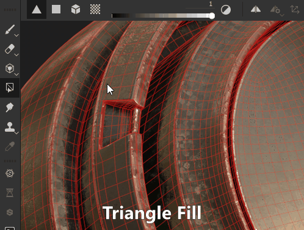

# Riempimento poligono

Lo strumento **Riempimento poligonale** () consente di disegnare rapidamente le maschere trasformando i poligoni selezionati in una maschera pixel. Potrebbe sembrare uno strumento di selezione 3D di altre applicazioni 3DCC, ma in realtà è uno strumento di riempimento che genera dati pixel. Ciò significa che si selezionano e si deselezionano i lavori utilizzandoli per pittura bianco o nero.

Lo strumento Riempimento poligonale funziona su [Livelli di pittura,](../../interface/layer-stack/layer-stack.md) ma è limitato solo al colore di base e non è destinato a questo scopo. [Utilizzalo solo per le maschere](../../interface/layer-stack/masking-and-effects.md).

Sono disponibili 4 modalità di selezione:

*  **Riempimento triangolare** - riempie i singoli tri mesh.
*  **Riempimento poligono** - riempie interi poligoni. Se la trama è già stata triangolata al momento dell’esportazione, non esegue alcuna operazione diversa da Riempimento triangolo.
* Riempimento trama **** - riempie intere sottotrame collegate. Come la modalità &quot;sotto-oggetto&quot; nelle applicazioni 3D, riempirà ogni poligono connesso a quello su cui si fa clic.
* **riempimento blocco UV** - riempie l&#39;intero blocco UV o &quot;isola&quot;. Funziona come il riempimento Trama, ma osservando i poligoni collegati nello spazio UV. Il riempimento si interrompe ai bordi UV.

Queste 4 modalità possono essere combinate e commutate, il che significa che un po&#39; di uso intelligente ti consente di contrassegnare e rimuovere rapidamente le sezioni in una maschera utilizzando la modalità Trama e blocco UV.

I tasti di scelta rapida (predefiniti) associati allo strumento Riempimento poligono sono:

* *Tasto numerico 4*: seleziona lo strumento Riempimento poligono.
* *X* - Inverte il colore corrente quando si colorano le maschere. Sostituirà rapidamente il nero con il bianco. In modalità di pittura di materiali, questo tasto di scelta rapida non ha alcun effetto.
