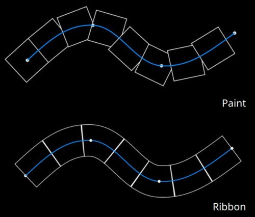

# Percorso del nastro

Lo strumento <b>Barra multifunzione </b>tracciato consente di creare pattern che si deformano lungo una curva definita da punti sulla superficie del modello 3D. La barra multifunzione può essere utilizzata anche per scrivere testo lungo una curva.

Lo strumento Barra multifunzione può essere selezionato dal menu dello strumento Tracciato nella barra degli strumenti:

Oppure tramite il pulsante <b>Tipo di percorso</b>:

## Panoramica

Lo strumento Percorso dei nastri si distingue dallo strumento Disegna lungo tracciato per il modo in cui disegna immagini e materiali.

Mentre con lo strumento basato su disegno o pennello un’immagine viene ripetuta più volte su un tracciato, con il nastro l’immagine viene ripetuta lungo il tracciato e deformata per seguirne le curve. I singoli componenti di un pennello artistico sono chiamati <b>timbri</b>, mentre quelli della barra multifunzione sono chiamati <b>patch</b>.

## Impostazioni

### Dimensioni

| Parametro | Descrizione |
| --- | --- |
| <b>Larghezza traccia</b> | Controlla la larghezza globale del tratto corrente. |

### Opacità

| Parametro | Descrizione |
| --- | --- |
| <b>Opacità tratto</b> | Controllate l’opacità finale del tratto corrente. |

### Traccia

| Parametro | Descrizione |
| --- | --- |
| <b>Orientamento immagine</b> | Definite la direzione dell’immagine di input. Questa direzione controlla il modo in cui l&#39;immagine viene posizionata sul tracciato. |
| <b>Capovolgi immagine</b> | Capovolgete l’immagine lungo l’asse o la larghezza del tracciato. |
| <b>Angolo</b> | Definite l&#39;aspetto degli angoli acuti (tangenti divise) sul tracciato. I comportamenti possibili sono:<ul data-preserve-html="true"> <li data-preserve-html="true"><b>Angolo vivo</b>: angolo vivo/punta</li> <li data-preserve-html="true"><b>Angolo arrotondato</b>: angolo arrotondato</li> <li data-preserve-html="true"><b>Angolo smussato</b>: angolo quadrato/piatto</li> <li data-preserve-html="true"><b>Taglia join</b>: avvia nuovamente il percorso. Questa modalità creerà un nuovo percorso con sezioni di inizio/fine dedicate.</li> </ul>Di seguito sono riportati gli angoli, in ordine:  

 |
| <b>L&#39;omissione termina alla chiusura</b> | Se questa opzione è attivata, le sezioni iniziale/finale verranno rimosse quando un tracciato viene chiuso per creare un ciclo continuo. Questo vale sia per gli scostamenti di dilatazione che per i tratti dinamici. |

### Dilatazione e affiancatura

Il Percorso dei nastri può usare due modalità diverse per controllare come un’immagine viene ripetuta ed estesa lungo un tracciato:

* <b>Allunga lungo il percorso</b>: (impostazione predefinita) l&#39;immagine ripetuta lungo il percorso verrà allungata per adattarsi alla lunghezza del percorso
* <b>Mantieni proporzioni</b>: le proporzioni dell&#39;immagine ripetuta lungo il percorso verranno mantenute. Se l’immagine è troppo lunga rispetto al tracciato, verrà ritagliata.

#### Allunga lungo il percorso

| Parametro | Descrizione |
| --- | --- |
| <b>Allunga solo tra scostamenti</b> | Se questa opzione è attivata, mantiene intatte le sezioni iniziale e finale di un’immagine mentre si allunga al centro. Utilizzare i parametri <b>Offset iniziale</b> e <b>Offset finale</b> per definire la dimensione di queste sezioni. La sezione centrale verrà calcolata automaticamente in base all&#39;inizio/fine.  

 |
| <b>Modalità Porzione</b> | Definite come ripetere un&#39;immagine lungo il tracciato. I valori possibili sono:<ul data-preserve-html="true"> <li data-preserve-html="true"><b>Nessuna</b>: l&#39;immagine non verrà ripetuta. Si allungherà lungo l&#39;intero tracciato.</li> <li data-preserve-html="true"><b>Automatico</b>: (impostazione predefinita) l&#39;immagine viene ripetuta automaticamente un certo numero di volte in base alle sue dimensioni e alla larghezza del tratto.</li> <li data-preserve-html="true"><b>Personalizzata</b>: l&#39;immagine viene ripetuta del numero di volte definito dal parametro <b>Tiling amount</b>.</li> </ul> |
| <b>Importo in porzioni</b> | Specificate quante volte un&#39;immagine viene ripetuta in modalità affiancata <b>Personalizzata</b>. |
| <b>Mirroring ogni 2 porzioni</b> | Ripetete l’immagine usata per tutta la lunghezza del tracciato ogni secondo. |
| <b>Fattore proporzioni</b> | Estendete o comprimete le proporzioni dell’immagine corrente. |

#### Mantieni le proporzioni

| Parametro | Descrizione |
| --- | --- |
| <b>Rapporto</b> | Definite il modo in cui l’immagine viene ridimensionata mantenendo le proporzioni:<ul data-preserve-html="true"> <li data-preserve-html="true"><b>Adatta alla larghezza del tracciato</b>: (impostazione predefinita) Adatta l&#39;immagine alla larghezza del tracciato. In questo caso, l’immagine può risultare ritagliata se troppo lunga.</li> <li data-preserve-html="true"><b>Adatta alla lunghezza del tracciato</b>: adattate la dimensione dell&#39;immagine in modo che un numero esatto si adatti al tracciato mantenendo approssimativamente le proporzioni.</li> </ul> |
| <b>Rimuovi porzioni ritagliate</b> | Se attivata, rimuoverà le ripetizioni lungo il percorso che non possono essere completamente visibili (se sono ritagliate). Questa impostazione è disabilitata se <b>Rapporto</b> è impostato su <b>Adatta alla lunghezza del percorso</b>. |
| <b>Modalità Porzione</b> | Definite come ripetere un&#39;immagine lungo il tracciato. I valori possibili sono:<ul data-preserve-html="true"> <li data-preserve-html="true"><b>Nessuna</b>: l&#39;immagine non verrà ripetuta. Si allungherà lungo l&#39;intero tracciato.</li> <li data-preserve-html="true"><b>Automatico</b>: (impostazione predefinita) l&#39;immagine viene ripetuta automaticamente un certo numero di volte in base alle sue dimensioni e alla larghezza del tratto.</li> <li data-preserve-html="true"><b>Personalizzata</b>: l&#39;immagine viene ripetuta del numero di volte definito dal parametro <b>Tiling amount</b>.</li> </ul> |
| <b>Mirroring ogni 2 porzioni</b> | Ripetete l’immagine usata per tutta la lunghezza del tracciato ogni secondo. |
| <b>Allineamento</b> | Definite la posizione iniziale dell&#39;immagine lungo il tracciato. I valori possibili sono:<ul data-preserve-html="true"> <li data-preserve-html="true"><b>Allinea all&#39;inizio</b>: l&#39;immagine viene disegnata a partire dal primo punto del tracciato.</li> <li data-preserve-html="true"><b>Allinea al centro</b>: l&#39;immagine viene disegnata al centro del tracciato.</li> <li data-preserve-html="true"><b>Allinea alla fine</b>: l&#39;immagine viene disegnata a partire dall&#39;ultimo punto sul tracciato.</li> </ul> |
| <b>Fattore proporzioni</b> | Estendete o comprimete le proporzioni dell’immagine corrente. |

### Fusione canali

Questa sezione controlla il risultato della fusione quando il tracciato si sovrappone.

| Parametro | Descrizione |
| --- | --- |
| <b>Alpha</b> | Controlla il modo in cui la sezione <b>Alpha</b> del Percorso dei nastri viene fusa nelle aree in cui si sovrappone, il che influisce sull&#39;intensità della fusione di tutti gli altri canali. I valori possibili sono:<ul data-preserve-html="true"> <li data-preserve-html="true"><b>Normale</b>: utilizza il canale alfa del segmento superiore.</li> <li data-preserve-html="true"><b>Schiarisci (max)</b>: (impostazione predefinita) utilizza il valore alfa massimo, mantenendo inalterato il segmento più opaco.</li> <li data-preserve-html="true"><b>Scherma lineare (Aggiungi)</b>: aggiunge l&#39;alfa dei segmenti per accumularli insieme, con un valore più saturo.</li> </ul> |
| <b>Normale</b> | Definite il modo in cui il canale <b>Normale</b> viene fuso nelle aree in cui il tracciato si sovrappone. I valori possibili sono:<ul data-preserve-html="true"> <li data-preserve-html="true"><b>Normale</b>: utilizza il risultato del segmento superiore.</li> <li data-preserve-html="true"><b>Combinazione mappa normale</b>: (impostazione predefinita) combina i segmenti con uguale intensità.</li> <li data-preserve-html="true"><b>Dettagli mappa normale</b>: considera il segmento superiore come dettagli aggiuntivi, mentre le aree inferiori ne manterranno l&#39;intensità.</li> </ul>Questa impostazione è diversa dal metodo di fusione <b>Normale</b> definito per l&#39;intero livello, che viene applicato dopo la fusione della sovrapposizione del tracciato stesso. <b>Nota</b>: questa impostazione è disabilitata se il canale è di colore uniforme. È compatibile solo con bitmap e risorse di Substance. |
| <b>Height</b> | Definisci come fondere il canale <b>Height</b> nelle aree in cui il tracciato si sovrappone. I valori possibili sono:<ul data-preserve-html="true"> <li data-preserve-html="true"><b>Normale</b>: utilizza il risultato del segmento superiore.</li> <li data-preserve-html="true"><b>Scherma lineare (Aggiungi)</b>: aggiunge i segmenti mantenendo la loro intensità originale.</li> <li data-preserve-html="true"><b>Scurisci (min)</b>: mantenete solo il valore più scuro/più basso dei segmenti sovrapposti.</li> <li data-preserve-html="true"><b>Luce (max)</b>: (impostazione predefinita) mantenete il valore più chiaro/più alto dei segmenti sovrapposti.</li> <li data-preserve-html="true"><b>Schermo</b>: simile a <b>Schermo lineare</b>, ma con un risultato meno saturo.</li> </ul>Questa impostazione è diversa dal metodo di fusione <b>Height</b> definito per l&#39;intero livello, che viene applicato dopo la fusione della sovrapposizione del tracciato stesso. <b>Nota</b>: questa impostazione è disabilitata se il canale è di colore uniforme. È compatibile solo con bitmap e risorse di Substance. |

Esempio di un possibile aspetto del metodo di fusione con il canale del height:

## Testo e immagini non quadrate

Quando si utilizza una [risorsa di testo](../text-resource.md) o un&#39;immagine con proporzioni non quadrate, questa verrà ridimensionata automaticamente per adattarsi al Percorso dei nastri.

Questo comportamento consente di scrivere testo o ripetere immagini come ritagliare i pattern lungo un tracciato.

