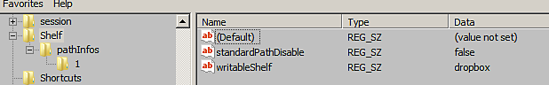

# Modifica manuale dei percorsi delle risorse

Questa pagina spiega come modificare le preferenze per aggiungere o rimuovere un percorso di risorsa senza avviare l&#39;applicazione.

## Posizione delle preferenze

Il percorso della risorsa viene gestito con le preferenze dell&#39;applicazione che possono variare a seconda della piattaforma:

<table data-preserve-html="true"> <colgroup> <col/> <col/> <col/> </colgroup> <tbody> <tr> <th>Sistema</th> <th>Versione</th> <th>Tracciato</th> </tr> <tr> <td rowspan="2"><p><strong>Windows</strong></p><p>(Registro di sistema)</p></td> <td><strong>7.2</strong> o versioni successive</td> <td>HKEY_CURRENT_USER\Software\Adobe\Adobe Substance 3D Painter</td> </tr> <tr> <td>Precedente</td> <td>HKEY_CURRENT_USER\Software\Allegorithmic\Substance Painter</td> </tr> <tr> <td rowspan="2"><p><strong>Mac</strong></p><p>(libreria)</p></td> <td><strong>7.2</strong> o versioni successive</td> <td>/Utenti/[nome utente]/Library/Preferences/com.adobe.Adobe Substance 3D Painter.plist</td> </tr> <tr> <td>Precedente</td> <td>/Utenti/[nome utente]/Library/Preferences/com.substance3d.Substance Painter.plist</td> </tr> <tr> <td rowspan="2"><strong>Linux</strong></td> <td><strong>7.2</strong> o versioni successive</td> <td>/home/[nome utente]/.config/Adobe/Adobe Substance 3D Painter.conf</td> </tr> <tr> <td>Precedente</td> <td>/home/[nome utente]/.config/Allegorithmic/Substance Painter.conf</td> </tr> </tbody> </table>

## Aggiunta di un percorso in Windows

I percorsi di Windows possono essere gestiti tramite il registro di Windows:

<table>
<tr style="border: 0;">
<td style="border: 0;" valign="top">


</td>
<td style="border: 0;" valign="top">


</td>
</tr>
</table>

1. Fai clic su **Start > Esegui** o premi **Windows + R**.
1. Digita &quot;**regedit**&quot; (senza virgolette) nella finestra di dialogo e premi **OK**.
1. Accedi alla vista struttura a sinistra della finestra **Editor del Registro di sistema** e seleziona la chiave del Registro di sistema indicata in precedenza.
1. **Aggiungere una chiave** sotto **pathInfos** con un **numero** come nome. Incrementa il numero in base alle chiavi esistenti (partendo da 1).
1. Fai **clic con il pulsante destro del mouse** > **nuovo** > **Valore stringa** nella parte destra della finestra. Assegnale il nome **disabled** e imposta il valore su **false**.
1. Fai **clic con il pulsante destro del mouse** > **nuovo** > **Valore stringa** nella parte destra della finestra. Assegna un nome a **nome** e immetti il nome dello scaffale personalizzato.
1. Fai **clic con il pulsante destro del mouse** > **nuovo** > **Valore stringa** nella parte destra della finestra. Assegna un nome al **percorso** e imposta il valore sul percorso in cui si trova lo scaffale.
1. Non dimenticare di aumentare di 1 la chiave &quot; **size** &quot; all&#39;interno di &quot; **pathInfos** &quot;.
1. Chiudete la finestra.
1. Avviare l&#39;applicazione.

È possibile definire il nuovo percorso come predefinito (se vengono create nuove risorse, come i predefiniti) modificando il valore della voce **writableShelf** nel nome del nuovo percorso.



## Aggiunta di un percorso su Linux

Su **Linux** è possibile creare percorsi aggiuntivi tramite il file di configurazione delle preferenze dell&#39;applicazione utente, archiviato nella directory principale (vedere.

1. Accedi al percorso sopra menzionato.
1. Apri il file **Substance 3D Painter.config**
1. Scorri verso il basso fino alla sezione **[Shelf]**

Aggiungete un nuovo percorso di scaffale incrementando l&#39;ultimo numero visibile, ad esempio:

```
pathInfos2disabled=false  

pathInfos2name=custom_resources 

pathInfos2path=/home/Username/Documents/custom_path 

writableShelf=custom_resources
```


Utilizzare la variabile **writableShelf** per specificare il percorso predefinito, ovvero il percorso in cui verranno create nuove risorse, come i predefiniti.

Salva le modifiche e riavvia l’applicazione.
